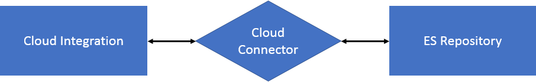

<!-- loio53db5fb382b54bba86abb413bd3711a7 -->

# Importing Content from ES Repository

You can fetch content directly from ES repository. This enables you to reuse the integration content that you already have in your ES repository and avoid the overhead of creating that content again in the Cloud Integration web application.

To enable this content import feature, you have to configure the connection settings to connect to ES repository. Since this is an on-premise system, you need to connect to it via *Cloud Connector.*

For more information on *Cloud Connector*, see [SAP Cloud Connector documentation](https://help.sap.com/viewer/cca91383641e40ffbe03bdc78f00f681/Cloud/en-US/e6c7616abb5710148cfcf3e75d96d596.html).

You can also check out this blog in SAP community: [Importing Message Mapping from ES Repository in SAP Cloud Integration](https://blogs.sap.com/2018/02/09/importing-message-mapping-from-es-repository-in-sap-cloud-platform-integration/).

