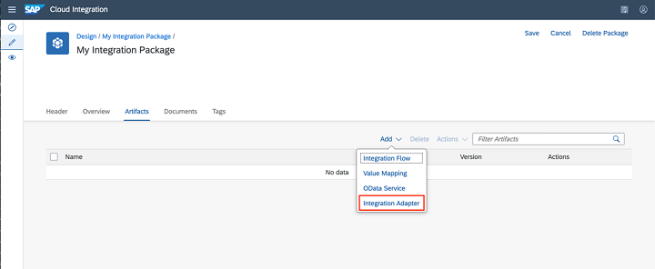

<!-- loio482286e544014098874fde0da4bcca2c -->

# Importing Custom Integration Adapter

Use the integration-adapter artifact type to import custom integration adapter in your integration package.

<a name="loio482286e544014098874fde0da4bcca2c__prereq_udy_xlk_mmb"/>

## Prerequisites

-   You’ve developed a custom integration adapter using Adapter SDK. For more information, see [Developing Custom Adapters](developing-custom-adapters-7392cc4.md).

-   You've exported integration adapter content, which is essentially an `*.esa` file in your local file system.

-   You’ve assigned the role template *WorkspacePackagesEdit* and *WorkspaceArtifactsDeploy* that are required to accomplish the various tasks when working with custom integration adapter. For more information, see [Tasks and Permissions for Cloud Integration](../60-Security/tasks-and-permissions-for-cloud-integration-556d557.md).

-   You’ve created an integration package. For more information, see [Create an Integration Package](https://help.sap.com/viewer/368c481cd6954bdfa5d0435479fd4eaf/Cloud/en-US/748968a0f43d442f98d93a9a197cdbd2.html).

## Context

Cloud Integration can connect to a multitude of systems in the cloud and on-premise. It already comes with an impressive number of adapters that allow communication with SAP and Non-SAP systems, security standards, and business-specific requirements.

Custom integration adapter eases the integration of a business based on your requirements and it has the following lifecycle operations:

<table>
<tr>
<th valign="top">

Design Time Operations

</th>
<th valign="top">

Monitoring view Operations

</th>
</tr>
<tr>
<td valign="top">

The adapter is available for modeling in the integration flow once the custom adapter is imported as an artifact in the integration package.

</td>
<td valign="top">

You can monitor the status of deployed custom integration adapter. The status details show the status of the integration adapter with regard to its usage at runtime.

</td>
</tr>
<tr>
<td valign="top">

The version history shows the versions of the adapters that are maintained in the design workspace.

</td>
<td valign="top">

You can *Restart*, *Undeploy*, and *Download* from the *Manage Integration Content* view.

</td>
</tr>
<tr>
<td valign="top">

You can *Delete*, *Download*, and *Deploy* the imported custom integration adapter through *Actions*. You can also edit via *View metadata*.

</td>
<td valign="top">

 

</td>
</tr>
</table>

## Procedure

Here's how you can import an integration adapter in Cloud Integration in the cloud foundry environment.

1.  Choose *Design* \> *Integrations and APIs*.

2.  Select the integration package in which you want to add a custom integration adapter.

3.  Choose *Edit* to enable editing of the package

4.  Go to the *Artifacts* tab and choose *Add* \> *Integration Adapter*.

5.  Choose *Browse* to import integration adapter file \(`*.esa`\). *Name*, *ID*, and *Version* fields get auto filled.

6.  In the *Type* list, select a type for your adapter.

    *Type* is used to categorize the adapters based on line of business the adapter is targeted at. For example, Analytics, CRM, ERP, Finance, HCM, Marketing.

7.  In the *Application* list, select the application for which you're developing the adapter.

    *Application* refers to the software/application for which the adapter provides either inbound or outbound connectivity. For example, select *Slack* when you develop an adapter that provides connectivity to Slack application.

8.  Choose *Deploy*.

    > ### Note:  
    > You need to be familiar with the following aspects:
    > 
    > -   The integration adapter *ID* needs to be unique across the tenant. When you create a new integration adapter, by default the entry for *Name* and *ID* is automatically imported from the file.
    > -   If there’s already an integration adapter with the same *ID*, the system throws an error.
    > -   To find more information about the integration adapter with the same ID \(for example, the integration package name and the integration adapter name\), click *Show More* below the error message.
    > -   The integration adapter must be deployed first before deploying the integration flow that consumes the integration adapter.
    > -   The adapter isn't available for modeling once you delete it from the integration package.
    > -   Once you undeploy the integration adapter artifact, it’s removed from the *Manage Integration Content* view.
    > -   If you're unable to find the imported integration adapter when modeling the integration flow, the browser cache needs to be cleared. To clear browser cache, choose *Empty cache and hard reload* from the application browser window.

    

<a name="task_cbw_j13_4mb"/>

<!-- task\_cbw\_j13\_4mb -->

## Deploying an Integration Adapter

You've now completed all steps to develop your adapter project, imported as an artifact in the package, and consumed for modeling an integration flow. To use the adapter in the integration flow for processing, you need to deploy the adapter.

<a name="task_cbw_j13_4mb__steps_o14_ssg_qmb"/>

## Procedure

1.  Open the integration package.

2.  Go to the *Artifacts* tab.

3.  Select the *Actions* button next to the name of a custom integration adapter.

4.  Select *Deploy*.

