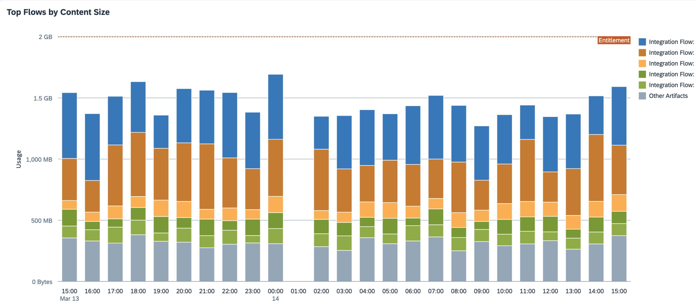

<!-- loiof72b7ffed5f344af8c1064b074199403 -->

# Inspect Content Size

You can inspect the number of integration artifacts deployed on your SAP Integration Suite tenant \(account\) and the file size they allocate for a given time period.

Integration flows and other content artifacts get deployed to the file system rather than the database. The *Content Size* feature calculates the total file size of all deployed content artifacts, including integration flows, value mappings, integration adapters, and so on.

> ### Note:  
> *Content Size* displays the compressed size of the content artifacts \(the size of the deployed `.jar` file\). In order to see the uncompressed references of your integration flows, navigate to **Manage Integration Content** as described in the *Functions* section of this page. For more information, see [Manage Integration Content](manage-integration-content-09a7223.md).

The default value of the entitlement is 2GB, as documented at [What Is SAP Cloud Integration?](https://help.sap.com/viewer/368c481cd6954bdfa5d0435479fd4eaf/Cloud/en-US/e12c09cc8e9b4574b092d8964b049ce6.html "Support end-to-end process integration through the exchange of messages.") :arrow_upper_right:.

<a name="loiof72b7ffed5f344af8c1064b074199403__section_kv2_5tf_ccc"/>

## Screen Components

The bar chart shows the artifacts that put the highest load on the file system for a given time period, each represented by a different color as shown below:

You can change the displayed time period by selecting a different option in the dropdown box under *Time*. You can select *Past Day*, *Past Week*, *Past Month*, or *Custom* for a custom time interval.

> ### Note:  
> When you select the option *Custom* for the *Time* filter, you can adjust the date and time intervals with the calendar and watch elements. You can select dates up to 30 days in the past. However, selection of dates in the future is disabled.

The total content size of the deployed artifacts is plotted in a bar graph against time. The horizontal axis shows the time window, and the vertical axis shows the file size used by the artifacts in MB.

The legend lists the top consuming integration artifacts and associates a color to each artifact.

> ### Note:  
> The system reads the resource consumption every hour. This means that there can be a maximum lag of 1 hour between processing an integration flow with a certain transaction setting and displaying the latest integration flow usage in the *Inspect* feature.

<a name="loiof72b7ffed5f344af8c1064b074199403__section_w3b_1vf_ccc"/>

## Functions

Choose a bar to get more context information and access the following functions:

-   *Inspect Artifact*

    Navigate to the more detailed *Inspect Artifact* screen to inspect the selected artifact further. For more information, see [Inspect Resource Consumption for Individual Integration Flow](inspect-resource-consumption-for-individual-integration-flow-3380bd6.md).

-   *Show Integration Content*

    Navigate to *Manage Integration Content* to monitor the specific artifact you've selected. For more information, see [Manage Integration Content](manage-integration-content-09a7223.md).

    > ### Note:  
    > You can use this function to inspect an artifact and its uncompressed references. In the *Manage Integration Content* screen, go to *Artifact Details* \> *View Deployed Artifact* \>*Integration Flow* \> *References*. You can find all the uncompressed archives, schemas, and scripts of your selected artifact there.

-   *Zoom In*/*Zoom Out*. Extend/reduce the selected time period.

<a name="loiof72b7ffed5f344af8c1064b074199403__section_idz_s5t_22c"/>

## Troubleshooting

If the total file size of the artifacts exceeds the system's storage, limit the size of the deployed integration contents. For more information, see [Limit Size of Deployed Integration Content](limit-size-of-deployed-integration-content-417f82b.md).

