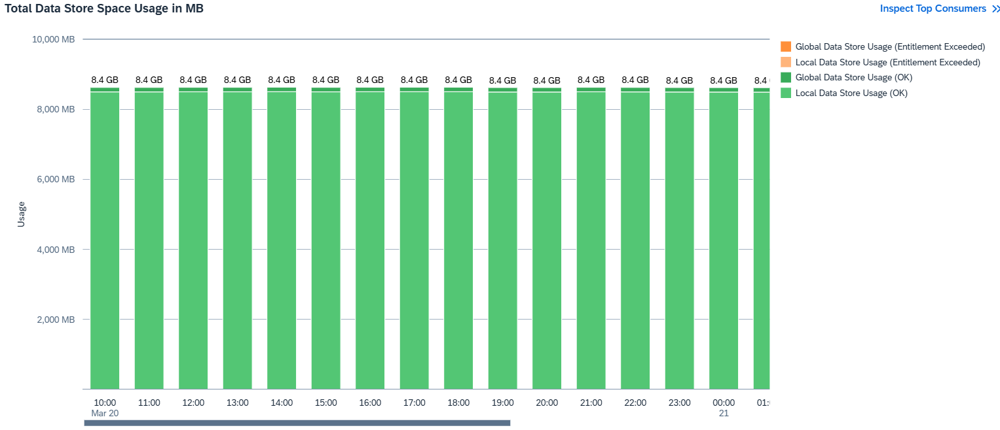

<!-- loiofcc08f6a450543b7bbed16e7de81e70e -->

# Inspect Data Store Usage

Inspect the data store usage and message size of the tenant database for a given time period.

Each SAP Integration Suite tenant is associated with a physical database that has a limited size. The data store is a logical storage that consumes tenant database volume. It can be accessed to by certain integration flows steps \(read and write access\) to read and write the message payload or variables during runtime. There are two kinds of data stores:

-   Local data store. It can be accessed explicitly by a single integration flow.

-   Global data store. It can be accessed by all integration flows deployed on a tenant.

This database is used by certain steps during the runtime of integration flows. These steps allow you to write data to the data store and to read the data from it \(see [Define Data Store Operations](define-data-store-operations-79f63a4.md)\). These integration flows, consequently, use tenant database volume.

The default value of the entitlement for the total data store space usage is 35 GB, as documented at [What Is SAP Cloud Integration?](https://help.sap.com/docs/cloud-integration/sap-cloud-integration/what-is-sap-cloud-integration). If the entitlement is exceeded there's a risk of overloading the database storage, which might eventually cause problems in the database management system and impact message processing.

<a name="loiofcc08f6a450543b7bbed16e7de81e70e__section_g5k_p3y_bcc"/>

## Screen Components

You can choose to display either the *Total Data Store Space Usage* or the *Data Store Message Size* in a graphical format using the *Resource* dropdown menu.

### *Total Data Store Space Usage*

The bar chart indicates the tenant database's data store usage over a defined period, as shown in the image below:

You can change the displayed time period by selecting a different option in the dropdown box under *Time*. You can select *Past Day*, *Past Week*, *Past Month*, or *Custom* for a custom time interval.

> ### Note:  
> When you select the option *Custom* for the *Time* filter, you can adjust the date and time intervals with the calendar and watch elements. You can select dates up to 30 days in the past. However, selection of dates in the future is disabled.

The data store usage is plotted in a bar graph against time. The horizontal axis shows the time window, and the vertical axis indicates the total data store space used in MB.

The usage level is represented by the following elements:

****

<table>
<tr>
<th valign="top">

Graphical Element

</th>
<th valign="top">

Data Store Usage

</th>
<th valign="top">

Meaning

</th>
</tr>
<tr>
<td valign="top">

Dark Green Bar

</td>
<td valign="top">

Global \(OK\)

</td>
<td valign="top">

Global data store usage is within the given limit.

</td>
</tr>
<tr>
<td valign="top">

Light Green Bar

</td>
<td valign="top">

Local \(OK\)

</td>
<td valign="top">

Local data store usage is within the given limit.

</td>
</tr>
<tr>
<td valign="top">

Dark Orange Bar

</td>
<td valign="top">

Global \(Entitlement Exceeded\)

</td>
<td valign="top">

Global data store usage exceeds the given limit.

</td>
</tr>
<tr>
<td valign="top">

Light Orange Bar

</td>
<td valign="top">

Local \(Entitlement Exceeded\)

</td>
<td valign="top">

Local data store usage exceeds the given limit.

</td>
</tr>
</table>

The bar height represents the average data volume \(in MB\) used by data stores, whether global or local. The threshold is based on the storage consumption entitlement for the tenant database.

> ### Note:  
> The system reads the resource consumption every hour. This means that there can be a maximum lag of 1 hour between processing an integration flow with a certain transaction setting and displaying the latest integration flow usage in the *Inspect* feature.

### **Data Store Message Size**

The line chart for *Data Store Message Size* displays the size of messages stored in the data stores over a specific time period, as shown in the image below:

The line height indicates the size that messages reached at different points in time. Select one of the bullet points to view the exact message size at the chosen time.

You can use the **Message Size** filter to choose between displaying the **Average** or **Maximum** message size. The average is calculated over hourly or daily intervals, depending on the time period you select in the **Time** filter. While the average usage of data stores might seem uncritical, usage could reach warning or critical levels for short periods. To inspect this situation, select **Maximum** in the **Message Size** filter.

<a name="loiofcc08f6a450543b7bbed16e7de81e70e__section_zg5_q3y_bcc"/>

## Functions

Choose a bar or a bullet to get more context information and access the following functions:

-   *Show Messages*

    Navigate to the *Monitor Message Processing* screen for the selected time period. For more information, see [Monitor Message Processing](monitor-message-processing-314df3f.md).

-   *Inspect Top Consumers*

    Navigate to the *Top Data Stores* screen that allows you to inspect tenant database usage by data stores in more detail.

    The target screen shows:

    -   Local data stores that are identified as top consumers of the tenant database for a specific time period \(as selected by the *Time* parameter\).

    -   Global data stores that are identified as top consumers of the tenant database for a specific time period \(as selected by the *Time* parameter\).

    See:

    [Inspect Top Data Stores by Usage](inspect-top-data-stores-by-usage-55670e6.md)

    [Inspect Top Data Stores by Message Size](inspect-top-data-stores-by-message-size-00431bf.md)

-   *Show Data Stores*

    Navigate to the *Manage Data Stores* screen for the selected time period . For more information, see [Managing Data Stores](managing-data-stores-ac39f1d.md).

-   *Zoom Out* and *Zoom In* to extend/reduce the selected time period. 

<a name="loiofcc08f6a450543b7bbed16e7de81e70e__section_vgy_pw5_ywb"/>

## Troubleshooting

If there's a critical situation with a data store, check if the data store is used at all in any integration scenario. Also check if you can reduce the setting for *Expiration Time*.

Check if the data stores shown as main consumers contain many overdue entries. In this case, check why these entries aren't being consumed in a timely manner, and consider deleting the overdue entries if they're no longer required, in order to free up storage space.

In order to reduce storage consumption by large data stores, consider reducing the *Expiration Period* \(see [Define Data Store Write Operations](define-data-store-write-operations-46260ee.md)\). 

It isn't recommended to use data stores for monitoring purposes, for example, by storing all failed messages for inspection. Data stores are intended as temporary storage for transactional data.

If you're using the *Data Store Write* integration flow steps for development and testing purposes, this means, if you want to inspect how messages are being processed, use the integration flow tracing feature \(see [Guidelines and Best Practices for Message Monitoring](guidelines-and-best-practices-for-message-monitoring-6f598b4.md)\).

More information:

-   [Define Data Store Operations](define-data-store-operations-79f63a4.md)

-   [Store/Retrieve Messages in/from the Data Store](store-retrieve-messages-in-from-the-data-store-604f7b1.md)

-   [Anticipate Message Throughput When Choosing a Storage Option](anticipate-message-throughput-when-choosing-a-storage-option-5b38765.md)

-   [Using Data Storage Features When Designing Integration Flows](using-data-storage-features-when-designing-integration-flows-a836b4e.md)

-   [Define Transaction Handling](define-transaction-handling-2a5d4bc.md)

