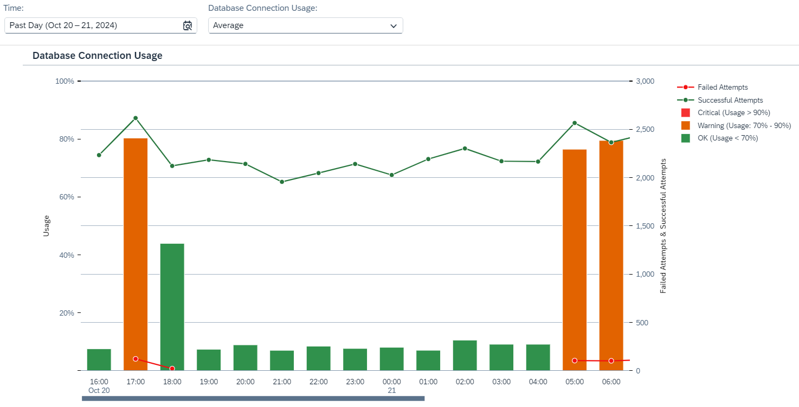

<!-- loio567eb42ef7c349e78c8c814dfeecd696 -->

# Inspect Database Connection Usage

Inspect database connection usage for a given time period and analyze critical situations in which insufficient database connections are available.

Each SAP Integration Suite tenant is associated with a physical database that has a limited size. The data store is a logical storage that consumes tenant database volume. It can be accessed to by certain integration flows steps \(read and write access\) to read and write the message payload or variables during runtime. There are two kinds of data stores:

Every integration flow step that implies access to the tenant database requires a database connection. This number of available database connections is a limited integration resource.

Database connection usage depends on the integration flow design and on the volume of the processed data. There can also be situations where not enough connections are available. Furthermore, the configured transaction handling settings have an effect on database connection usage.

<a name="loio567eb42ef7c349e78c8c814dfeecd696__section_czd_4dk_dcc"/>

## Screen Components

The bar chart shows the database connection usage of the tenant database for a defined time period, as shown in the image below.

You can change the displayed time period by selecting a different option in the dropdown box under *Time*. You can select *Past Day*, *Past Week*,*Past Month*, or *Custom* for a custom time interval.

> ### Note:  
> When you select the option *Custom* for the *Time* filter, you can adjust the date and time intervals with the calendar and watch elements. You can select dates up to 30 days in the past. However, selection of dates in the future is disabled.

You can use the *Database Connection Usage* filter to choose between displaying the *Average* or *Maximum* usage of database connections. The average is calculated over hourly or daily intervals, depending on the time period you select in the *Time* filter. While the average usage of database connections might seem uncritical, usage could reach warning or critical levels for short periods. To inspect this situation, select *Maximum* in the *Database Connection Usage* filter.

The database connection usage is plotted in a bar graph against time. The horizontal axis shows the time window, and the vertical axis shows the percentage of database connection usage in relation to the maximum usage. The maximum usage corresponds to the situation where all database connections are used.

The usage level is represented by the following elements:

<table>
<tr>
<th valign="top">

Graphical Element

</th>
<th valign="top">

Database Connection Usage

</th>
<th valign="top">

Meaning

</th>
</tr>
<tr>
<td valign="top">

Red Bar

</td>
<td valign="top">

More than 90%

</td>
<td valign="top">

Critical: There's a risk of overloading the database storage

</td>
</tr>
<tr>
<td valign="top">

Orange Bar

</td>
<td valign="top">

Between 70% and 90%

</td>
<td valign="top">

Warning: Database connection usage exceeds the given limit.

</td>
</tr>
<tr>
<td valign="top">

Green Bar

</td>
<td valign="top">

Less than 70%

</td>
<td valign="top">

OK: Database connection usage is within the given limit.

</td>
</tr>
<tr>
<td valign="top">

Red Bullet

</td>
<td valign="top">

Failed attempts

</td>
<td valign="top">

The Cloud Integration runtime can't get any database connections because no free database connection is available.

</td>
</tr>
<tr>
<td valign="top">

Green Bullet

</td>
<td valign="top">

Successful attemps

</td>
<td valign="top">

The number of successful attempts to connect to the database. This reflects how actively the database is being used.

</td>
</tr>
</table>

> ### Note:  
> The system reads the resource consumption every hour. This means there can be a maximum lag of 1 hour between processing an integration flow with a certain transaction setting and displaying the latest integration flow usage in the *Inspect* feature.

<a name="loio567eb42ef7c349e78c8c814dfeecd696__section_tqd_3w1_bxb"/>

## Functions

Choose a bar or a bullet to get more context information and access the following functions:

-   *Show Messages*

    Navigate to the *Monitor Message Processing* screen and inspect the message processing log for the selected time interval. For more information, see [Monitor Message Processing](monitor-message-processing-314df3f.md).

-   *Inspect Top Consumers*

    Inspect database connection usage per integration flow.

    Navigate to the *Database Connections* screen that allows you to inspect database connection resources in more detail.

    The target screen shows:

    -   The database connection usage for those integration flows that are identified as top consumers of the database connection pool for a given time period \(as selected with the *Time* parameter\).

    -   Integration flows that cause critical database connection load \(unavailable connections\) for a given time period \(as selected with the *Time* parameter\).

        For more information, see:

        [Inspect Top Integration Flows by Database Connection Usage](inspect-top-integration-flows-by-database-connection-usage-79c5a05.md)

        [Inspect Top Integration Flows with Failed Connection Attempts](inspect-top-integration-flows-with-failed-connection-attempts-5d9d214.md)

-   *Zoom Out* and *Zoom In* to extend/reduce the selected time period.

<a name="loio567eb42ef7c349e78c8c814dfeecd696__section_vgy_pw5_ywb"/>

## Troubleshooting

If there are not enough database connections, check your top consuming integration flows. In particular, check the *Transaction Handling* parameter \(when the Integration Process or Local Integration Process shape is selected in an integration flow model\). Check if *Required for JDBC* is selected and, if it is, check if you can choose another option.

More information:

-   [Define Proper Transaction Handling](define-proper-transaction-handling-1c31963.md)

-   [Transaction Handling Guidelines](transaction-handling-guidelines-52e3f67.md)

-   [Define Transaction Handling](define-transaction-handling-2a5d4bc.md)

