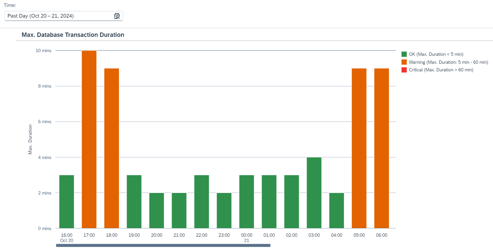

<!-- loio6736a3726760451bab9b07017df65616 -->

# Inspect Database Transaction Usage

Inspect database transaction duration for a given time period and analyze critical situations in which long-running transactions occur.

There are no hard limits for the number and duration of database transactions. However, ideally, design your integration scenarios so that transactions are short lived. Long-living transactions can impose a significant load on database resources. A high load on database resources can cause problems in the database management system and impact message processing.

<a name="loio6736a3726760451bab9b07017df65616__section_rvw_5tx_dcc"/>

## Screen Components

The bar chart shows the maximum transaction duration of the tenant database for a defined time period, as shown in the image below.

You can change the displayed time period by selecting a different option in the dropdown box under **Time**. You can select **Past Day**, **Past Week**,**Past Month**, or **Custom** for a custom time interval.

> ### Note:  
> When you select the option *Custom* for the *Time* filter, you can adjust the date and time intervals with the calendar and watch elements. You can select dates up to 30 days in the past. However, selection of dates in the future is disabled.

The maximum duration of database transactions is plotted in a bar graph against time. The horizontal axis shows the time window, and the vertical axis shows the duration of database transactions in minutes.

The duration level is represented by the following elements:

<table>
<tr>
<th valign="top">

Graphical Element

</th>
<th valign="top">

Database Transaction Usage

</th>
<th valign="top">

Meaning

</th>
</tr>
<tr>
<td valign="top">

Red Bar

</td>
<td valign="top">

Maximum duration: more than 60 minutes

</td>
<td valign="top">

Critical: long running transactions can cause issues with the system database.

</td>
</tr>
<tr>
<td valign="top">

Orange Bar

</td>
<td valign="top">

Maximum duration: between 5 minutes and 60 minutes

</td>
<td valign="top">

Warning: transactions are running for longer than expected.

</td>
</tr>
<tr>
<td valign="top">

Green Bar

</td>
<td valign="top">

Maximum duration: less than 5 minutes

</td>
<td valign="top">

OK

</td>
</tr>
</table>

> ### Note:  
> The system reads the resource consumption every hour. This means there can be a maximum lag of 1 hour between processing an integration flow with a certain transaction setting and displaying the latest integration flow usage in the *Inspect* feature.

<a name="loio6736a3726760451bab9b07017df65616__section_czs_yvx_dcc"/>

## Functions

Choose a bar to get more context information and access the following functions:

-   *Show Messages*

    Navigate to the **Monitor Message Processing** screen and inspect the message processing log for the selected time interval. For more information, see [Monitor Message Processing](monitor-message-processing-314df3f.md).

-   *Inspect Top Consumers*

    Navigate to the *Top Integration Flows* screen and inspect those integration flows that are identified as using the longest running transactions of the tenant database for a specific time period \(as selected by the *Time* parameter\).

    For more information, see [Inspect Top Integration Flows by Maximum Transaction Duration](inspect-top-integration-flows-by-maximum-transaction-duration-ab67942.md).

-   *Show Message With Max. Duration*

    Navigate to the **Monitor Message Processing** screen and inspect the message processing log with the maximum duration for the selected time interval. For more information, see [Monitor Message Processing](monitor-message-processing-314df3f.md).

-   **Zoom Out** and **Zoom In** to extend/reduce the selected time period.

<a name="loio6736a3726760451bab9b07017df65616__section_dfd_lqt_4xb"/>

## Troubleshooting

If there are integration flows exhibiting transaction durations at warning or even critical level, check your top consuming integration flows. In particular, check the *Transaction Handling* parameter \(when the *Integration Process* or *Local Integration Process* shape is selected in the integration flow model\). Check if *Required for JDBC* is selected and, if it's, check if you can choose another option.

More information:

-   [Define Proper Transaction Handling](define-proper-transaction-handling-1c31963.md)

-   [Transaction Handling Guidelines](transaction-handling-guidelines-52e3f67.md)

-   [Define Transaction Handling](define-transaction-handling-2a5d4bc.md)

