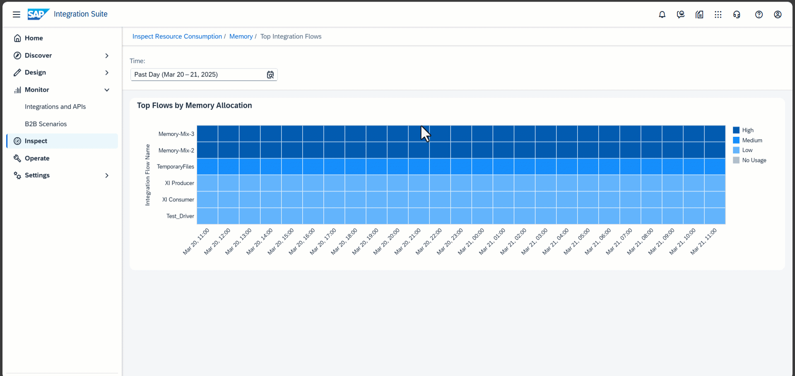

<!-- loio2a2e1f2e6ebe4264a4debddb92d890b2 -->

# Inspect Integration Flows By System Memory Usage

Inspect relative memory allocation per integration flow for a given time period \(as selected with the *Time* parameter\).

The chart shows memory allocation and allows you to do a relative comparison of integration flows with regard to memory consumption.

> ### Note:  
> Heap memory is continuously allocated for processing messages, and it's automatically reclaimed by garbage collection when it’s no longer used. If the allocated memory is high and can't be reclaimed by the garbage collector for a longer time, you can expect memory issues.
> 
> However, it's usual for an integration flow to have high throughput and allocate a lot of memory, as long as the memory is reclaimed fast enough. This is the normal mode of operation for high-throughput scenarios.

Only those integration flows that are identified as top consumers of memory in terms of allocation are shown \(sorted top-down by average usage\).

The color shade of a cell reflects the level of memory allocation. The darkest shade reflects the highest usage observed during the selected time period.

Choose a cell to display the degree of memory allocation and to access one of the following functions for the selected integration flow \(results are filtered according to the setting of the *Time* parameter\):

-   *Show Messages*

    Navigate to the *Monitor Message Processing* screen for the time period covered by the bar. For more information, see [Monitor Message Processing](monitor-message-processing-314df3f.md).

-   *Show Integration Content*

    Navigate to the *Manage Integration Content* screen for the related integration flow. For more information, see [Manage Integration Content](manage-integration-content-09a7223.md).

-   *Inspect Integration Flow*

    Inspect the system memory usage of the selected integration flow. For more information, see [Inspect Resource Consumption for Individual Integration Flow](inspect-resource-consumption-for-individual-integration-flow-3380bd6.md).

-   *Show Flow Step*

    Choose this function to navigate to the *Integration Designer*. The specific flow step identified as the main memory consumer is highlighted in the integration flow.

    

-   *Copy Flow Step to Clipboard*

    Copy the identifier of the integration flow step that was detected as the main consumer of memory to the clipboard. After navigating to the integration flow designer via the function *Show Integration Content*, you can use this identifier for finding the integration flow step within the integration flow.

    > ### Tip:  
    > On the *Manage Integration Content* screen, you can select *View Deployed Artifact* to navigate to the integration flow editor for the deployed artifact. Alternatively, you can select *Navigate to Artifact Editor* to navigate to the integration flow editor in the *Design* section.

-   *Copy Fow ID to Clipboard* 

    Copy the integration flow identifier to the clipboard. This is useful on screens where you can filter by integration flow using the artifact ID.

-   **Zoom Out** and **Zoom In** to extend/reduce the selected time period.

