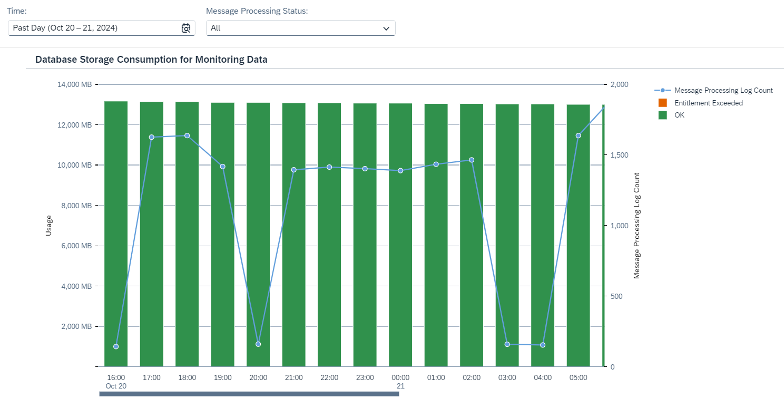

<!-- loio216dc43e45b7423eb670e6e1e7bd05e0 -->

# Inspect Monitoring Storage Usage

Inspect usage of the monitoring storage database for a given time period \(as selected with the *Time* parameter\).

At runtime, monitoring data is written to a database. For each integration flow processed at runtime, a message processing log is written that contains information about the processing steps \(see [Message Processing Log](message-processing-log-b32f8cd.md)\).

The default value of the assigned database capacity is 35 GB, as documented at [What Is SAP Cloud Integration?](https://help.sap.com/docs/cloud-integration/sap-cloud-integration/what-is-sap-cloud-integration).

When the assigned database capacity for monitoring storage is exceeded, you're advised to use the *Inspect* feature to examine and minimize storage usage. Exceeding the assigned database limit for monitoring storage doesn't imply that message processing logs can't be persisted anymore. However, in this case SAP can't ensure optimal performance for message monitoring.

<a name="loio216dc43e45b7423eb670e6e1e7bd05e0__section_ant_4b2_2cc"/>

## Screen Components

The bar chart shows the consumption of the database storage for monitoring data for a defined time period, as shown in the image below:

You can change the displayed time period by selecting a different option in the dropdown box under *Time*. You can select *Past Day*, *Past Week*, *Past Month*, or *Custom* for a custom time interval.

> ### Note:  
> When you select the option *Custom* for the *Time* filter, you can adjust the date and time intervals with the calendar and watch elements. You can select dates up to 30 days in the past. However, selection of dates in the future is disabled.

However, the value of a bar at the time period 11:00-12:00 doesn't represent the amount of monitoring data that was added during 11:00-12:00. But rather the total amount of monitoring data found in the database during 11:00-12:00.

The database storage usage is plotted in a bar graph against time. The horizontal axis shows the time window, and the vertical axis indicates the total data store space used in MB.

The thresholds are based on the assigned database capacity for monitoring storage consumption in the monitoring database.

The usage level is represented by the following elements:

<table>
<tr>
<th valign="top">

Graphical Element

</th>
<th valign="top">

Monitoring Storage Usage

</th>
<th valign="top">

Level of Usage

</th>
</tr>
<tr>
<td valign="top">

Orange Bar

</td>
<td valign="top">

Entitlement exceeded

</td>
<td valign="top">

Warning: Monitoring storage usage exceeds the given limit.

The bar height shows the data volume \(in MB\) used by monitoring data.

The thresholds are based on the entitlement for storage consumption in the tenant database.

</td>
</tr>
<tr>
<td valign="top">

Green Bar

</td>
<td valign="top">

Less than 100%

</td>
<td valign="top">

OK: Monitoring storage usage is within the given limit.

The bar height shows the data volume \(in MB\) used by monitoring data.

</td>
</tr>
<tr>
<td valign="top">

Blue Bullet

</td>
<td valign="top">

Message Processing Log Count

</td>
<td valign="top">

The count of message processing logs. You can filter the count of message processing logs by status with the *Message Processing Status* filter. The default value is *All*, which means that the total count of message processing logs is displayed.

</td>
</tr>
</table>

> ### Note:  
> The system reads the resource consumption every hour. This means there can be a maximum lag of 1 hour between processing an integration flow with a certain transaction setting and displaying the latest integration flow usage in the **Inspect** feature.

<a name="loio216dc43e45b7423eb670e6e1e7bd05e0__section_i53_1d2_2cc"/>

## Functions

Choose a bar or a bullet to get more context information and access the following functions:

-   *Show Messages*

    Navigate to the *Monitor Message Processing* screen for the selected time period. For more information, see [Monitor Message Processing](monitor-message-processing-314df3f.md).

-   *Inspect Top Consumers*

    Navigate to the *Top Integration Flows* screen that allows you to inspect those integration flows that write the most message processing logs for a specific time period. For more information, see: [Inspect Top Integration Flows by Message Processing Log Count](inspect-top-integration-flows-by-message-processing-log-count-696b65e.md).

-   *Zoom Out* and *Zoom In* to extend/reduce the selected time period. 

<a name="loio216dc43e45b7423eb670e6e1e7bd05e0__section_vgy_pw5_ywb"/>

## Troubleshooting

If the assigned capacity for the monitoring database volume is approached or even exceeded, you can inspect which integration flows are the top contributors \(see [Inspect Top Integration Flows by Message Processing Log Count](inspect-top-integration-flows-by-message-processing-log-count-696b65e.md)\). For the top consuming integration flows you can ensure that the message processing *Log Level* parameter is set to *Info* 

To do that, in the *Monitor* \> *Integrations* section, click a tile in the *Manage Integration Content* section select the integration flow, and configure the *Log Configuration* parameter accordingly.

See: [Setting Log Levels](setting-log-levels-4e6d3fc.md) 

You can also check if there are integration flows showing many erroneous message processing logs. To filter for such integration flows, set the *Message Processing Status* filter to *Failed*. Check the respective integration flow and fix the root cause for the failures.

You might see a critical status, even though there were not too many message processing logs in the past 24 hours. In this situation you have to extend the time selection to *Past Week* or even *Past Month*, to reveal the point of time when a large amount of message processing logs further in the past could have filled the monitoring storage to a critical level. Note also that monitoring data is removed only through an automated cleanup job, which removes monitoring data for which the retention period has expired \(30 days by default\).

More information:

[Guidelines and Best Practices for Message Monitoring](guidelines-and-best-practices-for-message-monitoring-6f598b4.md)

