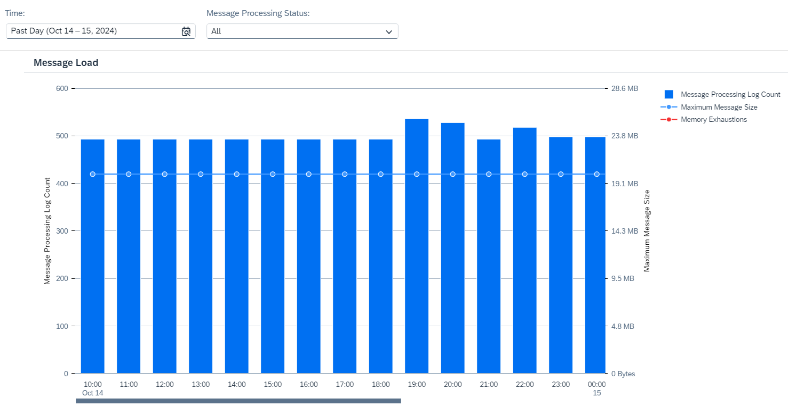

<!-- loioe9617dd737384100b96194d37badbb80 -->

# Inspect System Memory Usage

Inspect the usage of the system heap memory for a given time period \(as selected with the *Time* parameter\).

Messages processed by integration flows at runtime consume system heap memory. Consumption of heap memory depends on several factors:

-   Message throughput

    The higher the number of messages that are processed within a given time frame, the higher the consumption of memory. In addition, you can expect that consumption increases with message sizes.

-   Integration flow design

    An integration flow can contain steps with a particularly high demand for memory, such as \(but not limited to\) Groovy scripts and message mappings.

<a name="loioe9617dd737384100b96194d37badbb80__section_n2t_cp2_2cc"/>

## Screen Components

The bar chart shows the message load for a defined time period, as shown in the image below.

You can change the displayed time period by selecting a different option in the dropdown box under *Time*. You can select *Past Day*, *Past Week*, *Past Month*, or *Custom* for a custom time interval.

> ### Note:  
> When you select the option *Custom* for the *Time* filter, you can adjust the date and time intervals with the calendar and watch elements. You can select dates up to 30 days in the past. However, selection of dates in the future is disabled.

The message load is plotted in two charts against time:

-   The total count of message processing logs \(MPLs\) for a given time period \(as selected with the *Time* parameter\) is plotted in a bar chart.

    You can filter the count of message processing logs by status with the **Message Processing Status** filter. The default value is **All**, which means that the total count of message processing logs is displayed.

    The number of MPLs is identical to the number of messages processed during the selected time period.

-   The maximum message size within this time period is plotted in a line chart with a blue bullet.

-   In addition, time periods during which an exhaustion of heap memory was observed are marked in red on the horizontal axis.

> ### Note:  
> The system reads the resource consumption every hour. This means there can be a maximum lag of 1 hour between processing an integration flow with a certain transaction setting and displaying the latest integration flow usage in the **Inspect** feature.

<a name="loioe9617dd737384100b96194d37badbb80__section_fp1_2q2_2cc"/>

## Functions

Choose a bar or a bullet to get more context information and to access to the following functions:

-   *Show Messages*

    Navigate to the *Monitor Message Processing* screen for the selected time period For more information, see [Monitor Message Processing](monitor-message-processing-314df3f.md).

-   *Inspect Top Consumers*

    Navigate to the *Top Integration Flows* screen that allows you to inspect memory allocation by integration flows in more detail. For more information, see: [Inspect Integration Flows By System Memory Usage](inspect-integration-flows-by-system-memory-usage-2a2e1f2.md).

-   *Show Message With max. Size*

    Navigate to the **Monitor Message Processing** screen and inspect the message processing log with the maximum size for the selected integration flow and time interval. For more information, see [Monitor Message Processing](monitor-message-processing-314df3f.md).

-   *Zoom Out* and *Zoom In* to extend/reduce the selected time period. 

<a name="loioe9617dd737384100b96194d37badbb80__section_vgy_pw5_ywb"/>

## Troubleshooting

If memory exhaustion have been detected, you can identify the corresponding integration flow and flow step on the *Top Flows by Memory Allocation* screen.

Consider the following recommendations for specific flow steps to mitigate memory exhaustion situations.

-   General integration flow design measures

    You can design integration flows in such a way that memory consumption is minimized.

    More information: [Optimize Memory Footprint](optimize-memory-footprint-dc24074.md)

-   *Script* step

    When using XMLSlurper or JSONSlurper in a script, check out the following SAP Community blog: [Stream the XMLSlurper input in Groovy Scripts](https://blogs.sap.com/2017/06/20/stream-the-xmlslurper-input-in-groovy-scripts/).

    In general, avoid getting the message body as String wherever possible. If you wish to implement a mapping, consider using a *Message Mapping* for XML or JSON payloads.

-   JDBC adapter

    When using the JDBC receiver adapter, make sure that not too many records are loaded per request. Otherwise, the memory can be overloaded.

-   *Splitter* step

    When using Splitter steps, an incoming message can spawn many messages by placing a high load on memory. If you use an *Iterating Splitter* with parallel processing enabled, consider reducing the number of parallel processes. In other cases, consider reducing the bulk size and/or the rate of incoming messages.

    More information: [Reduce the Memory Consumption for Splitter Scenarios](reduce-the-memory-consumption-for-splitter-scenarios-de974b8.md)

-   Mapping

    Mappings can require a high degree of memory allocation. Therefore, consider reducing the rate of incoming messages in case of memory shortages.

