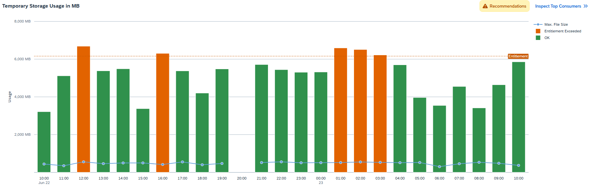

<!-- loio7cdfaa73d9fd47c08acf27a9d9b2b2a1 -->

# Inspect Temporary Storage

You can inspect the total storage usage that temporary files allocate in the file system for a given time period.

At runtime, the system can cache messages in temporary files. The *Temporary Storage* feature calculates the storage volume these temporary files use and shows the maximum file size detected over the selected time period.

Temporary files become especially relevant when integration flows process large messages.

> ### Note:  
> The system deletes messages that are temporarily stored from storage when message processing completes.

<a name="loio7cdfaa73d9fd47c08acf27a9d9b2b2a1__section_ufx_bp2_lcc"/>

## Screen Components

The bar chart shows the total storage used by temporary files for a defined time period, as shown in the image below:

You can change the displayed time period by selecting a different option in the dropdown box under *Time*. You can select *Past Day*, *Past Week*, *Past Month*, or *Custom* for a custom time interval.

> ### Note:  
> When you select the option *Custom* for the *Time* filter, you can adjust the date and time intervals with the calendar and watch elements. You can select dates up to 30 days in the past. However, selection of dates in the future is disabled.

The total storage usage is plotted in a bar graph against time. The horizontal axis shows the time window, and the vertical axis shows the storage usage level in MB.

The usage level is represented by the following elements:

****

<table>
<tr>
<th valign="top">

Graphical Element

</th>
<th valign="top">

Temporary Storage Usage

</th>
<th valign="top">

Meaning

</th>
</tr>
<tr>
<td valign="top">

Green Bar

</td>
<td valign="top">

OK

</td>
<td valign="top">

Temporary storage usage is within the recommended limit of 2.5 GB.

</td>
</tr>
<tr>
<td valign="top">

Orange Bar

</td>
<td valign="top">

Entitlement Exceeded

</td>
<td valign="top">

Temporary storage usage exceeds the recommended limit of 2.5 GB.

</td>
</tr>
<tr>
<td valign="top">

Blue Bullet

</td>
<td valign="top">

Max. File Size

</td>
<td valign="top">

The maximum size that temporary files reach at the defined time period.

</td>
</tr>
</table>

> ### Note:  
> The system reads the resource consumption every hour. This means that there can be a maximum lag of 1 hour between processing an integration flow with a certain transaction setting and displaying the latest integration flow usage in the Inspect feature.

<a name="loio7cdfaa73d9fd47c08acf27a9d9b2b2a1__section_w44_zp2_lcc"/>

## Functions

Choose a bar or a bullet to get more context information and access the following functions:

-   *Show Messages*

    Navigate to the *Monitor Message Processing* screen for the selected time period. For more information, see [Monitor Message Processing](monitor-message-processing-314df3f.md).

-   *Inspect Top Consumers*

    Navigate to the *Top Integration Flows* screen that allows you to inspect those integration flows that occupy the most storage in more detail. For more information, see [Inspect Top Integration Flows by Storage Usage](inspect-top-integration-flows-by-storage-usage-9183e3b.md).

-   *Zoom Out* and *Zoom In* to extend/reduce the selected time period. 

<a name="loio7cdfaa73d9fd47c08acf27a9d9b2b2a1__section_lry_4jt_22c"/>

## Troubleshooting

If temporary files show storage usage at a warning or critical level, consider the following:

-   Check if the maximum file size is very large, such as hundreds of MB or even GB. If it is, consider processing smaller messages. For more information, see Disk Space in [System Scope for Cloud Integration](../system-scope-for-cloud-integration-8ea3822.md) .
-   Check for delays in message processing when temporary storage reached a critical level. Message processing delays can cause temporary files to accumulate in storage.

If these recommendations don't resolve the issue, consider adjusting the integration flow design and message payload so that the system processes smaller messages with less latency.

