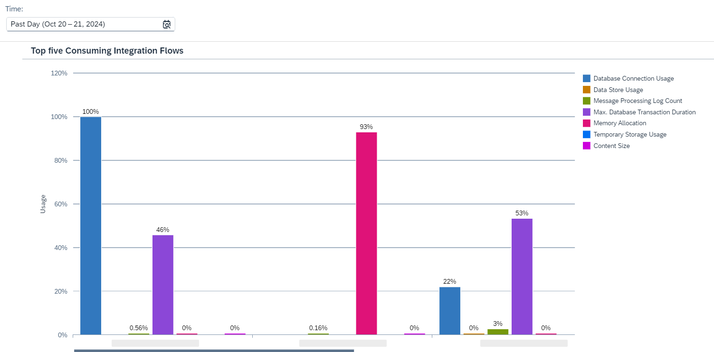

<!-- loioc8fd522cfba742a192b55255785029fe -->

# Inspect Top Consuming Integration Flows

You can inspect the top five integration flows that consume the most resources.

The *Integration Flows* feature allows you to analyze and compare the integration flows that allocate the most resources among all your deployed integration flows. The bar graph also helps you to identify which specific resources are being consumed the most within each integration flow

<a name="loioc8fd522cfba742a192b55255785029fe__section_ffs_stb_mcc"/>

## Screen Components

The bar chart shows the five integration flows with the highest resource consumption for the defined time period.

Each flow displays different colored bars representing the levels of consumption of the different resources within the individual integration flows, as shown in the image below.

You can change the displayed time period by selecting a different option in the dropdown box under *Time*. You can select *Past Day*, *Past Week*, *Past Month*, or *Custom* for a custom time interval.

> ### Note:  
> When you select the option *Custom* for the *Time* filter, you can adjust the date and time intervals with the calendar and watch elements. You can select dates up to 30 days in the past. However, selection of dates in the future is disabled.

The total resource consumption is presented in a bar graph. The horizontal axis displays the names of the integration flows, while the vertical axis shows the percentage of total resource consumption over the selected time period.

You can choose one of the bars to learn more about the consumption level of a specific resource. Depending on the resource type, you can see:

-   **Usage relative to the entitlement.** This shows the maximum resource usage based on the resource's own entitlement.

-   **Usage relative to other integration flows.**This indicates the usage level based on the total consumption of all integration flows.

-   Maximum detected usage, duration, or time of the selected resource within the integration flow. The color of the value indicates whether the resource's entitlement was exceeded. If the consumption is at a critical level, it appears in orange or red. If the usage is within the given limit, it appears in green. If the value is in black, despite being high, it means there's no critical risk.

> ### Note:  
> The system reads the resource consumption every hour. This means that there can be a maximum lag of one hour between processing an integration flow with a certain transaction setting and displaying the latest integration flow usage in the *Inspect* feature.

<a name="loioc8fd522cfba742a192b55255785029fe__section_zq1_f5b_mcc"/>

## Functions

Choose a bar to get more context information and access the following functions:

-   *Show Messages*

    Navigate to the *Monitor Message Processing* screen for the selected time period. For more information, see [Monitor Message Processing](monitor-message-processing-314df3f.md).

-   *Show Integration Content*

    Navigate to *Manage Integration Content* to monitor the specific integration flow you've selected. For more information, see [Manage Integration Content](manage-integration-content-09a7223.md).

-   *Inspect Integration Flow*

    Navigate to the more detailed *Inspect Integration Flow* screen to further inspect the selected resource's consumption. For more information, see [Inspect Resource Consumption for Individual Integration Flow](inspect-resource-consumption-for-individual-integration-flow-3380bd6.md).

