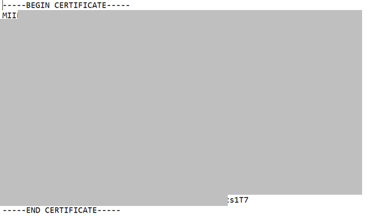
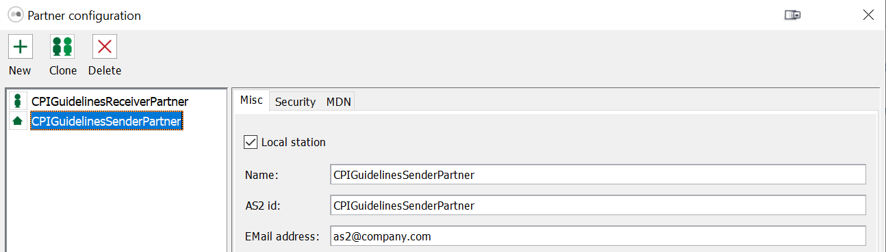
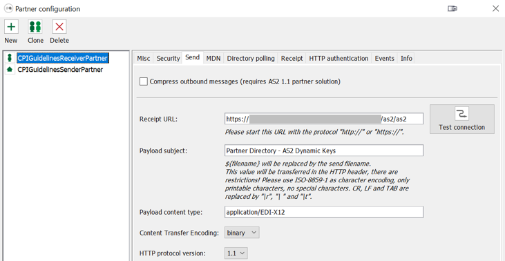

<!-- loiocfa038e99de641e9922a26fc63f1e0e8 -->

# Install and Configure Mendelson

To send a message to integration flow *Partner Directory - AS2 Dynamic Keys*, you need to install the Medelson tool.

You can use Mendelson to simulate AS2 partners sending test messages to a server.

As a prerequisite, install and configure Mendelson as described in the following SAP Community blog:

[B2B Capabilities in SAP Cloud Integration – Part 1](https://blogs.sap.com/2018/01/14/b2b-capabilities-in-sap-cloud-platform-integration-part-1/)

Make sure that you import the Cloud Integration SSL certificate \(the whole certificate chain\) into Mendelson.

To get the required certificate, perform the steps described at: [Using the Connectivity Test to Get the Load Balancer Server Root Certificate](../40-RemoteSystems/using-the-connectivity-test-to-get-the-load-balancer-server-root-certificate-5d6cbf4.md) and in SAP Community blog [Cloud Integration – How to Setup Secure HTTP Inbound Connection with Client Certificates](https://blogs.sap.com/2017/06/05/cloud-integration-how-to-setup-secure-http-inbound-connection-with-client-certificates/).

After these initial steps, you can configure Mendelson to enable it to send a message to the integration flow.

To configure the keys for encryption and signing, perform the following steps:

1.  Specify the key to be used to sign messages sent to Cloud Integration.

    To do that, open Mendelson and choose *File* \> *Certificates* \> *Sign/Crypt* to display the available keys.

    Select 1 key and rename it to `CPIGuidelinesSenderKey`.

    

2.  Export the base64-encoded certificate so that you can specify the related parameter `AS2_SenderPublicKey` in your Postman environment \(see: [First Steps - Import the Postman Collections](first-steps-import-the-postman-collections-0f4cf38.md)\).

    1.  Choose *Export certificate*.

    2.  On the next screen, as *Encoding* select *Text format \(PEM, \*.cer\)*.

        

    3.  Specify a name \(in field *Export file*\) and choose *OK*.

    4.  Open the exported file in a text editor and copy the content between \(but excluding\) the lines `-----BEGIN CERTIFICATE-----` and `-----END CERTIFICATE-----`.

        

    5.  Open Postman and in your Postman environment paste the certificate in the entry field for parameter `AS2_SenderPublicKey`.

3.  Import the public certificate of a Cloud Integration key pair. This certificate is to be used to encrypt messages sent to Cloud Integration.

    1.  Open the Web UI *Monitor* section for your tenant and select tile *Keystore* under *Manage Security*.

    2.  Select a key pair and choose *Download Certificate*.

    3.  Open Mendelson and choose *Sign/Crypt*.

    4.  Choose *Import certificate* and browse for the `.cer` file exported from the Cloud Integration keystore.

    5.  Rename the alias of the certificate to `CPIGuidelinesReceiverCert`.

Configure the local sender partner.

1.  Select *Partner* and on the next screen select the partner with the house symbol \(default name *mycompany*\).

2.  Open tab *Misc* and perform the following settings.

    -   Select the option *Local station*.

    -   For *Name* and for *AS2 id*, enter `CPIGuidelinesSenderPartner`.

    

3.  Open tab *Security* for the local sender partner and for *Private key \(Outbound signature generation\)* select the previously renamed key *CPIGuidelinesSenderKey*.

    

    The private key is used to sign outbound messages.

4.  Choose *OK*.

Configure the receiver partner.

1.  Select *Partner* and on the next screen select the partner with the figure symbol \(default name *mendelsontest*\).

2.  Open tab *Misc* and perform the following settings.

    -   Keep option *Local station* deselected.

    -   For *Name* and for *AS2 id*, enter `CPIGuidelinesReceiverPartner`.

    

3.  Open tab *Security* for the receiver partner and for *Partner certificate \(Outbound data encryption\)* and *Partner certificate \(Inbound signature verification\)* select the key *CPIGuidelinesReceiverCert*.

    

4.  Open tab *Send* and

    As *Receipt URL*, enter the endpoint address of the deployed integration flow *Partner Directory - AS2 Dynamic Keys*.

    As *Payload subject* enter `Partner Directory – AS2 Dynamic Keys`.

    

5.  In tab *MDN* disable option *Request signed MDN*.

6.  In tab *HTTP authentication*, select *Use HTTP authentication to send AS2 messages* and enter the username and password that is authenticated to call the integration flow.

7.  Choose *OK*.

You can now call the integration flow. To send a message, choose *File**Send file to partner*. You can select option *Send test data* to send a test message provided by Mendelson.

More information on AS2 messages and the Mendelson tool:

[B2B Capabilities in SAP Cloud Integration – Part 1](https://blogs.sap.com/2018/01/14/b2b-capabilities-in-sap-cloud-platform-integration-part-1/)

[B2B Capabilities in SAP Cloud Integration – Part 2](https://blogs.sap.com/2018/01/18/b2b-capabilities-in-sap-cloud-platform-integration-part-2/) 

