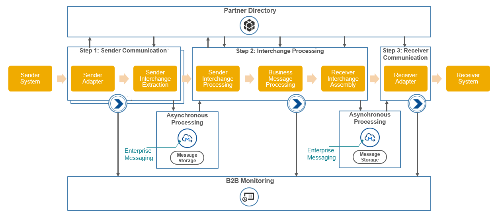

<!-- loio0ff62294f42a40938384de45ac6ea566 -->

# Integration Flow Configuration

Configure your integration flows to test the end to end scenario in SAP Integration Suite.

You only need to configure the integration flows when you need to run an end to end business scenario.

The package *Cloud Integration – Trading Partner Management* contains the necessary artifacts that have to be configured.

> ### Note:  
> This is a configure-only package and hence, you cannot edit the integration flows.

A generic integration flow process for SAP Integration Suite looks like this: 

To know more about the package, see [Cloud Integration - Trading Partner Management](https://api.sap.com/package/CloudIntegrationTradingPartnerManagement/integrationflow). Follow the next steps to copy the integration package to your *Design* space.

1.  Login to your Cloud Integration tenant.

2.  After the *Discover* tab, search for and open the package *Cloud Integration - Trading Partner Management*.
3.  Choose *Copy*.
4.  Navigate to the *Design* tab.
5.  Choose and open the integration package and navigate to the *Artifacts* tab.
6.  The following table lists the integration flows in the package and their purpose:

    **Cloud Integration - Trading Partner Management**

    <table>
    <tr>
    <th valign="top">

    Type
    
    </th>
    <th valign="top">

    Integration Flow
    
    </th>
    <th valign="top">

    Description
    
    </th>
    </tr>
    <tr>
    <td valign="top" rowspan="3">
    
    Sender
    
    </td>
    <td valign="top">
    
    Step 1 - Sender AS2 Communication Flow
    
    </td>
    <td valign="top">
    
    This integration flow receives and extracts messages sent using AS2 adapter.
    
    </td>
    </tr>
    <tr>
    <td valign="top">
    
    Step 1 - Sender IDOC Communication Flow
    
    </td>
    <td valign="top">
    
    This integration flow receives and extracts messages sent using IDOC adapter.
    
    </td>
    </tr>
    <tr>
    <td valign="top">
    
    Step 1 - Sender SOAP Communication Flow
    
    </td>
    <td valign="top">
    
    This integration flow receives and extracts messages sent using SOAP adapter.
    
    </td>
    </tr>
    <tr>
    <td valign="top">
    
    Interchange
    
    </td>
    <td valign="top">
    
    Step 2 - Interchange Processing Flow
    
    </td>
    <td valign="top">
    
    This integration flow transforms the message sent by the sender to the structure expected by the receiver.
    
    </td>
    </tr>
    <tr>
    <td valign="top">
    
    Receiver
    
    </td>
    <td valign="top">
    
    Step 3 - Receiver Communication Flow
    
    </td>
    <td valign="top">
    
    This integration flow gets the final message from the queue and sends it to the receiver.
    
    </td>
    </tr>
    <tr>
    <td valign="top">
    
     
    
    </td>
    <td valign="top">
    
    Reusable Groovy Scripts
    
    </td>
    <td valign="top">
    
    This is the collection of scripts used in the integration flows of the package.
    
    </td>
    </tr>
    </table>
    
    > ### Note:  
    > -   The supported sender adapters are:
    > 
    >     -   SOAP adapater
    > 
    >     -   AS2 adapter
    >     -   IDoc adapter
    > 
    > -   The supported receiver adapters are:
    > 
    >     -   SOAP adapater
    > 
    >     -   AS2 adapter
    >     -   IDoc adapter

7.  Follow the steps mentioned in the chapters listed next to configure and deploy the artifacts.

    1.  [Sender Side Integration Flow](sender-side-integration-flow-98380f4.md)

    2.  [Interchange Processing Flow](interchange-processing-flow-7d3bce9.md)
    3.  [Receiver Communication Flow](receiver-communication-flow-cd233d1.md)

