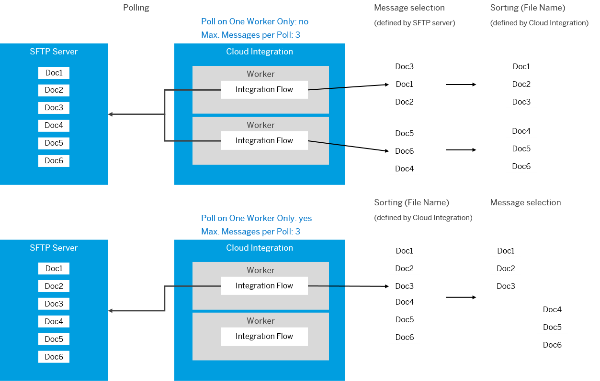

<!-- loio95bb34ab3856474eb6a7bae93160cd0b -->

# Integration Flow Deployed on Multiple Worker Nodes

If the integration flow is deployed on multiple worker nodes, each worker node is connected as separate consumer to the SFTP server.

The setting of parameter *Poll on One Worker Only* has the following impact on how the *Sorting* and the *Max. Messages per Poll* parameters behave at runtime.

-   If *Poll on One Worker Only* is **not** selected, before evaluating the *Sorting* setting, the system determines the maximum number of messages to be read from the SFTP server per poll \(as configured by the *Max. Messages per Poll* parameter\).

    For example, if there are 1000 files on the SFTP server and for *Max. Messages per Poll* you've specified `500`, the SFTP adapter reads the first 500 files from the SFTP server and, after this step, sorts these files according to the Sorting settings.

    If you don’t restrict the polling to one worker, files are processed in parallel. As consequence, you can run into a situation in which messages that are later in the sorting order can overtake other messages which are currently being processed on a different worker. This disturbs the sequence of messages.

-   If *Poll on One Worker Only* is selected, all files will first be sorted and then the messages according to the setting of parameter *Max. Messages per Poll* are selected.

