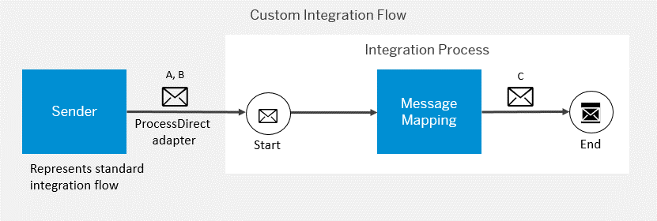

<!-- loio41b238c5331a4b1fbd3a0ccd342b7147 -->

# Integration Flow Extension - Concepts

This section provides an overview of the concepts and components required to implement an extension.

> ### Note:  
> The use cases that we use to explain the concept in detail are all mapping extensions, and we use variations of mapping extensions for our examples and tutorials as well.
> 
> Note that you can, however, extrapolate the concept to any other extension.

<a name="loio41b238c5331a4b1fbd3a0ccd342b7147__section_qyr_kmg_ngb"/>

## Customer Exits

This is the basic concept: A **standard integration flow**, predefined by SAP or an SAP partner as part of a standard integration package, contains one or more customer exits. Through these exits, one or more **customer integration flows** \(designed by the customer who is extending the standard content\) are called. The standard integration flow and the custom integration flows \(called through the customer exit\) have to be deployed on the same tenant.

To support mapping extensions, standard integration flows can provide 2 types of customer exits:

-   Pre-exit

    This exit is only required if the customer needs to extend the source message of the mapping. Using this exit, the standard integration flow calls a **pre-exit integration flow** \(which is designed by the customer\). Within the pre-exit integration flow, the extended source message is mapped to the message that is consumed by the mapping predefined in the standard integration flow.

-   Post-exit

    This exit is always required. It calls a post-exit custom integration flow that maps the output of the standard mapping and the extended source structure to the extended target structure.

The following figure shows the general overview of the message flow when a pre-exit and a post-exit are involved in the extension scenario.

The message flow in such an extension scenario works in the following way:

Let us assume that the mapping predefined in the standard integration flow defines the transformation of an original **message A** to **message B**.

We also assume that the customer has enhanced the source structure of the mapping \(resulting in **message A'**\). The pre-exit integration flow contains a mapping that transforms message A' to message A. Message A is then handed over to the standard integration flow and can be consumed by the predefined mapping.

The predefined mapping transforms message A to message B. Message B is then passed to the post-exit integration flow, where it's mapped against the actual enhancement of the target structure \(defined as **message C**\).

As indicated in the figure, the standard integration flow merges the original message \(with the extended structure, message A'\) with message B before handing it over to the post-exit integration flow. The post-exit mapping then consumes the merged message. Merging the message is a prerequisite for using fields from the original message A' that might have got lost during the standard mapping step in the post-exit mapping.

> ### Note:  
> Technically, the communication between the standard integration flow and the pre-exit and post-exit integration flow is accomplished through the ProcessDirect adapter.
> 
> This adapter allows you to directly connect different integration flows deployed on the same tenant. In contrast to any of the available HTTP-based adapters \( for example, the HTTP or SOAP adapter\), communication through the ProcessDirect adapter is not routed through the load balancer and, therefore, does not imply any network latency.
> 
> The ProcessDirect adapter \(both sender and receiver\) has only 1 parameter, which is *Address*. When 2 integration flows need to communicate with each other through this adapter, the value specified for *Address* \(in the related sender and receiver ProcessDirect adapters\) has to match in both integration flows.
> 
> More information: [ProcessDirect Adapter](processdirect-adapter-7445718.md)

> ### Note:  
> The standard integration flow is developed as part of an integration package that is made available in the Integration Content Catalog \(either by SAP or an SAP partner\). For the sake of simplicity, we refer to this target group as the *integration content publisher*.
> 
> The custom integration flows \(pre-exit and post-exit integration flows\) are developed by customers who want to consume the integration package and build the extension on top. For the sake of simplicity, we refer to this target group as the *customer*.
> 
> Depending on whether the standard integration flow contains both a pre-exit and a post-exit, or only a post-exit, the customer needs to create either 2 integration flows \(a pre-exit and a post-exit integration flow\) or only 1 post-exit integration flow to specify its own extensions.

<a name="loio41b238c5331a4b1fbd3a0ccd342b7147__section_y2z_4fr_wfb"/>

## Structure of the Standard Integration Flow

We first describe the structure of the standard integration flow, and then the structure of the custom \(pre-exit/post-exit\) integration flows.

The standard integration flow that supports mapping extensions is structured in the following way. It contains one or more *customer exits* \(pre-exit or post-exit\). These exits are encapsulated within local integration processes. From the local integration process, the related pre-exit or post-exit integration flow is called by the ProcessDirect receiver adapter.

The following figure shows the general structure of the **standard integration flow** containing both a pre-exit and a post-exit. Furthermore, the message flow is illustrated using the same notation for the different messages as already used above.

The standard integration flow contains a main integration process shape and 2 local integration process shapes \(as we assume that both a pre-exit and a post-exit are involved in this scenario\):

-   The main integration process contains the main business logic \(in this section, we'll just look at a mapping\) and 2 routing steps leading to 2 different message processing paths \(both containing a Process Call step\).

-   The local integration processes contain further steps to modify the message and – most important – the outbound call to a receiver. The receiver represents the pre-exit or post-exit integration flow. The outbound communication with the receiver is defined in a ProcessDirect adapter.

    In the model, the local integration process on the left represents the pre-exit, and the local integration process on the right represents the post-exit.

Let's go into more detail. The integration flow is designed so that the message is processed in the following way at runtime:

**Main Integration Process**

-   The sender system sends a message \(**A', which is the extended source message structure**\) to SAP Integration Suite through a sender channel.

    > ### Note:  
    > If as *Authorization* the option *User Role* is specified in the sender channel, the *User Role* parameter is externalized.
    > 
    > This enables consumers of the standard integration flow to apply their security role concept by providing a custom role for the integration flow.

-   The Content Modifier creates 2 exchange properties:

    -   `custom_extension_enabled`

        This exchange property is used as a parameter to control whether the extension concept should be applied to the standard integration flow or not. If its value is set to `true`, the pre-exit and post-exit integration flows are called. If its value is `false`, the standard mapping is applied without any further extension.

        This parameter is externalized so that the value can be specified during integration flow configuration without the need to edit the integration flow model.

    -   `original_payload`

        In this exchange property, the content of the original message received by the sender is stored \(to make it available in a later step where the original message is merged with the transformed message as preparation for the post-exit mapping step\).

-   The first router step opens 2 alternative processing paths. Which path is processed depends on the routing condition, which uses the exchange property `custom_extension_enabled` defined in the preceding Content Modifier.

    -   If the value of the property `custom_extension_enabled` is `false`, the default route \(upper path\) is taken.

        The default route directly leads to the standard mapping.

    -   If the value of the property `custom_extension_enabled` is `true`, the 2nd route \(lower path\) is taken. This route contains a Process Call step that passes the message to the local integration process on the left \(pre-exit\).

        This route is processed under the condition that the value of the exchange property `custom_extension_enabled` is `true`.

-   The mapping step transforms the inbound message to the target message **B**. The mapping step in this integration flow contains the standard mapping predefined by SAP or an SAP partner. This step always expects a predefined original message structure \(message A\). If the customer has extended the source structure \(to message A'\), the message needs to be processed by the pre-exit before the standard mapping step, to be transformed to the original structure A \(as already explained above\).

-   The subsequent router step also opens 2 alternative processing paths, using the same routing condition as the first router step \(using the exchange property `custom_extension_enabled` defined in the Content Modifier\).

    -   If the value of the property `custom_extension_enabled` is `false`, the default route \(upper path\) is taken.

        The default route now ends message processing. In this case, the message isn't subjected to any further processing other than the standard mapping.

    -   If the value of the property `custom_extension_enabled` is `true`, the 2nd route \(lower path\) is taken. This route contains a Process Call step that passes the message to the local integration process on the right \(post-exit\).

**Local Integration Process \(Pre-Exit\)**

If the message is first handed over to the local integration process with the pre-exit, the following steps are executed on the message:

A Request-Reply step calls a receiver \(which represents the pre-exit integration flow\) through a ProcessDirect receiver adapter.

The address of the ProcessDirect adapter is externalized and can be configured during integration flow configuration. The customer needs to make sure that the address of the ProcessDirect receiver adapter \(of the standard integration flow\) is the same as the one used in the ProcessDirect sender adapter of the pre-exit integration flow \(to be connected\).

**Local Integration Process \(Post-Exit\)**

If the message is first handed over to the local integration process with the post-exit, the following steps are executed on the message:

-   A Content Modifier constructs a message body that is composed of the following 2 parts:

    -   The original payload received from the sender \(contained in the `original_payload` exchange property created in the Content Modifier of the main integration process\)

        \(message **A'** in the figure\)

    -   The message that results as output from the Mapping step in the main process

        \(message **B** in the figure\)

    With this step, the original payload from the sender system \(**A'**\) is merged with the output message \(**B**\) resulting from the standard mapping step. The *concatenated* message is denoted as message **A',B**.

    This measure is required for the following reason: The standard mapping step transforms the original message into a new one \(**B**\), which means that certain fields from the original message \(**A**\) may no longer be available in the resulting message **B**. However, the customer requires such fields in the custom mapping step \(which is executed in the custom integration flow, as explained below\). The message merge is done in order to make sure that all fields of the original message are still available in the message that is handed over to the post-exit integration flow.

-   A Request-Reply step calls a receiver \(which represents the post-exit integration flow\) through a ProcessDirect receiver adapter.

    The address of the ProcessDirect adapter is externalized and can be configured during integration flow configuration. The customer needs to make sure that the address of the ProcessDirect receiver adapter \(of the standard integration flow\) is the same as the one used in the ProcessDirect sender adapter of the post-exit integration flow \(to be connected\).

<a name="loio41b238c5331a4b1fbd3a0ccd342b7147__section_ujk_cgr_wfb"/>

## Structure of the Pre-Exit and Post-Exit Integration Flows \(Designed by Customer\)

The following figure shows the general structure of a pre-exit or post-exit integration flow.

-   The sender shape represents the standard integration flow, which passes on the original message. The sender component is connected to the integration process component through a ProcessDirect sender adapter.

-   Detailed instructions about the mapping are provided in a separate topic. In short, the mapping steps in the pre-exit and the post-exit integration flow process the inbound message in the following way:

    -   Pre-exit mapping: Transforms the extended source message **A'** into the original message **A**, which can be consumed by the standard mapping.

    -   Post-exit mapping: Transforms the message **A', B** from the standard integration flow into the final message **C**.

<a name="loio41b238c5331a4b1fbd3a0ccd342b7147__section_kq3_rlr_wfb"/>

## Procedure

The following list contains the main tasks in an integration flow extension process:

**Tasks accomplished by the content publisher \(SAP or SAP partner\):**

Create and publish the standard integration flow. Make sure that it contains the required customer exits \(post-exit and, if applicable, pre-exit point\). Externalize those parameters that the customer needs to configure the required parameters \(for example, the addresses of the involved ProcessDirect adapters\) without changing the standard integration flow.

**Tasks accomplished by the customer** \(extending the content\):

> ### Note:  
> It is a prerequisite that you, the customer, have imported the integration package that contains the standard integration flow \(that is to be extended\) into your own workspace.

1.  Copy the desired standard integration flow \(as contained in the Integration Content Catalog\) into your own workspace.

2.  Create the required custom integration flows \(with the pre-exit and post-exit steps\).

    Make sure you deploy the custom integration flows on the same tenant as the standard integration flow.

3.  Configure the standard integration flow so that it can be used together with the custom integration flows.

    To access the configuration user interface with the externalized parameters, open the standard integration flow and select *Configure*.

    Examples:

    -   For the *custom\_extension\_enabled* parameter, enter the value `true`.

    -   For the *Address* parameter of the ProcessDirect receiver adapter, enter the same value as used in the *Address* field of the custom integration flow's ProcessDirect sender adapter.

**Related Information**  

[ProcessDirect Adapter](processdirect-adapter-7445718.md "Use ProcessDirect adapter (sender and receiver) to establish fast and direct communication between integration flows by reducing latency and network overhead provided both of them are available within a same tenant.")

[Configure Externalized Parameters of an Integration Flow](configure-externalized-parameters-of-an-integration-flow-462a478.md "")

[Define Process Call](define-process-call-cf0251e.md "")

[Define Local Integration Process](define-local-integration-process-520341a.md "You use the local integration process to simplify your integration process. You can break down the main integration process into smaller fragments by using local integration processes. You combine these fragments to achieve your main integration process.")

[Define Content Modifier](define-content-modifier-8f04a70.md "")

