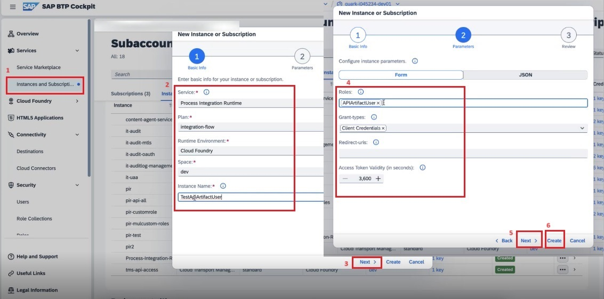
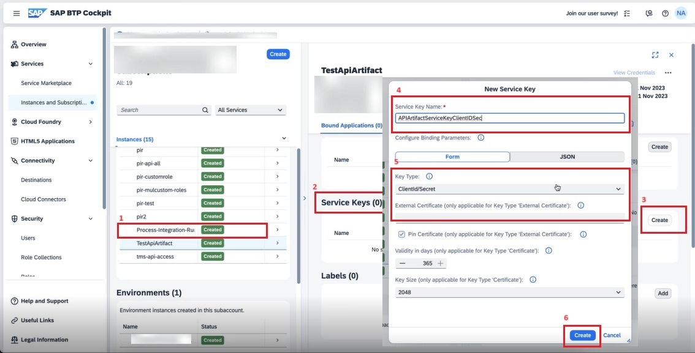
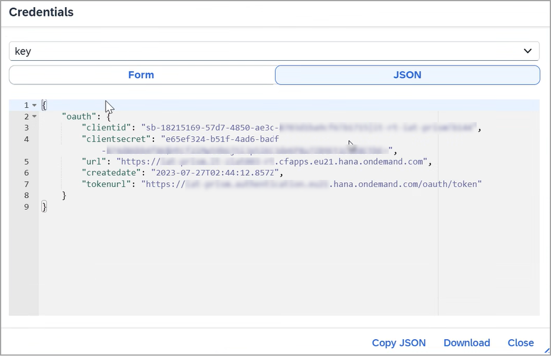

<!-- loiob63baa26290948e68fedabc10b35f33d -->

# Invoke an API Artifact by Obtaining API Credentials through Process Integration Runtime

To invoke an API artifact via a REST client, you'll need authentication credentials, which are generated by creating a Process Integration Runtime instance.

## Context

There are three supported authentication mechanisms, which can be set in authentication policy:

-   **Basic**: Basic authentication validates the client using a username and password. These credentials are checked against the identity provider. This method is typically used for lightweight authentication scenarios, such as development or test environment validation.

-   **OAuth**: OAuth 2.0 Bearer Token authentication involves token validation using either SAP BTP XSUAA or external identity providers such as Azure AD or Okta. This method supports both the Client Credentials Grant and Authorization Code Grant flows. It is ideal for secure and scalable authentication in production API environments.

-   **Client Certificate**: Client Certificate Authentication validates the client using an X.509 certificate. It is commonly used in high-security environments or for business-to-business \(B2B\) integrations.

    > ### Note:  
    > If you're using OAuth or Client Certificate authentication, you must configure the Process Integration Runtime instance and authenticate using either the client ID and secret or a certificate associated with that instance to access the API endpoint.

You can choose the authentication mechanism that best fits your security requirements.

To obtain the credentials for invoking API artifact endpoint, perform the following steps:

## Procedure

1.  In SAP BTP cockpit, choose *Instances and Subscription*.

2.  Create a *Process Integration Runtime* instance:

    1.  In the SAP BTP Cockpit, go to the *Subaccount* section. From the left-hand menu, select *Instances and Subscriptions* under the *Service Marketplace*.

    2.  Choose *Create*.

    3.  Fill in the following details on the *New Instances and Subscriptions* dialog:

        Fill in the *Basic Info*.

        -   Select **Service** as `Process Integration Runtime`.

        -   Choose **Plan** as `integration-flow`.

        -   Set the **Runtime Environment** to `Cloud Foundry`.

        -   Select the **Space** \(e.g., `dev`**\).

        -   Enter an **Instance Name** \(e.g., `TestApiArtifactUser`\).

    4.  Choose *Next*.

    5.  Fill in the *Parameters*.

        -   Under **Roles**, add `APIArtifactUser`**.

            > ### Note:  
            > The default role assigned is ESBMessaging.send. However, as illustrated in the screenshot below, you can create a custom role and assign it to the instance.

        -   For **Grant types**, select `Client Credentials`.

        -   Set **Access Token Validity** as desired \(e.g., `3600` seconds\).

            

    6.  Choose *Next*.

    7.  Review the configuration details and choose *Create*.

        The *Process-Integration-Runtime* instance gets created.

3.  Create a *Service Key* associated with the Process Integration Runtime service instance that you just created:

    1.  Select the instance named **Process-Integration-Runtime** from the list of instances

    2.  Scroll to or locate the **Service Keys** section within the selected instance and choose *Create*.

    3.  Enter the following details:

        -   Enter a **Service Key Name** \(e.g., `APIartifactServiceKeyClientIDSeq`\).

        -   Under **Key Type**, select **ClientId/Secret** from the dropdown menu if your authentication mechanism is *OAuth*.

            If you are using a *Client Certificate* as the authentication mechanism, select either *Certificate* or *External Certificate* as the key type.

        -   Choose the **Create** button at the bottom to generate the new service key.

            

4.  You can now copy the service keys **client ID**, **client secret** and the **tokenurl** for the Process Integration Runtime service instance in your REST client to execute the API artifact and access the endpoint.

    

