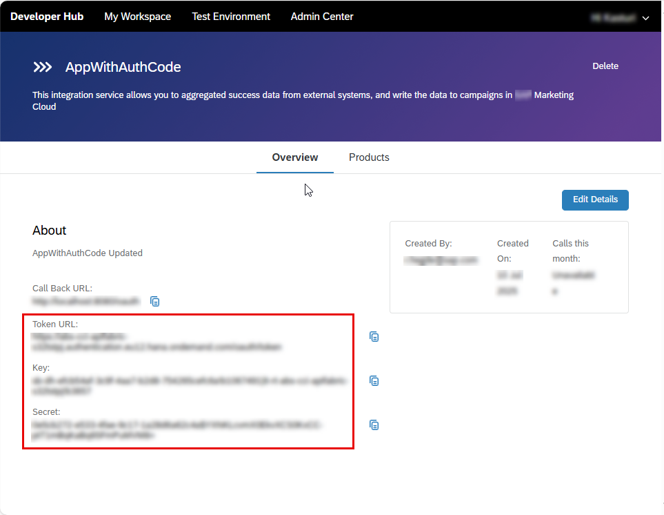

<!-- loioe79810fc92d64c60981cef394c219fb8 -->

# Invoke an API Artifact by Obtaining Credentials via Developer Hub

To invoke an API artifact, you need to obtain the credentials from the subscription for application you created when subscribing to a product in Developer Hub.

<a name="loioe79810fc92d64c60981cef394c219fb8__prereq_nls_54p_42c"/>

## Prerequisites

The *AuthGroup.API.ApplicationDeveloper* role collection must be assigned to you.

The content administrator has already added the API artifact to a product and have published the product. For more information, see [Discover and Publish APIs from SAP Integration Suite on Developer Hub](https://help.sap.com/viewer/6afa6d14ff6d4006b5614676722ef006/CLOUD/en-US/81b3323c0e9840a39020db6925f6e962.html "To make SAP Integration Suite API artifacts publicly available in Developer Hub, organize and categorize them by creating dedicated products. First, discover the APIs from SAP Integration Suite business systems. Then, add these discovered APIs to a product and publish the associated product in the catalog.") :arrow_upper_right:.

## Context

To obtain the necessary credentials:

## Procedure

1.  Log on to Developer Hub.

2.  Subscribe to the product that contains the API artifact you want to invoke using a REST client. For more information see, [Subscribe to Consume the APIs](https://help.sap.com/viewer/6afa6d14ff6d4006b5614676722ef006/CLOUD/en-US/f74f47d2b2944f9dbc645bc179e2d4e1.html "As an application developer, you need to subscribe to a product to consume the APIs within it. As part of the subscription process, you can either create a new application and add the product to it, or add the product to an existing application.") :arrow_upper_right:.

3.  Once the subscription is created, go to the *Overview* tab of your application.

    You will find the *Key*, *Secret*, and *Token URL*, which are used to generate the JWT token required to invoke the API artifact.

    

<a name="loioe79810fc92d64c60981cef394c219fb8__postreq_obg_zsp_hgc"/>

## Next Steps

1.  Copy the *Key*, *Secret* and *Token URL*.

2.  Open your REST client.

3.  Use the credentials to invoke the API artifact by including them in the appropriate headers or authentication fields.

