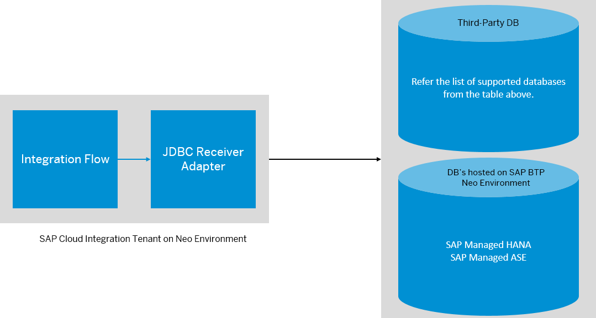

<!-- loio88be64412f1b46d684dfba11f2767c5b -->

# JDBC Receiver Adapter

The JDBC \(Java Database Connectivity\) adapter enables you to connect Cloud Integration to cloud or on-premise databases.

Use the JDBC receiver adapter in your integration flow to establish a connection with SAP-managed and third-party databases. Before deploying the integration flow, you’re required to do the following to establish connection with the database:

-   Your Tenant Administrator has uploaded and deployed JDBC drivers. For more information, see [Configure JDBC Drivers](configure-jdbc-drivers-77c7d95.md).

-   Create a Data Source, to access the database, based on the uploaded JDBC driver. For more information, see [Managing JDBC Data Sources](managing-jdbc-data-sources-4c873fa.md).

-   If you're connecting to on-premise database, then you must validate the connection in the Cloud Connector. For more information, see [Configure Access Control](https://help.sap.com/viewer/cca91383641e40ffbe03bdc78f00f681/Cloud/en-US/f42fe4471d6a4a5fb09b7f3bb83c66a4.html).

-   Configure the JDBC adapter to communicate with your database based on the environment that hosts your tenant.


> ### Note:  
> In the following cases certain features might not be available for your current integration flow:
> 
> -   You are using a product profile other than the one expected \(see [Updating your Existing Integration Flow](updating-your-existing-integration-flow-1f9e879.md)\).
> 
> -   A feature for a particular adapter or step was released after you created the corresponding shape in your integration flow \(see [Product Profiles](product-profiles-8007daa.md)\). To use the latest version of a flow step or adapter, edit your integration flow, delete the flow step or adapter, add the step or adapter, and configure the same. Finally, redeploy the integraion flow.

> ### Note:  
> This adapter exchanges data with a remote component that might be outside the scope of SAP. Make sure that the data exchange complies with your company’s policies.

The JDBC receiver adapter uses XML SQL Format message protocol. The adapter performs operations such as read, write, update, or delete database entries. For more information on modifying or structuring the content of the message payload, see [Defining XML Documents for Message Protocol XML SQL Format](https://help.sap.com/viewer/5cf7d2de571a45cc81f91261668b7361/7.5.4/en-US/2e96fd3f2d14e869e10000000a155106.html).

> ### Note:  
> -   UPSERT operation is currently not supported for XML SQL format. It’s recommended to use stored procedure to update an existing record. If the record doesn’t exist, then use INSERT.
> 
> -   Deploy the public certificate in the keystore of your Cloud Integration tenant for verifying the response.
> 
> -   While executing direct SQL queries, it’s recommended to use standard stored procedure method to read XML files.
> 
> -   Standard PI XML format is supported. But the PI XML doesn’t allow function calls to PostgreSQL server.

To try out a simple demo, visit the [blog](https://blogs.sap.com/2019/02/19/cloud-integration-a-simple-demo-scenario-using-the-jdbc-adapter/).


<a name="loio88be64412f1b46d684dfba11f2767c5b__JDBC_DataSources_URL_Pattern"/>

## Supported Databases

The following table lists the databases currently supported for Neo or Cloud Foundry tenants.


<table>
<tr>
<th valign="top">

Database supported for Neo and Cloud Foundry


</th>
<th valign="top">

Database supported for Neo only


</th>
</tr>
<tr>
<td valign="top">

-   [DB2](jdbc-for-db2-on-premise-9515cf8.md)
-   [Microsoft SQL Server \(Cloud\)](jdbc-for-microsoft-sql-server-cloud-4173d0a.md)
-   [Microsoft SQL Server \(On-Premise\)](jdbc-for-microsoft-sql-server-on-premise-9745e40.md)
-   [Oracle \(Cloud\)](jdbc-for-oracle-cloud-f868182.md)
-   [Oracle \(On-Premise\)](jdbc-for-oracle-on-premise-e6db38a.md)
-   [PostgreSQL \(Cloud\)](jdbc-for-postgresql-cloud-4d5b488.md)
-   [SAP HANA \(Cloud\)](jdbc-for-sap-hana-cloud-187a8e8.md)
-   [SAP HANA Platform \(On-Premise\)](jdbc-for-sap-hana-platform-on-premise-ff29388.md)


</td>
<td valign="top">

-   [SAP ASE Service \(Neo\)](jdbc-for-sap-ase-service-neo-a6271cc.md)
-   [SAP HANA Service \(Neo\)](jdbc-for-sap-hana-service-neo-030e47e.md)


</td>
</tr>
</table>


<a name="loio88be64412f1b46d684dfba11f2767c5b__section_qp3_rtw_nnb"/>

## Using the JDBC Adapter, Neo Environment

The following diagram shows how the JDBC adapter communicates with an HANA or ASE database that are managed by SAP.


The following diagram shows the supported the databases for Cloud Integration tenants hosted on Neo Environment:




### Generating Access Token for JDBC Data Source

You need to generate tokens for newly deployed JDBC Data Source artifacts for an HANA or ASE database. If the artifacts already exist, reuse the token until there is at least one artifact deployed for the database and you can’t generate new tokens for an existing JDBC Data Source. In case you undeployed the last artifact, you need to generate a new token for a new artifact for the specific database. Use the following command to list all grants for the specified schema:

> ### Source Code:  
> ```
> neo list-schema-access-grants --account owner --host hanatrial.ondemand.com --user myuser --id schema1
> ```

For more information on allowing access and to generate a one-time access token that permits the requesting application to access your schema from its subaccount, see [Grant Access to Schemas](https://help.sap.com/viewer/d4790b2de2f4429db6f3dff54e4d7b3a/Cloud/en-US/a3142222d2cb40b0b473f53855f571b0.html). To list all current schema access grants for a specified subaccount, see [list-schema-access-grants](https://help.sap.com/viewer/65de2977205c403bbc107264b8eccf4b/Cloud/en-US/371711d0c46347429a6aa69147e892fc.html).


## Using the JDBC Adapter, Cloud Foundry Environment

You’ve a Cloud Integration tenant hosted on a Cloud Foundry or multi-cloud environment that needs access to the on-premise \(SQL server\) or cloud databases provided "as-a-service" managed by third-party vendors.

By configuring the JDBC adapter you can connect to these databases. In addition, the adapter supports connection to a relational database type that provides an easy access point to connect with another databases. Use Amazon Relational Database Service \(Amazon RDS\) for accessing and managing the following databases:

-   PostgreSQL

-   Microsoft SQL

-   Oracle


> ### Note:  
> SAP-managed databases such as HANA and ASE aren’t supported in a multi-cloud environment. As an alternative, you can connect with SAP HANA Cloud database supported by AWS tenants hosted in the Cloud Foundry environment.

The following diagram shows the supported the databases for Cloud Integration..


### Connection

After adding the JDBC receiver adapter step in your integration flow, set up the connection based on the description mentioned in the table:

**Configure the Connection Details as Per the Description**


<table>
<tr>
<th valign="top">

Field


</th>
<th valign="top">

Description


</th>
</tr>
<tr>
<td valign="top">

*JDBC Data Source Alias*


</td>
<td valign="top">

Enter the name of the data source, which is created to establish the connection to your preferred database. For more information, see [Managing JDBC Data Sources](managing-jdbc-data-sources-4c873fa.md).

> ### Note:  
> -   Deployment of JDBC Data Source fails if you have heterogeneous cluster setup, that is the cluster setup must be configured with the same product profiles combination of different product profiles aren’t supported.
> 
> -   You can use the same JDBC Data Source in different integration flows configured with JDBC adapter. But you can’t use the same JDBC Data Source to configure multiple JDBC adapters within an integration flow. You need to deploy two JDBC Data Source artifacts with different names for the same database and use them in the integrations flows having multiple JDBC adapters.


</td>
</tr>
<tr>
<td valign="top">

*Connection Timeout \(in s\)*


</td>
<td valign="top">

Provide a connection timeout, in seconds, to define how long the adapter waits for a server response before the connection retry is terminated.


</td>
</tr>
<tr>
<td valign="top">

*Query/Response Timeout \(in s\)*


</td>
<td valign="top">

Provide a query timeout, in seconds, to define the waiting duration for receiving a query response. After the elapsed time, the adapter stops waiting for response.


</td>
</tr>
<tr>
<td valign="top">

*Maximum Records*


</td>
<td valign="top">

Determine a value to display the maximum number of fetched records.


</td>
</tr>
<tr>
<td valign="top">

*Batch Mode*


</td>
<td valign="top">

This enables you to process collection queries in a single request. For more details, see [Batch Payload and Operation](batch-payload-and-operation-760b267.md).


</td>
</tr>
<tr>
<td valign="top">

*Batch Operation*

\(only available if *Batch Mode* is selected\)


</td>
<td valign="top">

Choose the behavior of batch operation. For more details, see [Batch Payload and Operation](batch-payload-and-operation-760b267.md).


</td>
</tr>
</table>

