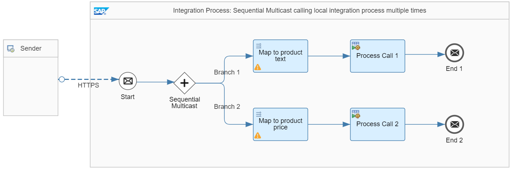
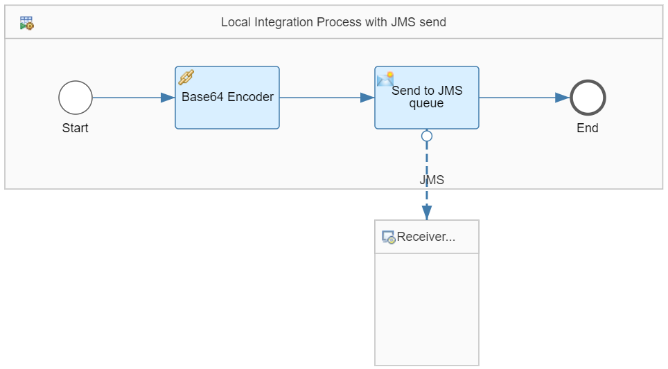
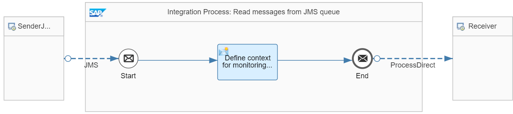

<!-- loioa5644c89003c4960aaa5bbe16ba8b1bb -->

# JMS Send Step in Local Integration Process

In this scenario, multiple messages are sent to a JMS queue and the data has to be updated consistently across all JMS write operations.

The same integration flow steps need to be carried out for all messages. Therefore, a local integration process is used for reasons of better reusability. This scenario is illustrated with the *Transaction Handling – Multicast With JMS Send* integration flow.

> ### Note:  
> As a prerequisite, deploy the *Generic Receiver* integration flow. You can find the *Generic Receiver* integration flow in the same package that contains the sample integration flow.

The integration flow contains 3 integration processes:

-   A main integration process with a sequential multicast calling the local integration process multiple times

-   A local integration process with a JMS send step

-   An integration process reading the processed messages from the queue and passing them to the generic receiver \(so that the messages are finally stored in the data store\)

<a name="loioa5644c89003c4960aaa5bbe16ba8b1bb__section_n2r_k2w_w4b"/>

## Main Integration Process

The multicast integration process is defined in the following way.

The process performs the following steps:

1.  It receives product information.

2.  A *Sequential Multicast* step splits the process into 2 branches.

    1.  In the first branch, only the product text information is passed to the local integration process.

    2.  In the second branch, the product price information is passed to the local integration process.

3.  Like in the [Splitter with Multiple Receivers \(JMS Adapter Type\)](splitter-with-multiple-receivers-jms-adapter-type-fc2755c.md) scenario,a format transformation is performed for the product price mapping. That way, a message processing error can easily be forced \(source price value isn't a number\).

You need a a transaction handler to ensure overall data consistency. In this case, the *Required for JMS* option is selected \(in the *Processing* tab when the *Integration Process* shape is selected\).

<a name="loioa5644c89003c4960aaa5bbe16ba8b1bb__section_wcr_l2w_w4b"/>

## Local Integration Process with JMS Send

The local integration process *Local Integration Process with JMS send* is defined in the following way:

The local integration process performs the following steps:

1.  The message that is passed over from the main integration process is base64-encoded.

2.  A *Send* step transfers the encoded message to a JMS queue using the JMS receiver adapter.

For the local integration process, the *From Calling Process* transaction handling setting is selected. This setting makes sure that the operations in the local subprocess are carried out within the same transaction of the overall process ensuring data inconsistency.

<a name="loioa5644c89003c4960aaa5bbe16ba8b1bb__section_h1s_l2w_w4b"/>

## Integration Process: Read Messages from JMS Queue

The *Integration Process: Read messages from JMS queue* integration process is defined like in the [Splitter with Multiple Receivers \(JMS Adapter Type\)](splitter-with-multiple-receivers-jms-adapter-type-fc2755c.md) scenario.

The integration process reads all messages from the JMS queue and forwards them to the *Generic Receiver*. This integration flow finally stores the messages in the data store called *TransactionHandling-MultipleSend*.

<a name="loioa5644c89003c4960aaa5bbe16ba8b1bb__section_vtc_khw_w4b"/>

## Executing the Scenario

If you use Postman together with the Postman collection provided with the integration package, expand the `TransactionHandling` collection folder. You will see subfolders for each scenario described as part of the guidelines. For the current scenario, expand the `MulticastWithJMSSend` folder. You will see three requests.

Since the integration flows are all CSRF-protected, you first need to run the HEAD request to fetch a token before posting the actual data.

Each POST request contains a sample product file.

If you run the `MulticastWithJMSSend_withoutError` POST request, message processing runs successfully. You find a new data store *TransactionHandling-MultipleSend* with two new entries, one holding the product text, the other the product price \(using the *Monitor* application and selecting the *Data Stores* tile under *Manage Stores*\).

Before running the 2nd POST request `MulticastWithJMSSend_withError`, delete the data store entries. If you send the request, the mapping to the price field leads to an error. Since the transaction handler is selected, no messages are written to the JMS queue, and therefore no new entries are written to the data store.

Optionally, you can run another test without a transaction handler. To do this, you need to modify the provided integration flow. Switch to Edit mode, change the transaction handler of the main process to *Not Required*, save, and redeploy the integration flow. Rerun the `MulticastWithJMSSend_withError` POST request. Now, you can see a new entry in the data store, actually the product text.

