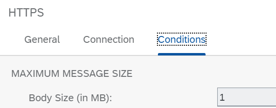
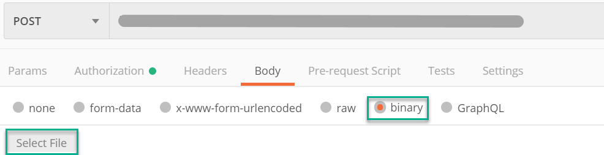

<!-- loio8319e33855724b7984a0d8a2bbef6b11 -->

# Limit Size of Incoming Messages

Limit the size of incoming messages to run the integration flow under well-defined boundary conditions.

Controlling incoming traffic isn't only the task for an external component such as a load balancer, but the integration flow itself must also be able to handle it appropriately.

Many inbound adapters in SAP Integration Suite , including all HTTP-based adapters, allow you to block processing of messages that exceed a certain size.

More information: [How to Guard Against Huge Messages](https://blogs.sap.com/2017/06/29/how-to-guard-against-huge-messages/) \(SAP Community blog\)

<a name="loio8319e33855724b7984a0d8a2bbef6b11__section_z1s_gsj_tkb"/>

## Implementation

To illustrate this rule, you can test the *Manage Resources - Limit Size Incoming Messages* integration flow.

This integration flow simply forwards the inbound message \(received from the HTTP client\) to the generic receiver.

In the HTTPS sender adapter, the *Body Size* parameter \(tab *Conditions*\) has been set to 1 MB.

When configuring your Postman request, you can set a large message by attaching a file with a significant size. To do that, select *binary* in Postman and browse for a large file on your computer.

If the message size exceeds 1 MB, the integration flow sends back the error message `Message body exceeds configured size limit (1.0 MB)...`. The subsequent steps of the integration flow are not executed.

