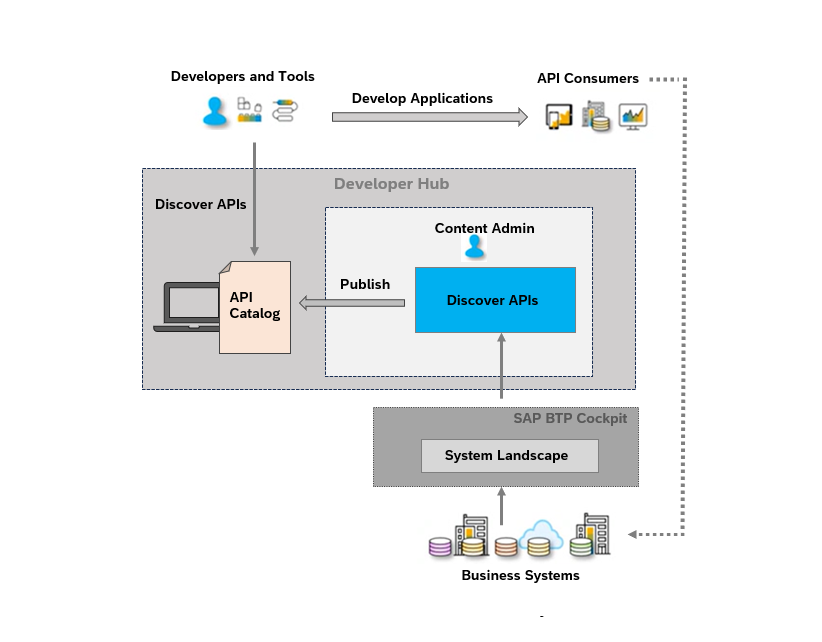

<!-- loio4b89a8b4d0f54797aca4a9e951be7d90 -->

# Manage Content

As a content administrator, you can create products that includes APIs from different business systems and manage the content that application developers can view on the catalog.

To illustrate the benefits of this feature, let's consider an example. Imagine you work for XYZ company and you are tasked with building an application. To accomplish this, you need to utilize APIs such as the sales order or CRM APIs from S4HANA, payroll APIs from SuccessFactors, and marketing solution APIs from SAP Marketing Cloud. Using this feature you can enhance the extensibility of these APIs and leverage them to build your application and address any challenges you encounter.

The block diagram illustrates the process of adding and registering business systems in the System Landscape within Business Technology Platform \(BTP\). Once a business system is added and registered, it can be found in Developer Hub. To discover the APIs within these systems, the content admin creates products and publishes them, making the products visible in the catalog. They can incorporate pertinent API documentation and ensure that this catalog is readily available to developers. Once they appear in the catalog, developers can explore and utilize these APIs to develop applications.

To achieve these objectives, your *Global Account Administrator* needs to register these systems in your system landscape. This action establishes a connection between the SAP system and SAP BTP. Following system registration, these systems appear on the *Manage Content* page in Developer Hub. For more information, see [Discover APIs within Integration Suite from Various Business Systems](discover-apis-within-integration-suite-from-various-business-systems-0cea56f.md).

> ### Note:  
> At present, you can only register and add S/4 HANA Cloud business systems.

