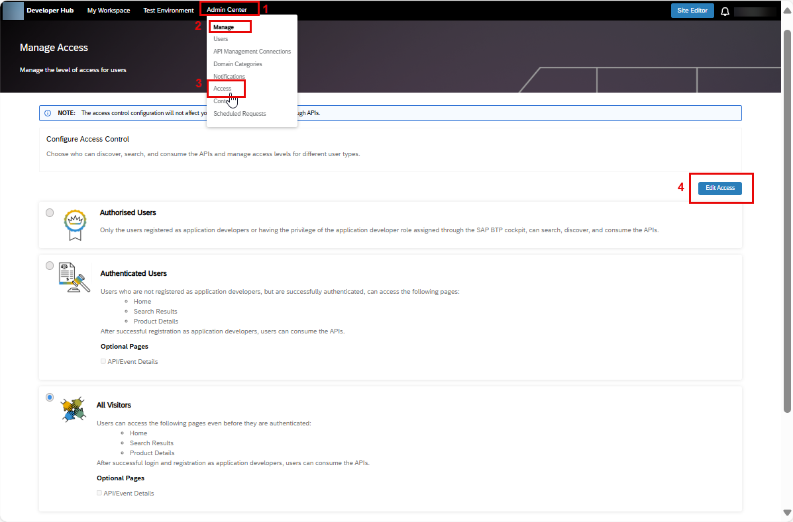

<!-- loio9df3ecea96b34c5a92ff67d6188470b9 -->

# Manage Developer Access

As a Developer Hub admin, you have the authority to control the level of access for your users, allowing them to search, discover, and access the content available on Developer Hub.

<a name="loio9df3ecea96b34c5a92ff67d6188470b9__prereq_wrk_nrx_nyb"/>

## Prerequisites

You need the following role to configure the access control checks:

-   *AuthGroup.API.Admin* 

    To assign this role, see [Assigning Role Collections to Users](../assigning-role-collections-to-users-80bb02e.md) .

> ### Note:  
> The **Manage Access** feature is available only in the new design of Developer Hub on the Cloud Foundry environment.

<a name="loio9df3ecea96b34c5a92ff67d6188470b9__context_wsd_mrx_nyb"/>

## Context

In Developer Hub, managing access for different users is important for several reasons like improving user productivity, resource optimization, privacy, and security.

User productivity is enhanced by granting users the appropriate access to carry out their tasks efficiently, without being overwhelmed by unnecessary information or resources. In this context, the **All Visitors** option allows anyone, whether logged in or not, to view the APIs without requiring authentication. However, the ability to consume the APIs still depends on obtaining the necessary developer role.

Moreover, by managing access, you can provide access to **Authenticated Users** who do not have a designated role, allowing them to access different pages of Developer Hub based on their specific needs. This facilitates broader exploration and enables users to familiarize themselves with the available resources. Nevertheless, the ability to consume the APIs still relies on obtaining the necessary developer role.

To maintain privacy and security, you can grant access to**Authorized Users** who are logged in and possess the required developer role. This ensures that only authorized individuals can seamlessly access and consume the APIs while upholding privacy and security measures.

> ### Note:  
> Access to the Developer Hub content using the API access plan is not affected by these permissions.

> ### Note:  
> As an administrator of Developer Hub, please note that when you update these permissions, it may take up to 5 minutes for the changes to be applied for other users of Developer Hub.

<a name="loio9df3ecea96b34c5a92ff67d6188470b9__steps_x4n_ksx_nyb"/>

## Procedure

1.  Log on to **Developer Hub**.

2.  Choose *Admin Center* \> *Manage Access* from the top navigation bar.

    

3.  Choose *Edit Access* to manage the level of access for different kinds of users.

    Select the appropriate permission from the following list:

    -   *Authorised Users*: These are the users who are registered as application developers or have the privilege of the application developer assigned through the SAP BTP cockpit. They can search, discover, and consume the contents of this Developer Hub application.

        > ### Note:  
        > By default, the option for *Authorised Users* is selected. However, you have the flexibility to change it to either *All Visitors* or *Authenticated Users*, depending on your specific requirements.

    -   *Authenticated Users*: These users are not registered as application developers but are successfully authenticated by the Developer Hub application and can access the following pages:

        -   Home

        -   Search results

        -   Product Details

        Optionally, you can select the *API Details* checkbox to provide access to the *API Details* page as well.

    -   *All Visitors*: These are the users who can visit the following pages even before they are authenticated by the Developer Hub application, that is without logging in to the Developer Hub application:

        -   Home

        -   Search results

        -   Product Details

        Optionally, you can select the *API Details* checkbox to provide access to the *API Details* page as well.

4.  Choose *Save* after providing the required permission.

