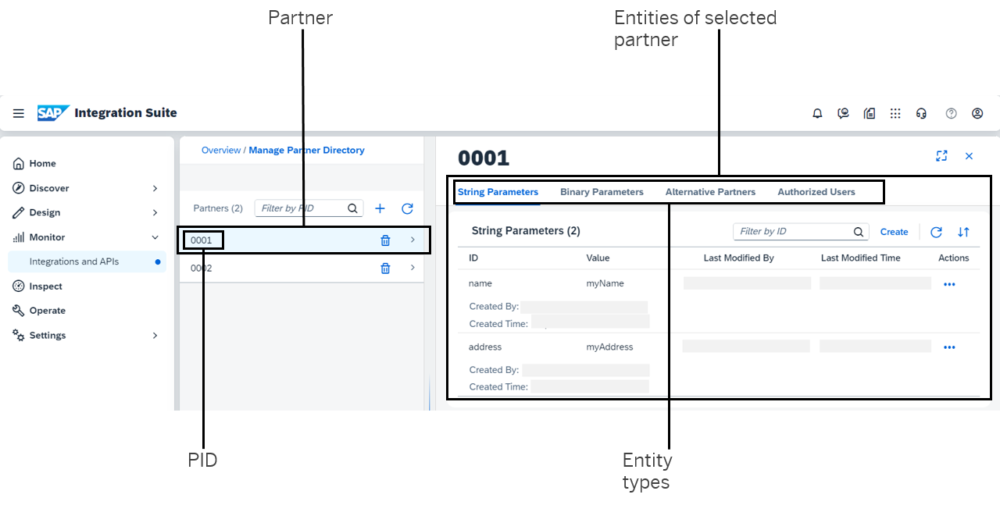

<!-- loio3d6eee7b9e40454c8af1708dac37ea3c -->

# Managing Partner Directory Entries

Manage Partner Directory entries that can be used to parameterize integration flows.

The Partner Directory facilitates the management of integration scenarios encompassing communication networks with numerous partners. In these scenarios, integration flows are parameterized with partner-specific parameters that are centrally stored in the Partner Directory. At runtime, integration flows can read information from the Partner Directory, based on the partner-specific values contained in the incoming request or the payload of the inbound message. This *dynamic* usage of integration flow parameters provides the advantage of adding new partners to the network without the need to edit and redeploy any integration flow, allowing for the extension of the business partner network without any downtime of the scenario.

> ### Tip:  
> Integration flows can access data from the Partner Directory through actions like the Script step.
> 
> For more comprehensive details on the concept and entities stored in the Partner Directory, see [Parameterizing Integration Flows Using the Partner Directory](parameterizing-integration-flows-using-the-partner-directory-b7812a5.md)
> 
> To view examples of integration flows using the Partner Directory, consult the integration flow design guidelines at [Use the Partner Directory Appropriately](use-the-partner-directory-appropriately-6e00412.md).
> 
> You can also use the Cloud Integration OData API to create, edit, and display the content of the Partner Directory \(see: [Partner Directory](partner-directory-0fe80dc.md)\).

With this feature, you can manage the contents of the Partner Directory by creating new entries, as well as editing and deleting existing ones.

To access the Partner Directory:

1.  Navigate to *Monitor* \> *Integrations and APIs*.

2.  Choose *Partner Directory*.

    If partners are defined, the screen displays a master table featuring the list of partners.

3.  Clicking on a partner in the list reveals the entities defined for the partner in another table on the right.

<a name="loio3d6eee7b9e40454c8af1708dac37ea3c__section_nlb_1dy_rcc"/>

## Screen Components

Each partner is identified by a partner ID \(*PID*\). When a partner is selected, different entity types are accessible through different tabs in the second table. For each entry, administrative information is displayed, including the user who created and modified the entry, and the timestamp of the entry's creation or last modification. Depending on the entity type, additional attributes are displayed for an entry \(see: [Partner Directory Entity Types](partner-directory-entity-types-950f4b2.md)\).

<a name="loio3d6eee7b9e40454c8af1708dac37ea3c__section_s1d_zcy_rcc"/>

## Functions

The following operations can be performed on partners and partner entities:

****

<table>
<tr>
<th valign="top">

Object

</th>
<th valign="top">

Operation

</th>
<th valign="top">

More Information

</th>
</tr>
<tr>
<td valign="top" rowspan="2">

Partner

</td>
<td valign="top">

Add

</td>
<td valign="top">

[Add Partner](add-partner-414b97d.md) 

</td>
</tr>
<tr>
<td valign="top">

Delete

</td>
<td valign="top">

[Delete Partner](delete-partner-83a9bfd.md) 

</td>
</tr>
<tr>
<td valign="top" rowspan="4">

Partner entity \(such like string parameter, binary parameter, alternative partner, or authorized user\)

</td>
<td valign="top">

Create

</td>
<td valign="top">

[Create Partner Directory Entity](create-partner-directory-entity-f41418f.md) 

</td>
</tr>
<tr>
<td valign="top">

Edit

</td>
<td valign="top">

[Edit Partner Entity](edit-partner-entity-858af76.md) 

</td>
</tr>
<tr>
<td valign="top">

Copy

</td>
<td valign="top">

[Copy Partner Entity](copy-partner-entity-d110a04.md) 

</td>
</tr>
<tr>
<td valign="top">

Delete

</td>
<td valign="top">

[Delete Partner Entity](delete-partner-entity-25aed52.md) 

</td>
</tr>
</table>

