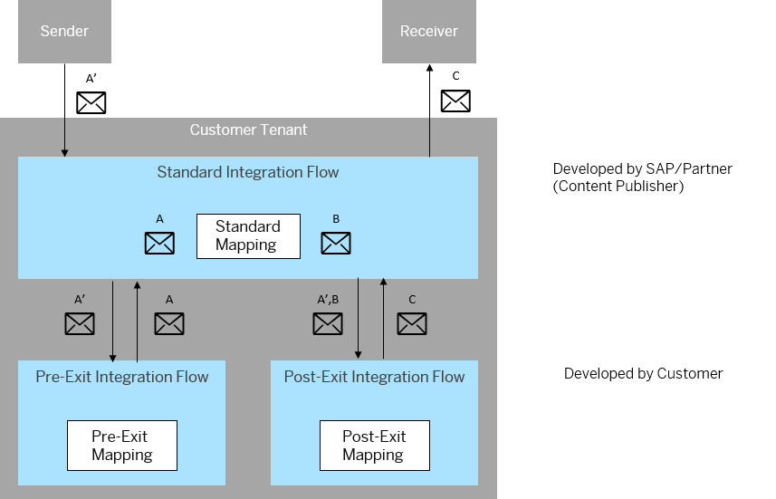

<!-- loio7749fb725b8543e9b660f34a06c75fe0 -->

# Mapping Extension Step by Step \(Example from SAP Hybris C4C\)

This section explains how to do mapping extensions based on a real example from the product area SAP Hybris Cloud for Customer \(C4C\).

> ### Note:  
> This section is targeted at the customer who is doing a mapping extension.

> ### Note:  
> For more background information regarding this example, check out the following blog in SAP Community: [Extending standard integration flow to support Customer extensions](https://blogs.sap.com/2018/08/12/extending-standard-integration-flow-to-support-customer-extensions/).

Let's assume that you want to do a mapping extension that also includes the extension of the source message structure. This means that both a pre-exit and a post-exit are involved. The integration flows discussed in this section have the same structure as those explained in [Integration Flow Extension - Concepts](integration-flow-extension-concepts-41b238c.md).

We also assume the following:

-   The sender is an SAP ERP system sending an IDoc message to Cloud Integration. An IDoc adapter is used as the sender channel for the standard integration flow.

-   The receiver is an SAP Cloud application that expects a SOAP message \(through the SOAP adapter\).

-   You also need to extend the *source* IDoc message. To support this use case, the standard integration flow contains a pre-exit. The pre-exit step will then enable you to design a corresponding pre-exit integration flow in order to map the extended *source* message to the original message structure. The message processed by the pre-exit integration flow can then be consumed by the standard mapping.

You need to create two integration flows, one for the pre-exit mapping and another one for the post-exit mapping. We explain the required steps to extend the mapping and to connect the custom integration flows with the standard integration flow.

The following figure shows the overall message flow between the standard integration flow and the pre-exit and post-exit integration flows, including sender and receiver.

The following message structures are involved in the extension scenario:

-   Message A

    Contains the original source message structure that is defined by the requirements of the sender system and can be consumed by the standard mapping.

-   Message A'

    Contains an extended source structure \(defined by the customer-specific requirements with regard to the sender system\).

    Typically, the customer derives message structure A' from message structure A by adding additional fields. In our example, the sender system is an SAP ERP system that sends an IDoc to SAP Cloud for Customer.

    Messages A and A' are IDoc messages.

-   Message B

    This is the target structure of the standard mapping. In other words, the standard integration flow maps message A to message B.

    In order to enable the standard mapping to consume the inbound message in the customer-specific scenario, message A' first has to be mapped to the original message structure A, which is defined in the standard integration flow. For this purpose, the message is passed to the pre-exit integration flow and mapped to message A, which can then be mapped within the standard integration flow.

-   Message C

    This is the message that results from the post-exit mapping.

Note that the letters A, A', and so on correspond to the notation as used in the general concept description in [Integration Flow Extension - Concepts](integration-flow-extension-concepts-41b238c.md).

**Related Information**  

[Prerequisites](prerequisites-8e37f79.md "")

[Creating the Pre-Exit Integration Flow](creating-the-pre-exit-integration-flow-418a960.md "")

[Creating the Post-Exit Integration Flow](creating-the-post-exit-integration-flow-12398d4.md "")

[Connecting Pre-Exit and Post-Exit Integration Flows with the Standard Integration Flow](connecting-pre-exit-and-post-exit-integration-flows-with-the-standard-integration-flow-f6280a3.md "")

