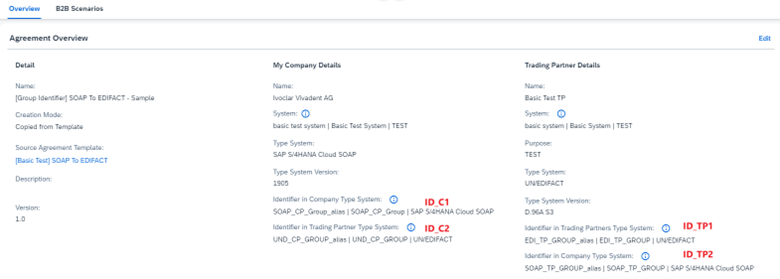

<!-- loio1ef7d9defa0c42918af92f046244f7bb -->

# Mapping the Identifier Group

Learn how to map the identifier group when using identifiers and identifier groups in agreements.

In an ideal scenario, 4 identifiers are used in a B2B transaction. Let us consider a scenario where:

-   **ID\_C1** is your company's unique identifier used in type system-based payloads.
-   **ID\_C2** is the unique identifier you as a company, provide to your trading partner for identification in their type system-based payloads.
-   **ID\_TP1** is your trading partner's unique identifier used in their type system-based payloads.
-   **ID\_TP2** is the unique identifier for your trading partner, provided by them or created by you, used in your type system-based payloads.

Here is an illustration:

Below are the possible use cases, focusing on the sender-side trading partner and receiver-side company scenarios.

> ### Note:  

These use cases also apply to the reverse scenarios, where the company is the sender and the trading partner is the receiver.

<a name="loio1ef7d9defa0c42918af92f046244f7bb__section_tvf_rfs_32c"/>

## Case N: 1

In a business transaction activity, when your trading partner uses multiple identifiers in their EDI payloads, but you only require a single identifier in your type system-based payload:

-   Trading Partner \(**ID\_TP1**\) at sender side: Uses an identifier group
-   TPM Company \(**ID\_TP2**\) at receiver side: Uses a single identifier on behalf of the trading partner

Customer don't need to do any mapping for this use case.

<a name="loio1ef7d9defa0c42918af92f046244f7bb__section_r55_xfs_32c"/>

## Case 1: N

In a business transaction activity, when your trading partner uses:

-   A single identifier in their sender EDI payload's interchange header
-   Additional EDI fields \(e.g., GLN\) to distinguish their sub-organizations

You can map this single identifier to multiple trading partner IDs in your receiver payload:

-   Trading Partner at sender side: Uses a **single identifier**
-   Company at receiver side: Uses an **identifier group** to represent the trading partner and their sub-organizations

<a name="loio1ef7d9defa0c42918af92f046244f7bb__section_ztw_dgs_32c"/>

## Case N: N

In a business transaction activity, when your trading partner:

-   Has multiple sub-organizations with unique identifiers in the EDI interchange header
-   Requires separate identifiers in your system for each sub-organization

You can map the trading partner's identifiers to distinct identifiers in your receiver payload:

-   Trading Partner at sender side: Uses an**identifier group** \(based on their type system\) for their sub-organizations
-   Company at receiver side: Uses another **identifier group** \(based on your type system\) for the trading partner and their sub-organizations

<a name="loio1ef7d9defa0c42918af92f046244f7bb__section_ugm_jgs_32c"/>

## Camel Headers, Activity PID/IDs and Identifiers

Since TPM does not provide a standard identifier group mapping function, you will need to create a custom integration flow to map a concrete identifier from your receiver identifier group to:

-   The interchange header identifier segment in your target payload
-   Display the identifier in B2B Monitor

To get started, you can utilize the following Camel headers in your custom integration flow:

**Camel Headers**

<table>
<tr>
<th valign="top">

Camel Header

</th>
<th valign="top">

Definition

</th>
</tr>
<tr>
<td valign="top">

SAP\_EDI\_Sender\_ID

</td>
<td valign="top">

This camel header stores the sender's single identifier retrieved from the inbound payload.

</td>
</tr>
<tr>
<td valign="top">

SAP\_EDI\_Receiver\_ID

</td>
<td valign="top">

This camel header stores the receiver's single identifier retrieved from the inbound payload.

</td>
</tr>
<tr>
<td valign="top">

SAP\_TPM\_ACTIVITYPARTNER\_ID

</td>
<td valign="top">

This camel header stores the Business Transaction Activity PID \(PID\) used to handle the inbound payload.

</td>
</tr>
</table>

Let us take UN/EDIFACT for example. If your inbound payload's interchange header is: `UNB+UNOB:3+987654322:1+123456781:1…`, then the corresponding camel headers are:

-   SAP\_EDI\_Receiver\_ID: `123456781`

-   SAP\_EDI\_Receiver\_ID\_Qualifier: `1`

-   SAP\_EDI\_Sender\_ID: `987654322`

-   SAP\_EDI\_Sender\_ID\_Qualifier: `1`

-   SAP\_TPM\_ACTIVITYPARTNER\_ID: `SAP_TPM_432b9204a1b5d5841b64036fab418c41`

Using the Activity PID `<SAP_TPM_ACTIVITYPARTNER_ID>`, you can find the following four parameters in the Partner Directory Data:

**ID in Partner Directory Data**

<table>
<tr>
<th valign="top">

ID \(in Partner Directory Data\)

</th>
<th valign="top">

Definition

</th>
</tr>
<tr>
<td valign="top">

SAP\_TPM\_SND\_Sender\_ID

</td>
<td valign="top">

This ID stores the Sender identifier at sender side

</td>
</tr>
<tr>
<td valign="top">

SAP\_TPM\_SND\_Receiver\_ID

</td>
<td valign="top">

This ID stores the Receiver identifier at sender side

</td>
</tr>
<tr>
<td valign="top">

SAP\_EDI\_REC\_Sender\_ID

</td>
<td valign="top">

This ID stores the Sender identifier at receiver side

</td>
</tr>
<tr>
<td valign="top">

SAP\_EDI\_REC\_Receiver\_ID

</td>
<td valign="top">

This ID stores the Receiver identifier at receiver side

</td>
</tr>
</table>

For an inbound \(trading partner to company\) Business Transaction Activity, this is how the UI fields are correlated to the Activity PID IDs:

**UI-Activity PID ID**

<table>
<tr>
<th valign="top">

UI Field

</th>
<th valign="top">

Activity PID ID

</th>
</tr>
<tr>
<td valign="top">

Trading Partner Identifier in Company Type System

</td>
<td valign="top">

SAP\_EDI\_REC\_Sender\_ID

</td>
</tr>
<tr>
<td valign="top">

Company Identifier in Company Type System

</td>
<td valign="top">

SAP\_EDI\_REC\_Receiver\_ID

</td>
</tr>
<tr>
<td valign="top">

Trading Partner Identifier in Trading Partner Type System

</td>
<td valign="top">

SAP\_TPM\_SND\_Sender\_ID

</td>
</tr>
<tr>
<td valign="top">

Company Identifier in Trading Partner Type System

</td>
<td valign="top">

SAP\_TPM\_SND\_Receiver\_ID

</td>
</tr>
</table>

> ### Note:  
> You can view the Activity PID IDs in the *Partner Directory Data* tab and the value of these four IDs can either be a single identifier’s identification or an identifier group’s name.

Consider a business transaction activity where:

1.  Your trading partner \(sender\) uses a single identifier **987654322** in their type system. So the corresponding ID would be: **SAP\_TPM\_SND\_Sender\_ID = "987654322"** 
2.  You \(receiver\) use an identifier group **SOAP\_TP\_GROUP** in your type system on behalf of your trading partner. The corresponding ID would be **SAP\_EDI\_REC\_Sender\_ID = "SOAP\_TP\_GROUP"**

> ### Note:  
> SAP\_TPM\_SND\_Sender\_ID and SAP\_EDI\_REC\_Sender\_ID are Activity PID IDs.

After completing the identifier mapping in your custom integration flow, return the following 3 Camel headers:

**Output Parameters**

<table>
<tr>
<th valign="top">

Camel Header \(output parameters\)

</th>
<th valign="top">

Purpose

</th>
</tr>
<tr>
<td valign="top">

SAP\_TPM\_REC\_Sender\_ID

</td>
<td valign="top">

When using an identifier group at the receiver side for your business transaction activity's sender party:

-   If a matched sub-identifier is found in your custom integration flow, set its identification to the Camel header `SAP_TPM_SND_Sender_ID`. This identification will be used as:
    -   Target payload's interchange sender identifier
    -   B2B Monitor interchange's sender identifier

-   If this Camel header is not set, the identifier group name will be used as:
    -   Target payload's interchange sender identifier
    -   B2B Monitor interchange's sender identifier

</td>
</tr>
<tr>
<td valign="top">

SAP\_TPM\_REC\_Receiver\_ID

</td>
<td valign="top">

When using an identifier group at the receiver side for your business transaction activity's receiver party:

-   If a matched sub-identifier is found in your custom integration flow, set its identification to the Camel header `SAP_TPM_REC_Receiver_ID`. This identification will be used as:
    -   Target payload's interchange receiver identifier
    -   B2B Monitor interchange's receiver identifier

-   If this Camel header is not set, the identifier group name will be used as:
    -   Target payload's interchange receiver identifier
    -   B2B Monitor interchange's receiver identifier

</td>
</tr>
<tr>
<td valign="top">

SAP\_TPM\_REC\_Receiver\_Name

</td>
<td valign="top">

When using an identifier group at the receiver side and a matched sub-identifier is found:

-   Set the sub-identifier's sub-organization name to the Camel header `SAP_TPM_REC_Receiver_Name`. This name will be displayed in B2B Monitor as the corresponding interchange's Receiver Name.
-   If this Camel header is not set, B2B Monitor will display the trading partner name \(or company name, depending on who is at the receiver side\) as the Receiver Name.

</td>
</tr>
</table>

