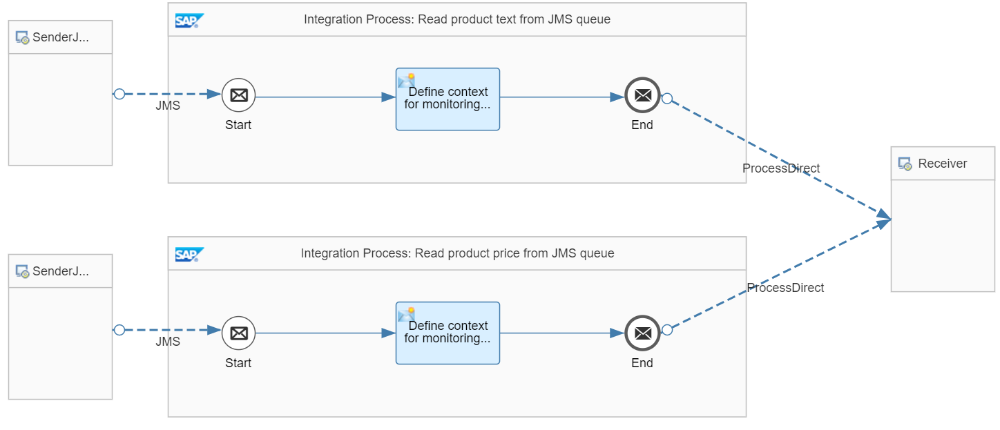

<!-- loio1c3e5830a26949ed807ae63e2079f475 -->

# Master Data Update with JMS Send Steps

In this scenario, product master data is updated using the Java Messaging Service \(JMS\).

Like in the [Master Data Update with XI Send Steps](master-data-update-with-xi-send-steps-5fb0541.md) scenario, product master data is consistently updated. However, JMS is used instead of the XI 3.0 protocol. Therefore, a JMS transaction handler is required to ensure data consistency. In order to keep the transaction as short as possible, the exchange of messages is done in a local subprocess that is called right at the end of the main process, so the transaction can be limited to the subprocess and the main process can be kept nontransactional.

> ### Note:  
> Prerequisite:
> 
> Deploy the *Generic Receiver* integration flow. You can find the *Generic Receiver* integration flow in the same package that contains the sample integration flow.

This scenario is illustrated with the *Transaction Handling – JMS Send Steps* integration flow.

The integration flow consists of 4 integration processes:

-   A main integration process that collects all required information and prepares the message bodies to be exchanged.

-   A local integration process with JMS send steps.

-   An integration process that reads a product text from a JMS queue.

-   An integration process that reads a product price from a JMS queue.


<a name="loio1c3e5830a26949ed807ae63e2079f475__section_yvd_rgb_x4b"/>

## Main Integration Process

The main integration process is identical to the main integration process of the [Master Data Update with XI Send Steps](master-data-update-with-xi-send-steps-5fb0541.md) scenario. Product text and price information are gathered and passed on to a local integration process at the end of the main integration process. For the main integration process, no transaction handler is required.


<a name="loio1c3e5830a26949ed807ae63e2079f475__section_mqm_sgb_x4b"/>

## Local Integration Process

The local integration process is defined in the following way.


Similar to the local integration process in the [Master Data Update with XI Send Steps](master-data-update-with-xi-send-steps-5fb0541.md) scenario, the product text and price information is sent to receiver systems. This time, this information is send to two different JMS queues, `TxH_Text` and `TxH_Price` respectively.

Before the second JMS send step, the following Groovy script is added to simulate an error situation.

```
import com.sap.gateway.ip.core.customdev.util.Message;
import java.util.HashMap;
def Message processData(Message message) {
    //Headers 
       def head = message.getHeaders();
       def error = head.get("error");
    //Exception
       if (error.toBoolean()) {
       String exceptionBody = 'An issue occured in message processing';
       throw new Exception(exceptionBody);   
       }
       
       return message;
}
```

For the local integration process, you need to set transaction handling to ensure data consistency. Since JMS receiver channels have been chosen, the corresponding transaction handler is selected, here *Required for JMS*.


<a name="loio1c3e5830a26949ed807ae63e2079f475__section_xvm_sgb_x4b"/>

## Read Messages from JMS Queue Integration Processes



The integration processes read the text and price messages from the respective JMS queue and forward them to the *Generic Receiver* integration flow. Finally, this integration flow stores the messages in the data store called `TransactionHandling-JMSSendSteps`.


<a name="loio1c3e5830a26949ed807ae63e2079f475__section_o14_sgb_x4b"/>

## Executing the Scenario

If you use Postman together with the Postman collection provided with the package, expand the `TransactionHandling` collection folder. You will find folders for each scenario described as part of the guidelines. For the current scenario, expand the `JMSSendSteps` folder. You will find 3 requests.

Since the integration flows are all CSRF-protected, you first need to run the HEAD request to fetch a token before posting the actual data.

Each POST request contains a sample request with a product ID.

Furthermore, the `error` header is passed on to the integration flow to simulate an error situation.

If you run the `JMSSendSteps_withoutError` POST request, message processing runs successfully. You will find a new data store `TransactionHandling-JMSSendSteps` with 2 new entries \(go to the *Monitor* application and select the *Data Stores* tile under *Manage Stores*\):

-   1 entry with the `ProductText` entry ID containing the product text

-   1 entry with the `ProductPrice` entry ID containing the product price


Before running the second POST request `JMSSendSteps_withError`, delete the data store entries. If you send the request, the error is thrown in the Groovy script. Since the transaction handler was selected, no messages are passed on to the JMS queues, and therefore no new entries are written to the data store.

