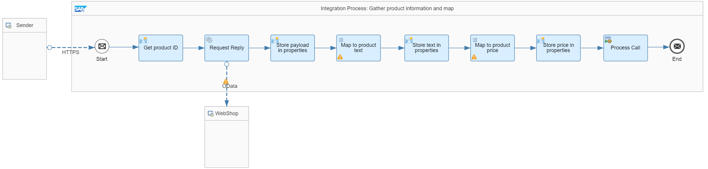
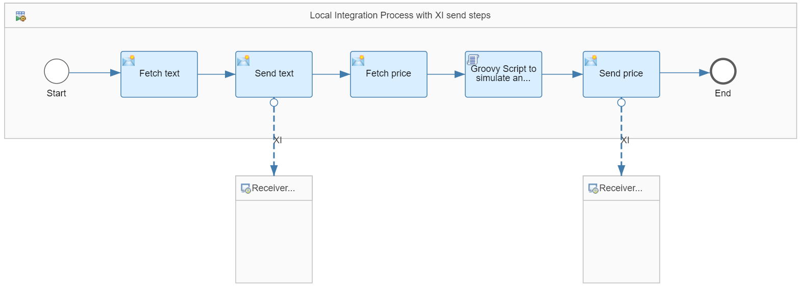

<!-- loio5fb05419e8414203a36c43abb8e2aaad -->

# Master Data Update with XI Send Steps

In this scenario, product master data is updated by calling the backend system via the XI 3.0 protocol.

Multiple master data tables are to be updated consistently. Therefore, a transaction handler is required to ensure data consistency. To keep the transaction as short as possible, the actual exchange of messages is done in a local subprocess that is called right at the end of the main process. That way, the transaction can be limited to the subprocess and the main process can be kept nontransactional.

> ### Note:  
> Prerequisite:
> 
> To enable communication via the XI protocol, you need to configure and deploy a *User Credentials* artifact that contains the credentials of a user with the `ESBMessaging.send` user role assigned. You can use the same user to run the Postman collection for the example integration flows. By default, the name of the *User Credentials* artifact must be `iFlowDesignGuidelineUser`. You can also choose another name but then you need to change the name of the externalized parameter accordingly.

This scenario is illustrated with the *Transaction Handling – XI Send Steps* integration flow.

The integration flow consists of three integration processes:

-   A main integration process that collects all required information and prepares the message bodies to be exchanged.

-   A local integration process with XI send steps.

-   An integration process mocking the backend system.


<a name="loio5fb05419e8414203a36c43abb8e2aaad__section_llg_53w_w4b"/>

## Main Integration Process

The main integration process is defined in the following way:



The process performs the following steps:

1.  A request with a product ID in the message body is passed to the integration flow.

2.  The *Get product ID* Content Modifier step stores the product ID in an exchange property based on the following settings \(in the *Exchange Property* tab\):


    <table>
    <tr>
    <th valign="top">

    Attribute
    
    </th>
    <th valign="top">

    Value
    
    </th>
    </tr>
    <tr>
    <td valign="top">
    
    Name
    
    </td>
    <td valign="top">
    
    productId
    
    </td>
    </tr>
    <tr>
    <td valign="top">
    
    Type
    
    </td>
    <td valign="top">
    
    XPath
    
    </td>
    </tr>
    <tr>
    <td valign="top">
    
    Data Type
    
    </td>
    <td valign="top">
    
    java.lang.String
    
    </td>
    </tr>
    <tr>
    <td valign="top">
    
    Value
    
    </td>
    <td valign="top">
    
    //ProductId
    
    </td>
    </tr>
    </table>
    
3.  In a *Request Reply* step, product data is read from an external source through the OData protocol \(using the OData receiver adapter\).

    The external data source supports the Open DataProtocol \(OData\). For our scenario, we use the ESPM WebShop, which is based on the Enterprise Sales and Procurement Model \(ESPM\) provided by SAP.

    The query is defined in the following way:

    ```
    $select=ProductId,Name,Category,CategoryName,CurrencyCode,DimensionDepth,DimensionHeight,DimensionUnit,DimensionWidth,LongDescription,PictureUrl,Price,QuantityUnit,ShortDescription,SupplierId,Weight,WeightUnit&$filter=ProductId eq '${property.productId}' 
    ```

4.  The *Store payload in properties* Content Modifier step stores the response of the OData call in an exchange property \(the body is overwritten in the subsequent processing step \). The settings are as follows \(in the *Exchange Property* tab\):


    <table>
    <tr>
    <th valign="top">

    Attribute
    
    </th>
    <th valign="top">

    Value
    
    </th>
    </tr>
    <tr>
    <td valign="top">
    
    Name
    
    </td>
    <td valign="top">
    
    payloadAll
    
    </td>
    </tr>
    <tr>
    <td valign="top">
    
    Type
    
    </td>
    <td valign="top">
    
    Expression
    
    </td>
    </tr>
    <tr>
    <td valign="top">
    
    Data Type
    
    </td>
    <td valign="top">
    
    java.lang.String
    
    </td>
    </tr>
    <tr>
    <td valign="top">
    
    Value
    
    </td>
    <td valign="top">
    
    $\{in.body\}
    
    </td>
    </tr>
    </table>
    
5.  In the *Map to product text* Message Mapping step, the product is mapped to product text.

6.  The *Store text in properties* Content Modifier step stores the target of the message mapping that holds the product text in an exchange property. The settings are as follows \(in the *Exchange Property* tab\):


    <table>
    <tr>
    <th valign="top">

    Attribute
    
    </th>
    <th valign="top">

    Value
    
    </th>
    </tr>
    <tr>
    <td valign="top">
    
    Name
    
    </td>
    <td valign="top">
    
    payloadText
    
    </td>
    </tr>
    <tr>
    <td valign="top">
    
    Type
    
    </td>
    <td valign="top">
    
    Expression
    
    </td>
    </tr>
    <tr>
    <td valign="top">
    
    Data Type
    
    </td>
    <td valign="top">
    
    java.lang.String
    
    </td>
    </tr>
    <tr>
    <td valign="top">
    
    Value
    
    </td>
    <td valign="top">
    
    $\{in.body\}
    
    </td>
    </tr>
    </table>
    
    This Content Modifier step restores the complete product information \(because this data is required as the source of the next message mapping\). Therefore, the message body is defined based on the following expression: `${property.payloadAll}` \(in the *Message Body* tab\).

7.  In the *Map to product price* Message Mapping step, the product is mapped to a product price.

8.  The *Store price in properties* Content Modifier step stores the target of the message mapping that holds the product price in an exchange property. The settings are as follows \(in the *Exchange Property* tab\):


    <table>
    <tr>
    <th valign="top">

    Attribute
    
    </th>
    <th valign="top">

    Value
    
    </th>
    </tr>
    <tr>
    <td valign="top">
    
    Name
    
    </td>
    <td valign="top">
    
    payloadPrice
    
    </td>
    </tr>
    <tr>
    <td valign="top">
    
    Type
    
    </td>
    <td valign="top">
    
    Expression
    
    </td>
    </tr>
    <tr>
    <td valign="top">
    
    Data Type
    
    </td>
    <td valign="top">
    
    java.lang.String
    
    </td>
    </tr>
    <tr>
    <td valign="top">
    
    Value
    
    </td>
    <td valign="top">
    
    $\{in.body\}
    
    </td>
    </tr>
    </table>
    
    After these steps, the message to be passed on to the backend system is prepared.

9.  Finally, the local subprocess, that performs the message exchange, is called.


The main process doesn't require any transaction handler. Therefore, the *Not Required* option is selected for the *Transaction Handling* parameter in the *Processing* properties of the integration process.


<a name="loio5fb05419e8414203a36c43abb8e2aaad__section_lwy_53w_w4b"/>

## Local Integration Process

The local integration process is defined in the following way.



The process performs the following steps:

1.  The *Fetch text* Content Modifier step fetches the product text from the exchange property and writes it into the message body \(based on the `${property.payloadText}` expression \(in the *Message Body* tab\).

2.  The *Send text* Send step transfers the message to the backend system \(through the XI receiver adapter\).

    The URL is defined as follows: `https://${header.host}/cxf/TransactionHandling/JDBC/MasterDataUpdate`.

    For convenience, the sample request message of the provided Postman collection contains the `host` header field  that holds the host name of the worker/runtime node. The host name needs to be maintained as a Postman environment variable anyway, so by using the expression `${header.host}` in the URL, the address of the XI channel doesn't need to be changed in order to be able to run the scenario in your own landscape.

    For the *Authentication Type*, select the *Basic Authentication* option. For *Credential Name*, specify the string *iFlowDesignGuidelineUser*.

    On the *Processing* tab, define the following settings :

    -   XI IDENTIFIERS FOR SENDER

        Communication Component: DefaultXISender

    -   XI IDENTIFIERS FOR RECEIVER

        Communication Component: DefaultXIReceiver

        Service Interface: ProductTextUpdate

        Service Interface Namespace: http://demo.sap.com/txh


    On the *Delivery Assurance* tab, define the following settings:

    Quality of Service: ExactlyOnce

    Temporary Storage: Data Store

3.  The *Fetch price* Content Modifier step fetches the product price from the exchange property and writes it into the message body \(based on the expression `${property.payloadPrice}` \(in the *Message Body* tab\).

4.  For demo purposes, the *Groovy Script to simulate an error* is added to simulate different error situations:

    -   If there's an error during message processing within the integration flow, an exception is thrown in the Groovy script.

    -   If there's a connection issue, an exchange property called `wrongPath` is created and added to the URL of the XI send step.


    The Groovy script is defined as follows:

    ```
    import com.sap.gateway.ip.core.customdev.util.Message;
    import java.util.HashMap;
    def Message processData(Message message) {
        //Headers 
           def head = message.getHeaders();
           def error = head.get("error");
           def errorType = head.get("error-type");
        //Properties 
           prop = message.getProperties();
           message.setProperty("wrongPath", "");
        //Exception
           if (error.toBoolean()) {
               if (errorType.equals("connection")) {
                    message.setProperty("wrongPath", "XYZ");  
               } else {
                    String exceptionBody = 'An issue occured in message processing';
                    throw new Exception(exceptionBody);  
                }
           }
           
           return message;
    }
    ```

5.  The *Send price* Send step transfers the message to the backend system \(through the XI receiver adapter\).

    The URL is defined as follows: `https://${header.host}/cxf/${property.wrongPath}TransactionHandling/JDBC/MasterDataUpdate`.

    This time, the `${property.wrongPath}` exchange property is added to be able to raise a connection error.

    The rest of the XI channel settings are the same as defined for the product text, except for the service interface name, where `ProductPriceUpdate` is maintained.


For the local integration process, transaction handling is set to ensure data consistency. In the configuration of the XI channels, the data store is chosen as temporary message storage. Therefore, the corresponding transaction handler \(*Required for JDBC*\) is selected for the integration process. Distributed transactions between JMS and JDBC resources aren't supported.


<a name="loio5fb05419e8414203a36c43abb8e2aaad__section_hqz_53w_w4b"/>

## Integration Process Mocking the Backend System

The integration process is defined in the following way.


The integration flow exposes an XI endpoint. In the XI sender channel, the following address is specified: `/TransactionHandling/JDBC/MasterDataUpdate`.

The message that is sent to the integration flow is stored in a data store called `TransactionHandling-XISendSteps` and the entry ID `${header.Sapinterfacename}`. That way, for the product text, the ID is `ProductTextUpdate`, for the product price it's `ProductPriceUpdate`.


<a name="loio5fb05419e8414203a36c43abb8e2aaad__section_ot4_ydb_x4b"/>

## Executing the Scenario

If you use Postman together with the Postman collection provided with the package, expand the `TransactionHandling` collection folder. You will find subfolders for each scenario described as part of the guidelines. For the current scenario, expand the `XISendSteps` folder. You will find four requests.

Since the integration flows are all CSRF-protected, you first need to run the HEAD request to fetch a token before posting the actual data.

Each POST request contains a sample request with a product ID.

Furthermore, the two headers `error` and `error-type` are passed on to the integration flow. These headers are used to simulate the different error situations:

-   If you set the `error` header to `false`, the message is successfully processed.

-   If you set the `error` header to `true`, and the `error-type` header to `other`, a processing error is triggered.

-   If you set the `error` header to `true`, and the `error-type` header to `connection`, a connection error occurs.


If you run the `XISendSteps_withoutError` POST request, message processing runs successfully. You find a new data store `TransactionHandling-XISendSteps` with two new entries \(go to the *Monitor* application and select the *Data Stores* tile under *Manage Stores*\):

-   1 entry with entry ID `ProductTextUpdate` containing the product text

-   1 entry with entry ID `ProductPriceUpdate` containing the product price


Before running the 2nd POST request `XISendSteps_withProcessingError`, delete the data store entries. If you send the request, the error is thrown in the Groovy script. Because the transaction handler has been selected, no messages are passed on to the mocked backend, and therefore no new entries are written to the data store.

Finally, if you send the POST request `XISendSteps_withConnectionError`, the 2nd XI call fails and goes into retry. If you check the data store called `TransactionHandling-XISendSteps`, one new entry with the entry ID `ProductTextUpdate` has been created. Furthermore, you find a new data store called `ReceiverPrice_XI` with 1 entry that is the temporary storage of the 2nd XI call. Because the error happens in the process of sending the message to the receiver backend system, the whole processing until storing the message in the temporary storage was successfully performed. Therefore, no rollback is carried out. A retry is done from the temporary storage in a new transaction. In the message monitor, you find a message in status *Retry*. If you delete the entry from the temporary data store, the message goes into status *Cancelled*.

