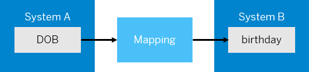

<!-- loio459ccdf98a7542d897c1e802d0be800a -->

<link rel="stylesheet" type="text/css" href="../css/sap-icons.css"/>

# Message Mapping

> ### Remember:  
> There are currently certain limitations when working in the Cloud Foundry environment. For more information on the limitations, see SAP Note [2752867](https://me.sap.com/notes/2752867).

Let us consider the example of replicating employee details from system A to system B. Each employee set in system A contains name, date of birth, address, and phone number. System B also provides similar functionality. However, the field names are different in system B. In system A, the employee date of birth is stored in **DOB** field but in system B, the employee date of birth is stored in **birthday** field. In such scenarios, you need an artifact that can define what the equivalent fields are in system A and system B respectively. Message mapping can help you achieve that. Using a graphical editor, you can define a table or a map \(hence the name mapping\) which the system uses as a reference to identify equivalent fields in system A and system B.

<a name="loio459ccdf98a7542d897c1e802d0be800a__section_kcz_prh_d2b"/>

## Standard and Custom Mapping Functions

In the same scenario, let us assume that the date of birth in system A is in YYYY-MM-DD format. You want to change the format to DD-MM-YYYY, the format in system B. In this case, you can use a mapping function that transforms the data into the format that you want, which in this case is DD-MM-YYYY.

The mapping editor provides some standard functions like *Arithmetic*, *Boolean*, *Constants*, *Conversions*, and *Date*.

> ### Note:  
> The supported format for *currentDate* function is `yyyy-mm-dd` or `yyyy-mm-dd hh:mm:ss` and the timezone for the function is that of the data center where your SAP Cloud Integration tenant is hosted.

If you're unable to achieve the desired transformation using standard functions, you can create a custom function in one of the following ways.

-   Choose  \(create script\) to create a custom-mapping function by manually entering the script.

-   Choose  \(add script file\) to upload a script file that contains the custom-mapping function.

<a name="loio459ccdf98a7542d897c1e802d0be800a__section_w2v_nth_d2b"/>

## Testing Message Mapping

The mapping editor provides two ways of testing message mapping:

1.  Simulate – for testing the entire mapping XML.
2.  Display Queue – for testing a specific node of the XML.

**1. Simulate:** The mapping simulates option enables you to test the entire mapping structure. The system shows if the mapping contains any errors, giving you a chance to fix these errors before deploying the integration flow. Once you complete the mapping, you can choose *Simulate* to run a simulation of the mapping.

> ### Restriction:  
> Simulation for message mappings doesn't work if you've activated Edge Integration Cell in your tenants.

**2. Display Queue:** The display queue option enables you to test the mapping of a specific node. In the *Mapping expression* area, provide a *Test Input File* and choose  \(Display Queue\) to display the simulated output for the provided test input file.

> ### Note:  
> -   Even if the integration flow isn't in edit mode you can execute simulate and display queue test. You can hence perform the tests for configure only content as well.
> 
> -   You can refer to input XML file uploaded for simulation, for display queue also, and vice versa.
> 
> -   When you revise a mapping schema, be it the source or target message, existing mapping definitions continue to remain as is. That is, if the revised schema doesn't include a previously used node, the graphical editor doesn't automatically delete such unused nodes.

