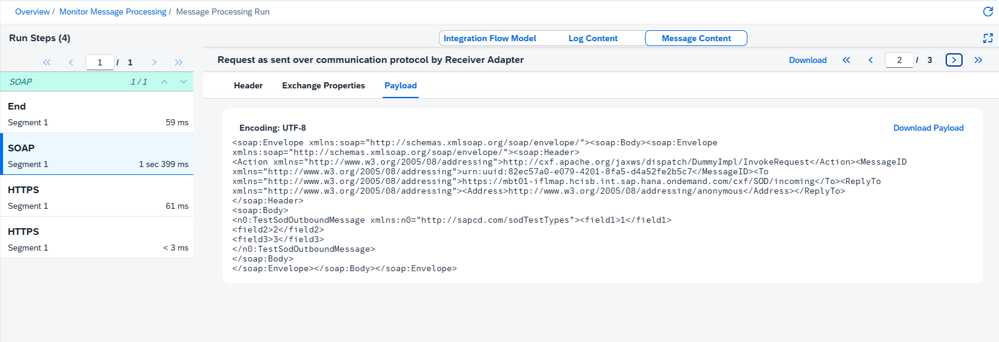

<!-- loioa9db4eab676443ec999e8f7f5b760c2e -->

# Message Processing Log - Adapter Tracing

The adapter tracing is part of the regular tracing feature and the payloads are recorded if you have set the log level to `Trace`.

The adapter tracing is only possible for adapters that transform the message either before sending or upon reception, such as *AS2*, *Ariba*, *LDAP*, *Mail*, *SuccessFactors* and *HTTP/HTTPS*. You also get tracing information for integration flows containing *CFX* based adapters such as*IDOC*, *SOAP*, *SAPRM*, but in this case you have to redeploy the integration flow to get the tracing data recorded in the regular tracing feature and displayed.

Adapter tracing is not possible for *SMS*, *SFTP*, *Facebook*, *Twitter* and *Process direct*, as they do not modify the payload.

> ### Remember:  
> For log level `Trace` , detailed information is recorded for all steps and in addition, the message content is tracked . The trace function expires after a certain time \(default value: 10 minutes\). After expiry the log level switches back to the log level set before. The recorded message content is also retained for a certain time \(default value: 1 hour\).

To view trace information details, select an integration flow from the overview list. Go to the *Log* section and open the log level link. In the integration flow model, the system displays trace entries as envelope icons.

## Payload

Adapter tracing captures detailed payload information at several stages of message processing. Initially, each step records its payload before execution begins. However, adapters that perform message transformation can capture additional payloads: the outbound message as it's sent over the communication protocol and the inbound response as it's received. This results in multiple payload entries.

You can view this payload by selecting a message processing step and switching to the *Message Content* tab. There you can find information such as headers, exchange properties, and payloads. You can also download all the details by choosing *Download* in the top right corner. A zip file containing one header file and one payload file is saved to your local file system.

When multiple payloads exist for a single step, a paging area appears in the interface. You need to navigate between pages to access all available payload data.

> ### Note:  
> It is possible that the adapter logs different payloads at different times. This can result in multiple entries for the step on the left-hand side panel.

To find the payload you need, check the description field. This field contains contextual information such as, *Request as sent over communication protocol by Receiver Adapter*, *Response as received over communication protocol by Receiver Adapter*, or *Message before Step*.

