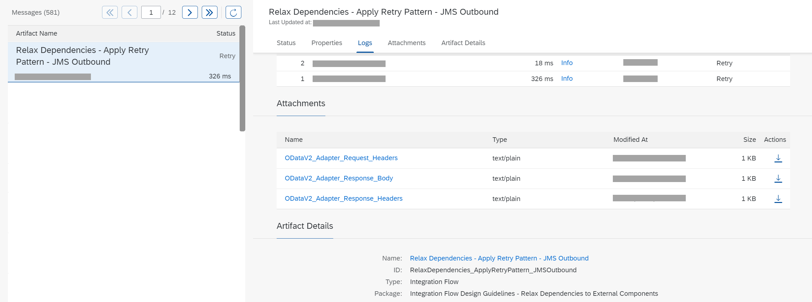

<!-- loiob32f8cda16034a8390ccaea98f8f68b1 -->

<link rel="stylesheet" type="text/css" href="../css/sap-icons.css"/>

# Message Processing Log

The message processing log displays structured information of a message.

Select a message from the list. In the view section, the header shows the integration flow name, the processing date and the time of its last update.

> ### Remember:  
> The dates and times diplayed are converted to the local time zone set for the browser.

Next, you can select and display *Status*, *Properties* and *Logs*. If the processing of a integration flow failed, the retry runs performed are displayed in the *Logs* section.

The logs section shows the number of runs as well as the following information:

**Runs**

<table>
<tr>
<th valign="top">

Property

</th>
<th valign="top">

Description

</th>
</tr>
<tr>
<td valign="top">

*\#* 

</td>
<td valign="top">

Displays the sequential number of the run.

</td>
</tr>
<tr>
<td valign="top">

*Started At* 

</td>
<td valign="top">

Displays the date and time of the last run.

</td>
</tr>
<tr>
<td valign="top">

*Duration* 

</td>
<td valign="top">

Displays the duration of the processing run in *ms*.

</td>
</tr>
<tr>
<td valign="top">

*Log Level* 

</td>
<td valign="top">

Displays the log level.

</td>
</tr>
<tr>
<td valign="top">

*Process ID* 

</td>
<td valign="top">

Displays the ID of the worker node on which the run was executed.

</td>
</tr>
<tr>
<td valign="top">

*Status* 

</td>
<td valign="top">

Displays the intermediate status of the message processing log after this run.

</td>
</tr>
</table>

You open the message processing log by selecting the **log level** of one of the runs.

The detailed view shows the list of the *Run Steps*.

If an error occurred in one of the run steps, it is shown by a red exclamation mark in the run step list. To display the error message, follow the exclamation mark.

If a **Split** or **Multicast Step** is used, the steps belonging to one sub-message get the same segment number. They can therefore be grouped together.

To view the *Log Content*, select one run step from the list and choose *Log Content*. The log content displays the *Properties* and the *Activities* of the step. If more than one step is related to a flow element, all of them are selected within the list and you can scroll from one step to the next by using the arrows in the element info bar and view the properties and activities accordingly.

You can only review the *Message Content* section, if the log level has been set to **trace**.

> ### Note:  
> The names of the flow elements can only be shown in the run step list if the integration flow model is loaded. If the model cannot be loaded, the system only shows the run steps IDs.

The *Integration Flow Model* is displayed on the right hand side, if it is deployed.

You can view the path taken by the message in the integration flow. If you select a run step for the list, it is highlighted in the integration flow model.

You can also select an element of the *Integration Flow Model* and the related run step will be highlighted in the run step list on the left hand side.

The properties view of the selected integration flow element is displayed at the end of the page.

The availability of the trace data is also visualized in the integration flow model as envelope icons.

**Envelope Icons**

<table>
<tr>
<th valign="top">

Icons

</th>
<th valign="top">

Description

</th>
</tr>
<tr>
<td valign="top">

</td>
<td valign="top">

Successfully processed step with trace data available.

</td>
</tr>
<tr>
<td valign="top">

</td>
<td valign="top">

Error in processed step with trace data available.

</td>
</tr>
<tr>
<td valign="top">

</td>
<td valign="top">

Successfully processed step with no trace data available.

</td>
</tr>
<tr>
<td valign="top">

</td>
<td valign="top">

Error in processed step with no trace data available.

</td>
</tr>
</table>

In order to have a visual distinction between steps with available trace data and steps with processing information only, inverted icons are displayed if there is no trace data available. :envelope: for a successfully processed step and if the step processing resulted in an error.

For more information on the *Trace* log level check out [Tracing the Execution of an Integration Flow](tracing-the-execution-of-an-integration-flow-4ec27d3.md).

> ### Note:  
> If the log level is set to *Info* and the processing does not show any error, the link to the detailed view is not active. If the processing shows at least one error, the link is active and you can access the detailed view.

> ### Note:  
> This component stores data on your tenant. Note that the tenant space is limited and shared with other tenant data like message processing logs.

**Related Information**  

[Message Processing Log – Text View](message-processing-log-text-view-718309a.md "The message processing log displays structured information on the processing of a message.")

[Monitor Message Processing](monitor-message-processing-314df3f.md "The message monitor provides an overview of the messages processed on a tenant and allows you to display the details for individual messages.")

[Message Processing Log - Adapter Tracing](message-processing-log-adapter-tracing-a9db4ea.md "The adapter tracing is part of the regular tracing feature and the payloads are recorded if you have set the log level to Trace.")

[Setting Log Levels](setting-log-levels-4e6d3fc.md "The log level for the message processing log specifies the granularity of information collected by the message processing log")

[Message Status](message-status-733a57b.md "The message processing status indicates how a messages has been processed at runtime.")

