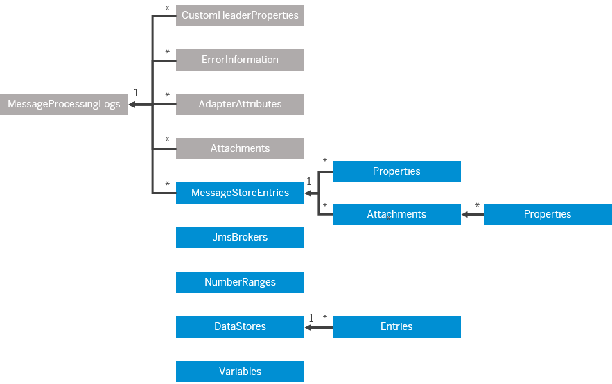

<!-- loio1aab5e9482f545539a7caae3e9887e4e -->

# Message Stores

Get data from Message Stores for processed messages and resources of the used JMS queues.

You can access the OData API at [Message Stores](https://api.sap.com/api/MessageStore/resource), where you can find the basic operations.

This documentation provides additional information.

<a name="loio1aab5e9482f545539a7caae3e9887e4e__section_n5v_hfm_s3b"/>

## Overview on Message Store Resources

Message content is stored by the *Persist* step of an integration flow. You can use this API to access the stored message and analyze it at a later point in time.

You can also use this API to get information about the JMS resources used in asynchronous messaging scenarios.

You can access the OData API at:

[https://api.sap.com/api/MessageStore/](https://api.sap.com/api/MessageStore/)

<a name="loio1aab5e9482f545539a7caae3e9887e4e__section_zz1_2lf_t4b"/>

## Entity Data Model for Message Store Resources

The following diagram shows how the `MessageProcessingLogs` resources \(gray\) are related to the `MessageStoreEntries` resources \(and related resources\) of the `Message Stores` API.

<a name="loio1aab5e9482f545539a7caae3e9887e4e__section_ast_b3w_3pb"/>

## Overview on Data Store/Variables Resources

During the processing of an integration flow, you can temporarily store data in the tenant database. This data can be accessed by steps within the same integration flow or another integration flow, deployed on the same tenant.

The following data can be stored:

-   Message payloads and headers as data store entries

    Data store entries can be accessed by Data Store Select or Data Store Get steps.

-   Any data as variable

    Variables can be accessed by dedicated integration steps, for example, by a content modifier to store the variable as property or header.

To do that, you use the *Data Store Write* step \(for data stores and data store entries\) or the *Write Variables* step \(for variables\) of an integration flow. With the Data Store Get or Select step, you can read data store content during the processing of an integration flow.

For an overview of the content of the tenant database, see [Using Data Storage Features When Designing Integration Flows](using-data-storage-features-when-designing-integration-flows-a836b4e.md).

Depending on the data store or variable type, the data is shared by all integration flows \(deployed on the tenant\) or only by one specific integration flow.

-   *Global*: Data is shared across all integration flows deployed on the tenant.

-   *Integration Flow*: Data can only be used within 1 integration flow.

<a name="loio1aab5e9482f545539a7caae3e9887e4e__section_fhy_xbx_k5b"/>

## Permissions

To authorize an API client to access the OData API:

Perform the steps described in: [Setting Up Inbound HTTP Connections \(for API Clients\)](../40-RemoteSystems/setting-up-inbound-http-connections-for-api-clients-8db3d51.md) 

Depending on the use case, assign the following role templates \(see [Tasks and Permissions for Cloud Integration](../60-Security/tasks-and-permissions-for-cloud-integration-556d557.md)\):

-   To view message store content: `MonitoringDataRead` 

-   To view data store entries: `DataStoresAndQueuesRead` 

-   To download the message payload \(stored as data store entry\) and to view variables: `DataStorePayloadsRead` 

-   To delete data store entries/variables: `DataStoresAndQueuesDelete` 

-   To view JMS resources: `DataStoresAndQueuesRead` 

<a name="loio1aab5e9482f545539a7caae3e9887e4e__section_uvw_dlf_t4b"/>

## Resources

****

<table>
<tr>
<th valign="top">

Resource

</th>
<th valign="top">

Description

</th>
</tr>
<tr>
<td valign="top">

Entries

</td>
<td valign="top">

Represents a message store entry.

A message store entry is created by a Persist step of an integration flow \(see [Persist Messages](persist-messages-8c35f3f.md)\).

</td>
</tr>
<tr>
<td valign="top">

Entry Attachments

</td>
<td valign="top">

Represents an attachment of a message from the message store

A message store entry is created by a Persist step of an integration flow \(see [Persist Messages](persist-messages-8c35f3f.md)\).

</td>
</tr>
<tr>
<td valign="top">

Entry Attachment Properties

</td>
<td valign="top">

Represents properties of message attachments from the message store.

A message store entry is created by a Persist step of an integration flow \(see [Persist Messages](persist-messages-8c35f3f.md)\).

</td>
</tr>
<tr>
<td valign="top">

Entry Properties

</td>
<td valign="top">

Represents a header of a message from the message store.

A message store entry is created by a Persist step of an integration flow \(see [Persist Messages](persist-messages-8c35f3f.md)\).

</td>
</tr>
<tr>
<td valign="top">

JMS Resources

</td>
<td valign="top">

Represents available resources of the used Java Message Service \(JMS\) queues.

JMS queues are accessed to by integration flows that contain an AS2, a JMS, or anXI adapter \(see [AS2 Adapter](as2-adapter-d3af635.md), [JMS Adapter](jms-adapter-0993f2a.md), and [XI Adapter](xi-adapter-8fedc92.md)\).

</td>
</tr>
<tr>
<td valign="top">

Data Stores

</td>
<td valign="top">

Represents a data store.

A data store entry is created by a Data Store Write step of an integration flow \(see [Define Data Store Write Operations](define-data-store-write-operations-46260ee.md)\).

</td>
</tr>
<tr>
<td valign="top">

Data Store Entries

</td>
<td valign="top">

Represents a data store entry.

A data store entry is created by a Data Store Write step of an integration flow \(see [Define Data Store Write Operations](define-data-store-write-operations-46260ee.md)\).

</td>
</tr>
<tr>
<td valign="top">

Variables

</td>
<td valign="top">

Represents a variable.

A variable is created by a Write Variables step of an integration flow \(see [Define Write Variables](define-write-variables-de04b75.md)\).

</td>
</tr>
<tr>
<td valign="top">

Number Ranges

</td>
<td valign="top">

Represents a Number Ranges object \(see [Managing Number Ranges](managing-number-ranges-b6e17fa.md)\).

While sending out a document when using EDI processing, a unique interchange number must be added to each document. To add such an interchange number, you can use the Number Range object. If EDIFACT is used, the outgoing EDIFACT messages have an Interchange Control Reference with a length of 1 to 9 digits.

</td>
</tr>
</table>

For general information about query options, see [Query Options](query-options-99f4b70.md).

> ### Note:  
> Cloud Integration doesn't provide a user interface to access the Message Store \(data stored by the Persist step\). You can only access this data using the OData API.
> 
> To access JMS resources through a user interface, you can use the *Monitor* application \(*Message Queues* tile under *Manage Stores*\).
> 
> To access Number Ranges objects through a user interface, you can use the *Monitor* application \(*Number Ranges* tile under *Manage Stores*\).
> 
> Cloud Integration provides a user interface for accessing data stores and variables \(go to the *Monitor* application and select the tile *Data Stores* or *Variables* under *Manage Stores*\).

<a name="loio1aab5e9482f545539a7caae3e9887e4e__section_wsk_33x_54b"/>

## Example Requests

You find various example requests on the SAP Business Accelerator Hub at [Message Stores](https://api.sap.com/api/MessageStore).

For more example requests, see .

-   [Message Stores Example Requests](message-stores-example-requests-02c57df.md)

-   [Data Store Example Requests](data-store-example-requests-e88d7d2.md)

-   [JMS Resources Example Requests](jms-resources-example-requests-c6c00d5.md)

To trigger the modifying actions \(POST, PUT, and DELETE\), you need to fetch a CSRF token first. You can do that in the following way: First, send a GET call to the API with a header `X-CSRF-Token` with the value `Fetch`. As a response, you get the value of the token in the header `X-CSRF-Token`. When sending the modifying request, add the header `X-CSRF-Token` with the token retrieved from the first call.

On SAP Business Accelerator Hub, you can test API calls against a sandbox tenant or against a custom tenant \(to be configured under *API Environment*\). If you want to perform an API call against your custom tenant using an HTTP client such like Postman, make sure that the request URL is composed in the following way:

`https://<host address>/api/v1/<relative resource path>`

The part `https://<host address>/api/v1` is also referred to as service root URI of the API call. For more information on the address of an API call, see [HTTP Calls and URI Components](http-calls-and-uri-components-ca75e12.md).

You can find the relative resource path for each operation on SAP Business Accelerator Hub.

