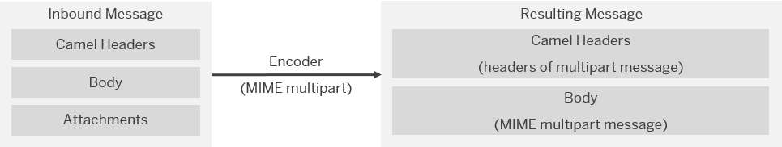

<!-- loio38165374a3b64ae9ba3e273a2742da1a -->

# MIME Multipart Messages

A Multipurpose Internet Mail Extensions \(MIME\) multipart message allows you to combine different kinds of content in one message \(for example, plain text and attachments\).

To mention a use case, if you want to send a message with attachments, but the protocol \(for example, HTTP or SFTP\) doesn't support attachments, you can send the message as a MIME multipart instead.

With a multipart subtype, you can specify how the different content types are combined as MIME multipart message. The property *Multipart Subtype* in the *Encoder* step allows you to specify the Content-Type property of the MIME message. For more information on the different options for *Multipart Subtype*, refer to the general definition of the Multipart Content-Type.

An input message for the MIME Multipart *Encoder* step doesn’t have to be composed in a specific way.

An inbound message for a MIME Multipart *Decoder* step has to be a MIME multipart message. Here, the multipart headers can either be stored as Camel headers or as part of the message body.

## Including Headers

You have the option to add custom headers to a MIME multipart message body. To enable this option, you have to activate *Add Multipart Header Inline*. In that case, the option *Include Headers* is displayed.

You can now enter regular expressions for the headers that are to be added. With such regular expressions \(regex\), you can define placeholders for the custom headers:

> ### Tip:  
> Example:
> 
> When you enter for *Include Headers* the string `(x-.*|myAdditionalHeader)`, all headers that start with `x-` and the header `myAdditionalHeader` are added to the body of the MIME-encoded message.

> ### Tip:  
> There are various cases where message headers can get lost. When SAP Cloud Integration sends a message to a receiver through a protocol that doesn't transfer Camel headers \(for example, when the Mail receiver adapter is used\). On the other hand, assume that the information contained in the header is required by the receiver to interpret and process the message in the right way. In such a case, you can configure the MIME Multipart Encoder in such a way that Camel headers become part of the message body. Using this feature, you can make sure that the information contained in the header is transferred to the receiver.

**MIME Multipart Encoder**

The following table summarizes how the *Encoder* step transforms the message depending on whether you select or deselect the option *Add Multipart Header Inline*.

**Encoder: Add Multipart Header Inline Option**

<table>
<tr>
<th valign="top">

Add Multipart Header Inline

</th>
<th valign="top">

Description

</th>
</tr>
<tr>
<td valign="top">

Selected

</td>
<td valign="top">

The Encoder transforms the inbound message into a new message where the message body \(of the resulting message\) is a MIME multipart message with headers.

Body and attachments \(if available\) of the inbound message are added as separate parts of the multipart message. The attachments are removed from the resulting message.

Note that the message are also always transformed into a MIME multipart message, regardless whether it contains attachments or not.

</td>
</tr>
<tr>
<td valign="top">

Deselected

</td>
<td valign="top">

The following cases can occur:

-   The inbound message has attachments: Encoder transforms message body and attachments of the inbound message into a MIME multipart message. The headers of the multipart message are added as Camel headers. The message body is replaced by the rest of the message.

-   The inbound message has no attachments: Encoder does not change the inbound message.

</td>
</tr>
</table>

The following figures illustrate how the property *Add Multipart Header Inline* influences the processing of the message.

  
  
**Add Multipart Header Inline Selected**

  
  
**Add Multipart Header Inline Deselected**

**MIME Multipart Decoder**

The following table summarizes how the *Decoder* step transforms the message depending on whether you select or deselect the option *Multipart Headers Inline*.

**Decoder: Multipart Headers Inline Option**

<table>
<tr>
<th valign="top">

Multipart Headers Inline

</th>
<th valign="top">

Description

</th>
</tr>
<tr>
<td valign="top">

Selected

</td>
<td valign="top">

The Decoder transforms the first part of the multipart message into the message body of the resulting message and the following parts \(if available\) are transformed into attachments of the resulting message.

In case the inbound message is, other than expected, no MIME multipart message with inline headers, the complete message body is interpreted as a preamble of the MIME multipart, and the resulting message is empty.

</td>
</tr>
<tr>
<td valign="top">

Deselected

</td>
<td valign="top">

The following cases can occur:

-   The inbound message either doesn’t contain the multipart header as Camel header or the Content-Type is no multipart, the Decoder step doesn’t change the inbound message.

-   In all other cases, the header of the inbound message is used as header of the multipart message \(and deleted\). The message body of the resulting message is built up out of those parts that are contained in the message body \(and, if available, out of the attachments\).

</td>
</tr>
</table>

**Related Information**  

[MIME Multipart Encoder: Handling Message Headers \(Examples\)](mime-multipart-encoder-handling-message-headers-examples-b446281.md "")

[Example Scenario with MIME Multipart Encoder/Decoder](example-scenario-with-mime-multipart-encoder-decoder-80baed3.md "")

