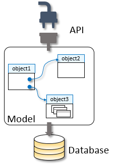

<!-- loio31f8c54de9ca4e8799371e7d385cde08 -->

# Model

It is common knowledge that data-driven software should be modeled on its underlying business processes.

Methodologies such as Domain-Driven Design are particularly relevant for complex data sets from diverse data sources. Data is arranged as related entities \(representing real-life business objects\) in data domains and connected through relationships \(called associations\) into logical data graphs. It is the ability to describe highly interconnected relationships that make data graphs the basis for modeling high-quality linked and coherent data that structurally represents business processes. In turn, graph-based APIs and protocols represent a growing trend in modern application development.

New business projects start with capturing the essential objects of a business domain in the form of a modeled data graph. The model serves both as the basis for persistence deployed as tables to databases and for the automatic service \(API\) definitions. [SAP Cloud Application Programming Model \(CAP\)](https://cap.cloud.sap/docs/guides/domain-models) and associated methodologies are an excellent starting point for the development of complex systems, "side-car" extensions, microservices, and other data sources.

But not everything can be modeled from scratch. Companies already use a variety of existing, multivendor business solutions services, on premise and cloud, each with their own data model and APIs. Landscapes are often a diverse collection of loosely coupled applications, systems, microservices, and other data sources, with different and inconsistent dialects, data concepts, APIs, and protocols. Developers have a hard time dealing with this complex diversity. Enterprise IT must track the dependency of client applications on the different APIs, widening the challenge to maintain and manage the lifecycle of the incongruent data models and APIs.

Traditional API management and API mediation solutions try to address some of these challenges, providing a developer portal and supporting relatively simple syntactic transformations, such as modifying HTTP headers, converting an XML payload to JSON, renaming APIs, or providing traffic management and abuse protection. But they do not address the more fundamental, semantic challenges faced by developers.

Graph, as a capability of SAP Integration Suite and API Management, is a next generation, semantic API mediation solution.

Out of the box, Graph provides a complete, semantic data graph spanning all major SAP systems, representing these systems as one single curated and connected data model, with a single API, a single authentication and access method, and a single protocol endpoint.

This SAP data graph is the foundation of an even broader semantic data graph of a customer's entire business landscape. Graph offers customers the methods, practices, and tools to expand the out-of-box data graph with additional custom entities and compositions, which can be seamlessly connect to the data graph, and consumed by developers in the same way.

Enterprises can use Graph to create and access their own, unique, enterprise data graph: a connected graph of all their business data.

