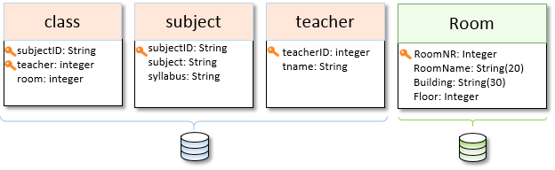
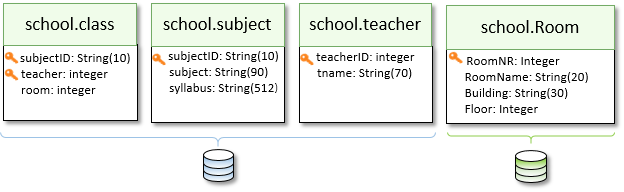
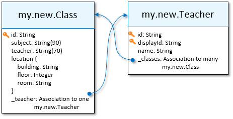
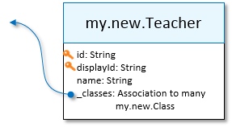

<!-- loiob8ab0c49d8844380a6a13540e148e3d3 -->

# Modeling Example

An example of a custom entity.

Custom entities are designed as a projection on the attributes of one or more existing entities, achieving benefits of simplification and consistency. This example illustrates the following: A data model of a school, with subjects, teachers, and classrooms. The example model has one API with three entities, describing the syllabus of the school, with the concept of a class: a combination of a subject and a teacher, taking place in a classroom. A second API, developed as a separate sidecar microservice, provides location information about the different classrooms. Both APIs are implemented with an underlying database persistence:



You can see how the two data sources are highly normalized, reflecting how the data is physically stored in two databases. But, while a highly normalized representation is usually the most efficient in storage, it's an inconvenient design for consumers of this data.

Imagine, as an app developer, you're asked to develop an application that lists the locations, teacher, and subject names of all classes, or perhaps prints a schedule of all of the classes taught by Joan Miller. You would have to access two different APIs, each with a different authentication. Then, write a loop for each class to perform as many as four different cross-API queries, with different protocol dialects, in order to collect all the required information for your app.


<a name="loiob8ab0c49d8844380a6a13540e148e3d3__section_a3b_vfw_dvb"/>

## Creating New Custom Entities

Our goal is to simplify the model by creating two custom entities, based on the *mirrored data sources* under their custom namespace. Custom namespaces are established when configuring the business data graphs that reference these data sources:



Even before we introduce custom entities, the inclusion of the data sources in the business data graph already allows the data to be accessed from one uniform API. For instance, to get a list of teachers called *Joan*, the following query could be called:

```
GET https://<subdomain>.a.integration.cloud.sap/graph/api/v1/school/teacher?$filter=startswith(name,'Joan')
```

As a data modeler or data architect, you want to redesign the model to make it much simpler for developers to query the data, and to avoid loops and multiple roundtrips. You can achieve this by *denormalizing* the class and classroom data \(`subject`, `teacher`, `location`\), and then by connecting the entities of the new model. You want to end up with a design that looks like this:



The entity `my.new.Class` is now self-contained, and includes all of the information that is relevant to most queries. There are also links to and from `my.new.Teacher`, allowing developers to easily navigate the model. Creating a list of all classes or listing Joan's classes is now done easily using single queries.

Setting up the new model requires the creation of two custom entities:


### `Class`

```
1 {
2 	"label": "Class information",
3 	"entity": "my.new.class",
4 	"version": "1.0.0",
5
6 	"sourceEntities": [
7    	{ "name": "school.class" },
8    	{ "name": "school.subject", "join": ["subjectID", "subjectID"] },
9    	{ "name": "school.Room", "join": ["room", "RoomNR"] }
10	 ],
11
12	 "attributes": [
13	   { "name": "id", "type": "String","key": true, "transform": "keyConcat", "source": ["subjectID", "teacher"] },
14   	{ "name": "subject", "sourceEntity": "school.subject", "annotations": { "description": "what they teach" } },
15   	{ "name": "teacher", "source": ["tname"], "sourceEntity": "school.teacher" },
16   	{ "name": "location.room", "type": "String", "source": "RoomName", "sourceEntity": "school.Room" },
17   	{ "name": "location.building", "source": ["Building"], "sourceEntity": "school.Room" },
18   	{ "name": "location.floor", "type": "String", "source": ["Floor"], "sourceEntity": "school.Room" },
19   	{ "name": "_teacher", "type": "Association", "associationTarget": "my.new.Teacher" },
20   	{ "name": "_teacher.id", "source": ["teacher"] }
21	 ]
22 }
```


### `Teacher`

```
23	{
24	  "label": "Teacher information",
25	  "entity": "my.new.Teacher",
26	  "version": "1.0.1",  // patch level 1
27	  "annotations": { "description": "An example of how to create a nice-to-use model of a \"teacher\"" }
28	
29	  "sourceEntities": [ 
30	    { "name": "school.teacher" }
31	  ],
32	  
33	  "attributes": [
34	    { "name": "id", "type": "String", "key": true, "source": ["teacherID"], "annotations": {"readonly": true} },
35	    { "name": "displayId", "type": "String", "source": "teacherID" },
36	    { "name": "name", "type": "String", "source": ["tname"] },
37	    { "name": "_classes[]", "type": "Assocation", "associatonTarget": "my.new.Class", "on": "_teacher" }
38	  ]
39	}


```

There's a lot going on here. Let's start from the second custom entity, `Teacher`.

Lines 23 and 39 enclose the custom projection object, whose full name is `my.new.Teacher`, the entity `Teacher` in the namespace `my.new` \(line 25\). By convention, entity names are singular and capitalized, while namespace names are all lower-case.

Line 26 defines the version of this custom entity. By convention, the first version is `1.0.0`. Here, we've upgraded to the first patch, so the version is `1.0.1`.



Lines 29–31 define the list of data sources that are used to define this new custom entity. Most custom entities are a projection on just one source entity. The source entity name is that of one of the mirrored entities. Here, the mirrored source entity is `school.teacher`, the teacher entity within the school namespace.

Lines 34–37 define the four attributes of our new `Teacher`. The first and second attributes are common attributes, both based on the same source attribute, `teacherID`. Observe that the default `integer` type is overwritten with the `String` type. And since the same source attribute is used to populate two different attributes, the `id` is defined as `readonly`. The `id`, `displayID`, and `name` are of the type `String`, without a maximal length. This overrides the default of inheriting the type of the attribute in the source system \(Integer and String\(70\) respectively\).

Pay special attention to line 37, where an association-to-many is defined, by listing the backlink, `_teacher in my.new.Class`.

Now, to the `Class` entity. This entity is composed of attributes coming from three different source entities. The relationship between these source entities is described in lines 6–9.

There are three data source entities, and `Class` is a composed projection, hiding the data sources from the consumer of the Graph API. The first and default source entity is `school.class`. Other source entities are defined in relation to its source attributes: `subjectID` and `room`, respectively.

The `school.class` entity has a composite key, in which only the combination of its two key attributes creates a unique value. Line 13 shows the use of the `keyConcat` transform to turn these into a single key, called `id`. Observe how most of the other attributes \(lines 14–18\) use source attributes from the other source entities, and they have to declare the source entity explicitly, using the `sourceEntity` property.

Line 14 is an example of an attribute whose name is the same as the source attribute \(subject\). It also shows how to provide a description for the attribute.

Finally, line 19 shows an association-to-many, with a single key reference, on line 20.

