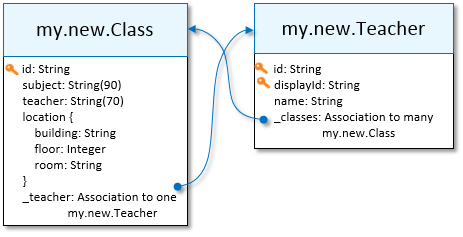

<!-- loioc354e55333e8433ab67ea6a02010f396 -->

# Modeling Principles and Design Guidelines


<a name="loioc354e55333e8433ab67ea6a02010f396__section_ywq_mvb_bvb"/>

## Elements of a Model


### Terminology


<table>
<tr>
<th valign="top">

Term

</th>
<th valign="top">

Definition

</th>
</tr>
<tr>
<td valign="top">

Entity

</td>
<td valign="top">

The structural design of the entity, the entity type.

It also refers to the data values, the entity instances.

</td>
</tr>
<tr>
<td valign="top">

Attribute

</td>
<td valign="top">

The design of the attribute or the value of a specific attribute instance.

</td>
</tr>
</table>

A data model consists of connected entities, which represent the business objects of the real world.

The detailed properties \(fields\) of an entity are called *attributes*. Entity instances must be uniquely addressable, via the use of key attributes. As a best practice, new custom entities only have one key attribute. Existing \(mirrored\) entities may have a composite key, consisting of several separate attributes.

Structurally, most attributes are simple \(primitive\) types, but can also be:

-   A nested array of primitive types

-   A structured type or a nested array of a structured type


A nested array of structured type is called a *Composition* \(a composition of many\) if the items can be uniquely identified within the array via the use of key attributes. Compositions represent a relationship of whole parts. They are composed of one root-entity and one or more subentities. The top-level entity containing a composition is the root-entity, and contained entity-arrays are called *subentities* or *component entities*. For example, a `Book` entity has a title \(a primitive attribute of type `String`\) and chapters, a nested subentity with its own title, description, page count, and so forth. Subentities can have further nested subentity compositions.

Semantically related attributes can be grouped together under a single name. For example, a book's ISBN and CIP codes are part of `publisher` data. This grouping is called *structured type*, rather than a *composition of one*.

The structure of an entity is easily represented as a pseudo JSON structure, for example:


<table>
<tr>
<th valign="top">

Entity Type Structure

</th>
<th valign="top">

Entity Instance

</th>
</tr>
<tr>
<td valign="top">

```
Book: {
   key id: String,
   title: String,
   publisher: { // structured type
     ISDN: String,
     CIP: String
   }
   chapters: [ // Composition
     { 
       key id: String,
       title: String,
       pageCount: Integer
     }
  ]
}

```


</td>
<td valign="top">

```
Book: 
{
   id: "5",
   title: "Harry Potter",
   publisher: {
     ISDN: "123abc",
     CIP: "aGh2"
   }
   chapters: [
     { id: "01", title: "chapter 1", pageCount: 12 }
     { id: "02", title: "chapter 2", pageCount: 14 }
   ]
}

```


</td>
</tr>
</table>

Entities are connected to each other through attributes known as *Associations*. An association is a reference to another entity, known as the target of the association. Unlike compositions, associations always target another independent entity. There are two types of associations:

-   Association to one: a link to one specific target entity instance

-   Association to many: a link to an array \(zero or more\) of target entities


Developers use associations to naturally navigate the data graph.


<a name="loioc354e55333e8433ab67ea6a02010f396__section_zz1_1wb_bvb"/>

## Custom Entities

Custom entities are designed as a projection on the attributes of one or more existing entities. The following example describes a database model of a school, with subjects, teachers, and classrooms. The example model has one API with three entities, describing the syllabus of the school, with the concept of a class: a combination of subject and teacher, taking place in a classroom. A second API, that is developed as a separate sidecar microservice, provides location information about the different classrooms. Both APIs are implemented with an underlying data persistence:


You can see how the two data sources are highly normalized, reflecting how the data is physically stored in two databases. But, while a highly normalized representation is usually the most efficient in storage, it's a deeply inconvenient design for consumers of this data.

Imagine that, as an app developer, you're asked to develop an application that provides a list of the locations, teacher, and subject names of all classes, or, perhaps, print a schedule of all classes taught by Joan Miller. You would have to access two different APIs, each with a different authentication, and then write a loop for each class to perform as many as four different cross-API queries \(with different protocol dialects\), in order to collect all the required information into your app.

While this example looks simplistic, it is representative of many bottom-up designed REST APIs.

As data modelers or data architects, you want to redesign the model to make it easier for developers to query the data, and to avoid loops and multiple round trips. You can achieve this by denormalizing the class and classroom data \(subject, teacher, location\), and then by connecting the entities of the new model. You might end up with an easier design that looks more like the following:



The `my.new.Class` entity is now self-contained and includes all information that is relevant to most queries. Using the links to and from the `my.new.Teacher` entity, developers can easily navigate this simple model. Creating a list of all of the classes or listing Joan Miller's classes are now easy, single-step queries.

