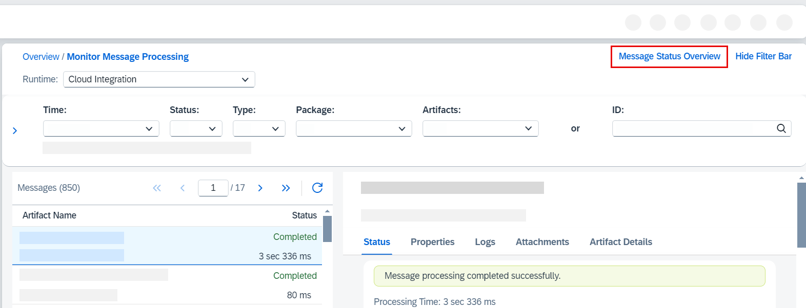

<!-- loio314df3f8f4334dd8829c62e865cc6d02 -->

# Monitor Message Processing

The message monitor provides an overview of the messages processed on a tenant and allows you to display the details for individual messages.

You open the message monitor by clicking a tile in the *Monitor Message Processing* area.

Messages are displayed according to the filter settings of the tile.

> ### Note:  
> In high-load scenarios, it is possible that the number of messages is still being determined while the list of messages is already being displayed. The determination of the message count is independent of the message search. This ensures that the message monitor does not encounter a timeout situation when determining a long list of messages.

## Filter Settings

You can control which messages are displayed by changing the filter.

You can filter messages by *Time*, *Status*, and *Artifact*.

**Filter Attributes**

<table>
<tr>
<th valign="top">

Attribute

</th>
<th valign="top">

Description

</th>
</tr>
<tr>
<td valign="top">

*Time* 

</td>
<td valign="top">

Allows you to select from the following predefined time intervals:

-   *All*

-   *Past Minute*

-   *Past Hour*

-   *Past 24 Hours*

-   *Past Week*

-   *Past Month*

-   *Custom*

    When you've selected the option *Custom*, you can select date and time with a graphical element with two components: a calendar element and a circular watch element. To select the date, interact with the calendar element and choose a specific day. To select the time, manipulate two separate circles on the watch element to set the desired hour and minute, respectively..

You can select the start and end time of the interval.

The specified time interval is displayed above the message list. When you browse different pages of the message monitor, the time interval stays the same. You can only modify the time interval by changing the filter settings or by refreshing the message monitor \(applies to all-time intervals except for *Custom*\).

</td>
</tr>
<tr>
<td valign="top">

*Status* 

</td>
<td valign="top">

Allows you to filter messages according to their status.

In the dropdown list you can select one of the following values as the status:

-   *All*

-   *Failed*

-   *Retry*

-   *Completed*

-   *Processing*

-   *Escalated*

-   *Cancelled*

-   *Discarded*
-   *Abandoned*

See: [Message Status](message-status-733a57b.md)

</td>
</tr>
<tr>
<td valign="top">

*Type* 

</td>
<td valign="top">

Allows you to filter for all artifacts with a dedicated type. The following filter options are available:

-   *All*

-   *Integration Flow*

-   *API \(Edge runtimes only\)*

-   *OData API*

-   *SOAP API*

-   *REST API*

</td>
</tr>
<tr>
<td valign="top">

*Package* 

</td>
<td valign="top">

Allows you to display all messages belonging to a specific package .

If you select a package, you can also filter for the different types or artifacts belonging to that package. If you change the package or type selected in the filter, however, the artifact selection is cleared as well.

</td>
</tr>
<tr>
<td valign="top">

*Artifact* 

</td>
<td valign="top">

Allows you to display messages associated with specific artifacts. You can select multiple artifacts for which you want to display messages. By default, all artifacts are shown.

The list contains all artifacts for which message processing logs exist. When you position the cursor on an artifact in the list, the tooltip shows the artifact ID.

You can filter for artifacts with a specific sequence of characters in their name or ID. The search is case insensitive.

</td>
</tr>
<tr>
<td valign="top">

*ID* 

</td>
<td valign="top">

Allows you to filter for messages using different of IDs.

See: [Using IDs to Filter Messages](using-ids-to-filter-messages-a820752.md)

</td>
</tr>
</table>

Choose *Use More Fields* to display additional filter criteria.

See: [Using Additional Filter Criteria](using-additional-filter-criteria-6891f9e.md)

## Messages Table

The messages for the selected filter settings are displayed in a table under *Messages*. If the number of filtered messages exceeds 50, the list is split over several pages \(each page containing a maximum of 50 messages\). You can browse through the different pages by selecting the corresponding navigation options \(*Show first data page*, *Show last data page*, *Show previous data page*, and *Show next data page*\).

Alternatively, you can enter a page number to navigate to a specific page of the list.

The following attributes are displayed for each message:

**Message Attributes in Message Overview**

<table>
<tr>
<th valign="top">

Attribute

</th>
<th valign="top">

Description

</th>
</tr>
<tr>
<td valign="top">

*Artifact Name* 

</td>
<td valign="top">

Display name of the artifact \(for example, the name of the integration flow that specifies the message processing\).

The tooltip shows the technical name, the artifact, and the package name.

</td>
</tr>
<tr>
<td valign="top">

*Status* 

</td>
<td valign="top">

Status of end-to-end message processing.

</td>
</tr>
<tr>
<td valign="top">

*Last Updated at* 

</td>
<td valign="top">

Time at which the message processing log was last updated.

</td>
</tr>
<tr>
<td valign="top">

*Processing Time* 

</td>
<td valign="top">

Total message processing time.

</td>
</tr>
</table>

For a selected message, the details are displayed to the right of the message table. The header area provides the following information about the selected message: *Artifact Name* and *Last Updated at*.

After the header, the following sections contain detailed information about the selected message:

-   *Status*

    Contains status information about the message such as the `Processing Time`. If the message is **NOT** in status COMPLETED, the last error message is displayed \(if available\).

-   *Properties*

    Contains

    -   The *Message ID*

    -   The *Correlation ID*
    -   The *Sender*
    -   The *Receiver*
    -   The *Application Message ID*
    -   The *Application Message Type*
    -   The *Custom Status*
    -   The *Retention Periods* for completed and uncompleted messages.

    > ### Note:  
    > *Sender*, *Receiver*, *Application Message ID*, *Application Message Type*, and *Custom Status* are optional and can be set via the Content Modifier. They're only shown if they aren’t empty.
    > 
    > The *Custom Status* is only visible if it differs from the overall processing status.

-   *Custom Header Properties*

    The properties can be set using the script step. If they’re set, they’re displayed in this section.

    For more information, see: [Use Custom Header Properties to Search for Message Processing Logs](use-custom-header-properties-to-search-for-message-processing-logs-d4b5839.md)

-   *Logs*

    Displays the *Log Level* and the *Runtime Node*. Choosing the log level link takes you to the message processing log displayed in table form. You access the textual representation by selecting *Open Text View*.

    If the processing of an integration flow failed and retry runs were performed, the runs are displayed in a table \(up to 50 retries\) in the *Logs*section.

    If Data Archiving is activated for logs of an integration artifact, the archiving status is displayed in this section. The status are:

    -   **Not Archived**:

        -   Data Archiving is not activated for logs of this integration artifact.

        -   Data Archiving does not consider logs of discarded message processing.
        -   Data Archiving is configured to consider logs of successfully completed messages only.

    -   **Archiving Pending**: Data Archiving is activated for logs of this integration artifact.
    -   **Archived**: Data Archiving is completed for this log.

-   *Attachments*

    This section is only displayed if the message processing log contains attachments.

    Any type of attachment that can be displayed as text is supported. In particular, the following types of content can be displayed:

    -   Plain text

    -   XML

        XML attachments are displayed as formatted plain text \(including tags\).

    -   Text files with comma-separated values

    -   Text files with tab-separated values

        In these files, each entry is represented as one line of the text file.

    -   HTML

        HTML attachments are displayed as plain text \(including tags\).

-   *Artifact Details*

    This section displays the artifact *Name*, *ID*, *Type*, and *Package*, if available.

    There are the following hyperlinks:

    <table>
    <tr>
    <th valign="top">

    Hyperlink
    
    </th>
    <th valign="top">

    Description
    
    </th>
    </tr>
    <tr>
    <td valign="top">
    
    *Manage Integration Content* 
    
    </td>
    <td valign="top">
    
    Opens the integration content monitor.

    When navigating to the integration content monitor, the active artifact that is currently deployed will be opened.

    See: [Manage Integration Content](manage-integration-content-09a7223.md)
    
    </td>
    </tr>
    <tr>
    <td valign="top">
    
    *View deployed Artifact* 
    
    </td>
    <td valign="top">
    
    Opens the deployed artifact \(if it's an integration flow, the model corresponding to the deployed integration flow is shown, but editing is not possible\).
    
    </td>
    </tr>
    <tr>
    <td valign="top">
    
    *Navigate to Artifact Editor* 
    
    </td>
    <td valign="top">
    
    Opens the artifact editor and allows you to edit the artifact \(if it's an integration flow, you can edit the integration flow model\).
    
    </td>
    </tr>
    </table>
    

<a name="loio314df3f8f4334dd8829c62e865cc6d02__section_jkv_4xd_5cc"/>

## Message Status Overview

You can quickly navigate to the Message Status Overview page with the button *Message Status Overview*.

**Related Information**  

[Message Processing Log – Text View](message-processing-log-text-view-718309a.md "The message processing log displays structured information on the processing of a message.")

[Message Status](message-status-733a57b.md "The message processing status indicates how a messages has been processed at runtime.")

[Configuring Archiving Settings](configuring-archiving-settings-c38760d.md "You can configure the archiving settings via the Integration Content Monitor for each integration flow.")

