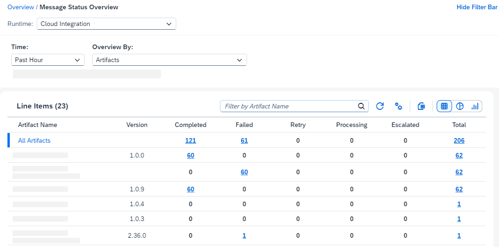
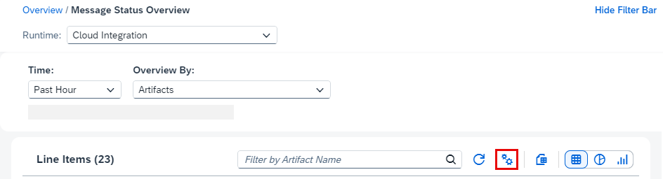

<!-- loio0cde046d97de4e89bd88c86ef878cfae -->

# Monitor Message Status Overview

The *Message Status Overview* page provides a customizable overview of the messages processed and their respective statuses in a selected time frame as well as quick navigation to and from the Message Monitor.

You access the Message Status Overview table by clicking the tile Message Status Overview in the section Monitoring Status Overview.

> ### Note:  
> *Message Status Overview* only works with edge locations that are running runtime version 8.20x or later, and Cloud Integration version 6.58.x. If you are using an earlier version, you will receive the error `No handler registered for command ‘com.sap.it.op.tmn.commands.dashboard.webui.MplStatusOverviewCommand’`. To resolve this issue, update your runtime version to 8.21.x or newer.

<a name="loio0cde046d97de4e89bd88c86ef878cfae__section_o4s_vmy_5cc"/>

## Message Status Overview Table

The table displays the collected data of the selected runtime, which you can change in the dropdown menu Runtime.

The table shows the individual list names, and the status filters you selected. For certain options, such as *Artifacts* or *Integration Flows*, it also shows the version. If the *Version* column is empty, this can be because it is still in *Draft*, the data can’t be retrieved or it is a row that contains combined data, such as the first row *All Artifacts* or *All Integration Flows*.

By default, the inline items are displayed in table format and sorted by the total number of messages in descending order. You can change this by selecting *Settings* \> *Sort*.

You can also choose to display your data as a pie chart or column chart by selecting *Pie Chart* or *Column Chart* respectively.

Once you switch to the pie or column chart, you can choose for example for which artifact, sender, or receiver \(according to your previously selected data under *Overview By*\) you want to see the data. To do so, use the dropdown menu above the chart. By default, the chart displays the combined data of the first row of the table.

The statuses shown in the charts correspond to the statuses in the table. You can change the selection and order the same way you would for the table version. For more information, see Status below.

**Navigation to and from Message Monitor**

You can navigate to the *Message Monitor* page by clicking any non-zero value in the table. The settings for the filters *Time*, *Status* and *Overview By* are then used on the *Message Monitor* page.

If you display your data in pie or column form, you can click on the respective parts or bars, which will take you to the *Message Monitor* page in the same way.

If you navigate back to *Message Status Overview* from the *Message Monitor* with the button *Message Status Overview*, the filters *Time* and *Overview By* you previously selected on the *Message Status Overview* page remain in place.

<a name="loio0cde046d97de4e89bd88c86ef878cfae__section_f5k_mny_5cc"/>

## Filter Options

You can customize your overview with various filter options. The table also allows you to filter for specific artifacts by entering the artifact name in the search field. This is case insensitive.

**Overview By**

You can filter your message statistics according to different criteria. You can get an overview for all artifacts or integration flows for example, or you can get more specific statistics for artifacts with senders or receivers.

Filter which data you want to show by selecting one of the following options from the dropdown list. By default, *Artifacts* is selected.

-   Artifacts

-   Integration Flows

-   APIs \(Edge runtime only\)

-   OData APIs

-   SOAP APIs

-   REST APIs

-   Application Message Type

-   Sender

-   Receiver

**Time**

Specify your selection by showing only messages processed in a specific time span, such as the last hour.

> ### Note:  
> The options available depend on your selected runtime and your database usage. It might not be possible to collect statistics for larger periods of time due to high database usage.

**Status**

Filter your messages according to their status. You can select multiple statuses which will be shown as columns in the table.

By default, five of the eight statuses are selected. You can adjust these under *Table Settings* \> *Columns* and choose additional statuses to display.

To change the order of the status columns, simply drag the status up or down in the list. If you select a status, you can also use the respective buttons next to the status name.

For more information on the different message statuses, see [Message Status](message-status-733a57b.md).

<a name="loio0cde046d97de4e89bd88c86ef878cfae__section_n45_qmf_jdc"/>

## Export Your Data

You can export your data as an Excel .xlsx file. This will take into account your current filter settings and order of columns. To do so, simply select *Export* and you will be asked whether you want to download the file.

You can choose a custom name for the file. The default name is determined by your *OverviewBy* filter settings.

Note that this option is only available if you display your data in table form.

