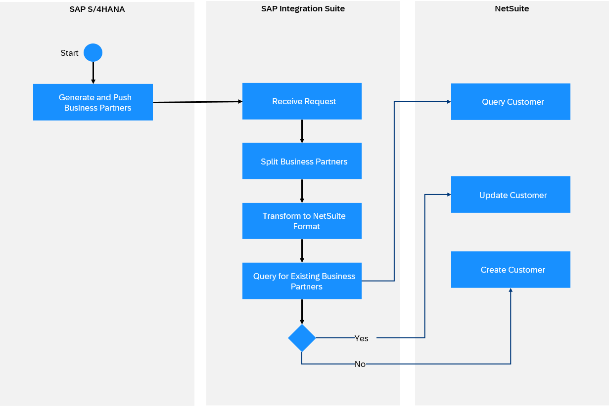

<!-- loio618127afc04e43179a34452d28780e50 -->

# NetSuite Receiver Adapter

The NetSuite receiver adapter connects SAP Integration Suite to NetSuite.

> ### Note:  
> This adapter is available on SAP Business Accelerator Hub.
> 
> For more information, see [Consuming Integration Adapters from SAP Business Accelerator Hub](consuming-integration-adapters-from-sap-business-accelerator-hub-b9250fb.md).
> 
> The availability of the adapter is dependent on your SAP Integration Suite service plan. For more information about different service plans and their supported feature set, see SAP Notes [2903776](https://launchpad.support.sap.com/#/notes/2903776) and [3188446](https://launchpad.support.sap.com/#/notes/3188446).

> ### Note:  
> This adapter exchanges data with a remote component that might be outside the scope of SAP. Make sure that the data exchange complies with your company’s policies.

NetSuite is an integrated cloud business software suite, including business accounting, ERP, CRM, and e-commerce software. The NetSuite receiver adapter helps you exchange data between the two systems.

<a name="loio618127afc04e43179a34452d28780e50__section_dfh_kr4_tbc"/>

## How the NetSuite Receiver Adapter Works

If you have configured a NetSuite receiver adapter, the data exchange is performed as follows at runtime: SAP sends the request to NetSuite \(this is a receiver system\) through SAP Integration Suite. NetSuite works on the request and sends back the data to SAP.

For Example, SAP S4/HANA generates and pushes the list of Business Partners to be copied to NetSuite. SAP Integration Suite receives the request and transforms it to the required NetSuite format. SAP Integration Suite then queries the existing Customers in NetSuite, updates data for existing customers, or creates a new entry for non-existent customers.

The adapter supports the following variants:

-   SOAP

-   RESTlet

<a name="loio618127afc04e43179a34452d28780e50__section_ndv_2s4_tbc"/>

## Configuring the NetSuite Receiver Adapter

The following tables describe the parameters that you need to configuration for a selected adapter variant.

### SOAP

**Connection**

<table>
<tr>
<th valign="top">

Parameter

</th>
<th valign="top">

Description

</th>
</tr>
<tr>
<td valign="top">

*Address* 

</td>
<td valign="top">

Specify the address of the NetSuite tenant to be used for the connection. This address typically includes your NetSuite Account ID. NetSuite URLs often follow the pattern: `https://<ACCOUNT_ID>.suitetalk.api.netsuite.com`.

Example: `https://12345-sb1.suitetalk.api.netsuite.com`

</td>
</tr>
<tr>
<td valign="top">

*Account ID* 

</td>
<td valign="top">

Specify the Account ID to be used for the connection.

Example: `1112711_SB1`

</td>
</tr>
<tr>
<td valign="top">

*Authentication* 

</td>
<td valign="top">

Select the Authentication Mechanism. Currently, only the Token-Based Authentication \(TBA\) is supported.

</td>
</tr>
<tr>
<td valign="top">

*Consumer Credentials Alias* 

</td>
<td valign="top">

Specify the name of the *User Credentials* artifact \(to be deployed in the *Monitor* \> *Integrations and APIs* section under *Security Material*\). The *User Credentials* artifact includes both Consumer Key \(as username\) and Consumer Secret \(as password\).

</td>
</tr>
<tr>
<td valign="top">

*Token Credentials Alias* 

</td>
<td valign="top">

Specify the name of the *User Credentials* artifact \(to be deployed in the *Monitor* \> *Integrations and APIs* section under *Security Material*\). The *User Credentials* artifact includes both Token ID \(as username\) and Token Secret \(as password\).

</td>
</tr>
<tr>
<td valign="top">

*Timeout \(in ms\)* 

</td>
<td valign="top">

Specify the response timeout in milliseconds. This timeout allows you to configure the maximum waiting time for SAP until a response is received from NetSuite.

Example: `6000`

</td>
</tr>
</table>

**Processing**

<table>
<tr>
<th valign="top">

Parameter

</th>
<th valign="top">

Description

</th>
</tr>
<tr>
<td valign="top">

*Version* 

</td>
<td valign="top">

Specify the version of the API to be used for this interaction with NetSuite.

</td>
</tr>
<tr>
<td valign="top">

*Operation* 

</td>
<td valign="top">

To access and exchange data with NetSuite, you can choose one of the available operations to specify the type of action you want to run in NetSuite.

</td>
</tr>
<tr>
<td valign="top">

*Record* 

</td>
<td valign="top">

Specify the NetSuite Object/Entity on which to perform the selected operation. It can be any of the NetSuite-defined records like Accounting records, Employee records, or any Custom records. This is an editable dropdown field; the user can manually add any other records that are not listed in the dropdown.

> ### Note:  
> Since the dropdown is editable, ensure you do not leave the operation field blank.

</td>
</tr>
<tr>
<td valign="top">

*Handle Multiple Record Types* 

</td>
<td valign="top">

Enable if the request intends to perform a list operation on multiple record types in a single call. For example: In addList operation, you can add both `Contact` and `Customer` records within a single request.

</td>
</tr>
<tr>
<td valign="top">

*Create Request From Properties* 

</td>
<td valign="top">

Enable this property to create the body from the properties.

</td>
</tr>
<tr>
<td valign="top">

*Id Type*

\(Only available if parameter *Create Request from Properties* is selected\)

</td>
<td valign="top">

Select the desired ID type of the record from the dropdown.

Example: *InternalID*

</td>
</tr>
<tr>
<td valign="top">

*Id Value*

\(Only available if parameter *Create Request from Properties* is selected\)

</td>
<td valign="top">

Specify the required ID value of the record.

Example: `1091144` 

</td>
</tr>
<tr>
<td valign="top">

*Treat Functional Error as Exception* 

</td>
<td valign="top">

Enable to treat a functional error returned by NetSuite as an exception.

</td>
</tr>
<tr>
<td valign="top">

*Enable Request Level Preferences* 

</td>
<td valign="top">

Enable to specify various request-Level preferences \(additional parameters below\).

</td>
</tr>
<tr>
<td valign="top">

*Disable Mandatory CustomField Validation*

\(Only available if parameter *Enable Request Level Preferences* is selected\)

</td>
<td valign="top">

Enable to change the handling of custom fields that are configured in the UI to be mandatory. When enabled, these fields won't be required during SOAP web services requests. If the property is disabled, it will be mandatory.

</td>
</tr>
<tr>
<td valign="top">

*Disable System Notes For Custom Fields*

\(Only available if parameter *Enable Request Level Preferences* is selected\)

</td>
<td valign="top">

Enable to prevent the creation of system notes for modifications to custom fields. System notes are automatically generated entries that track changes to a record, including changes to specific field values. Depending on your integration, utilizing this preference could enhance performance.

</td>
</tr>
<tr>
<td valign="top">

*Ignore Read Only Fields*

\(Only available if parameter *Enable Request Level Preferences* is selected\)

</td>
<td valign="top">

Enable to modify the system's behavior if you mistakenly send a value for a read-only field in your request. If this property is selected, the system ignores these read-only in your request payload.

</td>
</tr>
<tr>
<td valign="top">

*Warning As Error*

\(Only available if parameter *Enable Request Level Preferences* is selected\)

</td>
<td valign="top">

Enable to process all NetSuite warning messages as errors. This parameter changes the handling of custom fields that are configured on the user interface to be mandatory. When enabled, these fields won't be required in requests. If the property is disabled, it will be mandatory. If disabled and the required fields aren't provided, the system returns a `USER_ERROR`, prompting for the missing field value.

</td>
</tr>
<tr>
<td valign="top">

*Body Fields Only*

\(Only available if parameter *Enable Request Level Preferences* is selected\)

</td>
<td valign="top">

Enable to determine if sublist values should be included in search results. When enabled, only body fields are returned. If disabled, sublist values are also included. Selecting this property can significantly improve performance.

</td>
</tr>
<tr>
<td valign="top">

*Page Size*

\(Only available if parameter *Enable Request Level Preferences* is selected\)

</td>
<td valign="top">

Specify the number of records to be returned on a single page for the Search operation.

Example: When you set a value for page size, the following limits apply: for Synchronous operations, a minimum of 5 and a maximum of 1000, and for Asynchronous operations, a minimum of 5 and a maximum of *2000*.

</td>
</tr>
<tr>
<td valign="top">

*Return Search Columns*

\(Only available if parameter *Enable Request Level Preferences* is selected\)

</td>
<td valign="top">

Enable to return full records, as opposed to columns. The default value for the preference is true. If this property is enabled, it is also required to specify search return columns, otherwise, the system returns an error.

</td>
</tr>
<tr>
<td valign="top">

*Run Server SuiteScript And Workflow Triggers*

\(Only available if parameter *Enable Request Level Preferences* is selected\)

</td>
<td valign="top">

Enable to control SuiteScript and trigger workflows per request. If not selected, the company preference set on the SOAP Web Services Preferences page is used. If selected, it overrides the company preference set in the UI.

</td>
</tr>
<tr>
<td valign="top">

*Request Headers*

</td>
<td valign="top">

Enter a list of custom headers, separated by a pipe `|`, to send to the target system. By default, no custom headers are sent. Use an asterisk `*` to send all custom headers to the target system. Alternatively, you can dynamically pass on the values by defining a property that includes a list of headers.

</td>
</tr>
<tr>
<td valign="top">

*Response Headers*

</td>
<td valign="top">

Enter a list of headers coming from the target system's response, separated by a pipe `|`, to be received in the message. Use an asterisk `*` to receive all the headers from the target system, which is also the default value.

</td>
</tr>
</table>

### RESTlet

**Connection**

<table>
<tr>
<th valign="top">

Parameter

</th>
<th valign="top">

Description

</th>
</tr>
<tr>
<td valign="top">

*Address* 

</td>
<td valign="top">

Specify the address of the NetSuite tenant to be used for the connection. This address typically includes your NetSuite Account ID. NetSuite URLs often follow the pattern: `https://<ACCOUNT_ID>.suitetalk.api.netsuite.com`.

Example: `https://12345-sb1.suitetalk.api.netsuite.com`

</td>
</tr>
<tr>
<td valign="top">

*Account ID* 

</td>
<td valign="top">

Specify the Account ID to be used for the connection.

Example: `1112711_SB1`

</td>
</tr>
<tr>
<td valign="top">

*Authentication* 

</td>
<td valign="top">

Select the Authentication Mechanism. Currently, only the Token-Based Authentication \(TBA\) is supported.

</td>
</tr>
<tr>
<td valign="top">

*Consumer Credentials Alias* 

</td>
<td valign="top">

Specify the name of the *User Credentials* artifact \(to be deployed in the *Monitor* \> *Integrations and APIs* section under *Security Material*\). The *User Credentials* artifact includes both Consumer Key \(as username\) and Consumer Secret \(as password\).

</td>
</tr>
<tr>
<td valign="top">

*Token Credentials Alias* 

</td>
<td valign="top">

Specify the name of the *User Credentials* artifact \(to be deployed in the *Monitor* \> *Integrations and APIs* section under *Security Material*\). The *User Credentials* artifact includes both Token ID \(as username\) and Token Secret \(as password\).

</td>
</tr>
<tr>
<td valign="top">

*Reuse HTTP Connection*

</td>
<td valign="top">

Enable if the connection needs to be reused.

</td>
</tr>
<tr>
<td valign="top">

*Connection Timeout \(in ms\)*

</td>
<td valign="top">

Specify the maximum waiting time \(in milliseconds\) for the connection to be established.

</td>
</tr>
<tr>
<td valign="top">

*Response Timeout \(in ms\)*

</td>
<td valign="top">

Specify the maximum waiting time \(in milliseconds\) for a response message to be received.

</td>
</tr>
</table>

**Processing**

<table>
<tr>
<th valign="top">

Parameter

</th>
<th valign="top">

Description

</th>
</tr>
<tr>
<td valign="top">

*Operation Type*

</td>
<td valign="top">

Select the operation type:

-   *Basic* to use the dropdowns and parameter text fields.

-   *Advanced* to provide the relative URI.

</td>
</tr>
<tr>
<td valign="top">

*Method*

</td>
<td valign="top">

Select the required method for the above operation:

-   *POST*
-   *PUT*
-   *GET*
-   *DELETE*

</td>
</tr>
<tr>
<td valign="top">

*Script ID*

</td>
<td valign="top">

Specify the ID value of the deployed script.

</td>
</tr>
<tr>
<td valign="top">

*Deployment ID*

</td>
<td valign="top">

Specify the deployment number corresponding to the script.

</td>
</tr>
<tr>
<td valign="top">

*Relative URI*

</td>
<td valign="top">

Specify the relative path.

Example: `app/site/hosting/restlet.nl?script=7&deploy=1&id=3`

> ### Note:  
> The relative path is a part of the request URL after the instance URL and must start with /

</td>
</tr>
<tr>
<td valign="top">

*Query Parameters*

</td>
<td valign="top">

Specify the comma-separated query parameters that need to be added to the URL.

Example: `key1=value1,key2=value2`

</td>
</tr>
<tr>
<td valign="top">

*Content-Type*

</td>
<td valign="top">

Select the type of content for the RESTlet script.

-   *Application/JSON*

-   *Application/XML*

-   *TEXT/Plain*

</td>
</tr>
<tr>
<td valign="top">

*Request Headers*

</td>
<td valign="top">

Enter a list of custom headers, separated by a pipe \(|\), to send to the target system. By default, no custom headers are sent. Use an asterisk\(\*\) to send all custom headers to the target system. Alternatively, you can dynamically pass on the values by defining a property that includes a list of headers.

</td>
</tr>
<tr>
<td valign="top">

*Response Headers*

</td>
<td valign="top">

Enter a list of headers coming from the target system's response, separated by a pipe \(|\), to be received in the message. Use an asterisk \(\*\) to receive all the headers from the target system, which is also the default value.

</td>
</tr>
</table>

