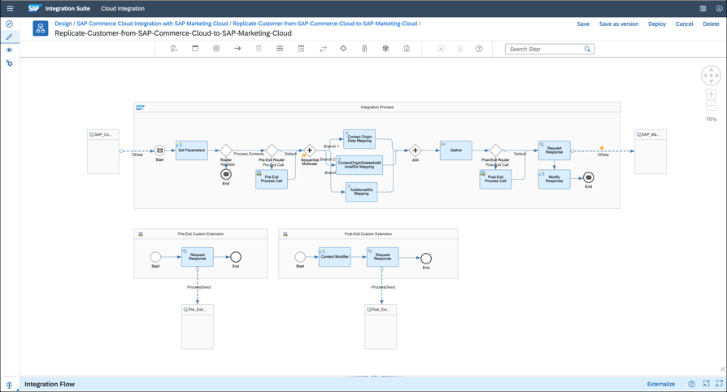

<!-- loiodb10bebf11fe4dc48bd97d2c4011485c -->

<link rel="stylesheet" type="text/css" href="../css/sap-icons.css"/>

# Overview of Integration Flow Editor

Cloud Integration provides an integration flow editor that comes with highly responsive features. It helps you to work efficiently in the development of an integration scenario.

<a name="loiodb10bebf11fe4dc48bd97d2c4011485c__section_ty5_drx_jqb"/>

## Integration Flow Editor

The editor displays and allows you to edit the content of the currently opened integration flow. It also displays tabs of the property sheet, so that you can move between them easily. The editor view provides sufficient space for modeling your integration scenarios. For more information about using components in the editor view, see [Define Settings for the Integration Flow](define-settings-for-the-integration-flow-3a6446c.md).

The palette shows all the options required to model an integration flow. For more information about the using different components during the development, see [Configure Integration Flow Components](configure-integration-flow-components-3171795.md).

  

<a name="loiodb10bebf11fe4dc48bd97d2c4011485c__section_itp_zqx_jqb"/>

## Benefits of the Integration Flow Editor

The editor comes with a simplified approach and provides you the following benefits:

-   Horizontal placement of palette gives more space for the modeling area.

-   You can see the minimized property sheet to have a better modeling area by design.

-   Double click to open the property sheet whenever you want to navigate to the detail section.

-   Availability of simulation tool in the palette helps you to simulate the integration flow during any phase of the development.

-   The search field in the palette helps you to search or choose the flow steps. It reduces your development time.

<a name="loiodb10bebf11fe4dc48bd97d2c4011485c__section_zjf_frx_jqb"/>

## Integration Flow Editor Palette

The following table shows the icons in the palette and their actions.

<table>
<tr>
<th valign="top">

Icon

</th>
<th valign="top">

Name of the Icon

</th>
<th valign="top">

Action

</th>
</tr>
<tr>
<td valign="top">



</td>
<td valign="top">

*Copy*

</td>
<td valign="top">

Allows you to copy flow steps from your integration flow.

</td>
</tr>
<tr>
<td valign="top">



</td>
<td valign="top">

*Paste*

</td>
<td valign="top">

Allows you to paste the copied flow steps within and across integration flows. Supports 2 pasting options:

-   explicit selection – you paste the copied flow steps at a specific point of your choice within or across integration flows.

-   without explicit selection – you paste within the integration flow without moving the mouse to a specific point. The pasted flow step overlaps the source flow step.

</td>
</tr>
<tr>
<td valign="top">



</td>
<td valign="top">

*Participants*

</td>
<td valign="top">

Specify the end points or sender and receiver participants. For more information, see [Assign Sender and Receiver Components](assign-sender-and-receiver-components-f0eb056.md).

</td>
</tr>
<tr>
<td valign="top">



</td>
<td valign="top">

*Process*

</td>
<td valign="top">

Define different processes, which are required to process the message transfer between the sender and receiver systems, to simplify your integration process and identify any exceptions appears in the integration process. For more information, see [Define Process Shapes](define-process-shapes-b573574.md).

</td>
</tr>
<tr>
<td valign="top">



</td>
<td valign="top">

*Events*

</td>
<td valign="top">

Define different events of message processing. For more information, see [Define Events](define-events-4c33ae8.md).

</td>
</tr>
<tr>
<td valign="top">

:arrow_right:

</td>
<td valign="top">

*Connectors*

</td>
<td valign="top">

Establish connection between the 2 flow steps.

</td>
</tr>
<tr>
<td valign="top">

:wastebasket:

</td>
<td valign="top">

*Delete*

</td>
<td valign="top">

Delete the selected component or the integration flow step.

</td>
</tr>
<tr>
<td valign="top">



</td>
<td valign="top">

*Mapping*

</td>
<td valign="top">

Define different kinds of mapping, if you want to define an association between fields of messages with different structuring you use message mapping. If you want to relate an Outbound service interface operation with an Inbound service interface operation, you use operation Mapping. For more information, see [Working with Mapping](working-with-mapping-68d816a.md).

</td>
</tr>
<tr>
<td valign="top">



</td>
<td valign="top">

*Message Transformers*

</td>
<td valign="top">

Convert messages from a format to another. For more information, see [Define Message Transformer Steps](define-message-transformer-steps-e223071.md).

</td>
</tr>
<tr>
<td valign="top">

</td>
<td valign="top">

*Call*

</td>
<td valign="top">

Define various steps that execute a call into a remote \(external\) component or into a sub process of the integration flow. For more information, see [Define Call Steps](define-call-steps-376619d.md).

</td>
</tr>
<tr>
<td valign="top">



</td>
<td valign="top">

*Message Routing*

</td>
<td valign="top">

Define the message path to perform different operations like splitting and routing messages. For more information, see [Define Routing Steps](define-routing-steps-ad0a19a.md).

</td>
</tr>
<tr>
<td valign="top">

:lock:

</td>
<td valign="top">

*Security Elements*

</td>
<td valign="top">

Encrypt, decrypt, sign, and verify messages in the integration flow. For more information, see [Define Security-Related Steps](define-security-related-steps-0f71687.md).

</td>
</tr>
<tr>
<td valign="top">



</td>
<td valign="top">

*Persistence*

</td>
<td valign="top">

Define different steps to access your tenant database. You can share data across different integration flows and store the messages. For more information, see [Define Message Persistence Steps](define-message-persistence-steps-cd48445.md).

</td>
</tr>
<tr>
<td valign="top">



</td>
<td valign="top">

*Message Validator*

</td>
<td valign="top">

Check the content of the message against a defined schema. For more information, see [Define Validator Steps](define-validator-steps-20e23e7.md).

</td>
</tr>
<tr>
<td valign="top">

:arrow_forward:

</td>
<td valign="top">

*Run Simulation*

</td>
<td valign="top">

Run the simulation once the start and end point have been defined. For more information, see [Simulation of an Integration Flow](simulation-of-an-integration-flow-2e2210b.md).

</td>
</tr>
<tr>
<td valign="top">



</td>
<td valign="top">

*Clear Simulation*

</td>
<td valign="top">

Remove all the simulation elements such as the start point, end point, and message processing output. For more information, see [Configure Simulation](configure-simulation-45a71f8.md).

</td>
</tr>
<tr>
<td valign="top">



</td>
<td valign="top">

*Context Sensitive Help*

</td>
<td valign="top">

Access the help information of a particular Flow step. It gives direct access to the information.

</td>
</tr>
<tr>
<td valign="top">

</td>
<td valign="top">

*Search Step*

</td>
<td valign="top">

Easy way to search a required flow step. You can either type in the search field or scroll down to select the flow step.

</td>
</tr>
</table>

<a name="loiodb10bebf11fe4dc48bd97d2c4011485c__section_xnt_4rx_jqb"/>

## Capabilities of the Integration Flow Editor

### Zoom

You can easily zoom in and out of the editor with your mouse scroll or the '+' and '-' action buttons on the top right of the editor. This feature is helpful when you've to edit large and complex integration flows.

### Quick Action Buttons for Integration Flow Steps

All integration flow steps and adapters provide quick action buttons that help you to connect, delete, view information, or do more such quick actions. These buttons are helpful in quickly building an integration flow. For example, when you want to delete an adapter, you just need to select the channel and then select the *Delete* \(:wastebasket:\) icon in the palette. This process just takes 2 clicks with the editor.

### Overview Mode

When you've a large integration flow, you need a visualization that helps you see the entire integration flow and navigate to a specific area in that flow. The overview mode provides you that option. By choosing the dedicated button on the bottom right of the screen, you get a bird's eye view of the integration flow.

### Modeling Constraints

The editor also has some constraints to help you ensure that you don’t make a mistake while modeling an integration flow. For example, the editor doesn't allow you to add integration flow steps outside the integration process.

The editor also prevents you from adding multiple incoming messages to integration flow steps. Currently, isn’t supported for *Request Reply*, *Content Enricher* and *Send* steps.

### Search for Steps

You use search step to find the required flow step during the development of an integration scenario. You can search the step with free text. For example, filter, sender, content modifier etc. When you enter a text as a search, the system looks for it and displays the flow step. You can just select and drop it in the modeling area.

### Double Click

You use double click to open the properties view of a step and integration flow. You can use the following methods to open the properties view:

-   Use splitter icon located at the bottom of the screen to move properties view up and down.

-   Use  *Restore* button to open properties view.

### Auto-Save

Consider a scenario where you’ve exited the integration editor while modeling an integration flow or encountered a session timeout. In both these cases, you'ven’t saved the changes made to the integration flow. To identify an unsaved integration flow artifact, you can find the **Unsaved Changes** text appearing under the name of the artifact.

In such scenarios, the Auto-Save functionality helps you recover the unsaved version of the integration flow. The next time when you open the specific integration flow in the WebUI, a popup appears asking if you would like to recover the unsaved integration flow. If you choose *Recover*, the application restores the integration flow you were working on before. If you don’t want to keep a previous version, then choose *Discard*.

> ### Note:  
> The Auto-save also helps you to recover the unsaved version of your script or an XSLT resource.

This feature prevents you from losing work and by default, the application saves your work for every 60 seconds.

### Copy and Paste Adapter Configurations

You can copy and paste adapter configurations within an integration flow.

Copy and paste only works between 2 sender adapters and 2 receiver adapters. Copy of a sender adapter details to a receiver adapter \(or vice versa\) isn’t supported.

> ### Example:  
> To copy and paste the configuration between 2 receiver adapters, navigate to the *Design* tab, and under your integration package, open an artifact in *Edit* mode. Select one of the receiver adapters and choose the **Copy**  button to copy its configuration details. Choose another receiver adapter and click on **Paste** button. The configuration details are copied into this receiver adapter.

> ### Note:  
> -   The paste function overwrites any existing configuration on the adapter including its type.
> 
> -   The copy and paste only works between 2 sender adapters and 2 receiver adapters. Copy of a sender adapter details to a receiver adapter or the vice versa, isn’t supported.
> -   This Copy-Paste feature is available only for adapter within the communication channel.

### Copy and Paste Flow Steps

You can copy and paste flow steps within and across integration flows.

Allows you to paste the copied flow step. Supports 2 pasting options:

-   explicit selection – you paste the copied flows step using `CTRL + V` or palette action at a specific point of your choice either within or across integration flows. To paste in a different integration flow, you must first choose a container like Integration Process or Local Integration process and then paste within the chosen container.

-   without explicit selection – you paste using `CTRL + V` or palette action within the integration flow without moving your mouse to a specific point. The pasted flow step overlaps the source flow step.

**Copy and Paste of multiple shapes**: You can copy multiple shapes and paste them in one go. For example, this is helpful when you want to copy a message routing shape like multicast or router and all of its paths. Select multiple shapes and sequence flows using the `Shift` key. Later, paste the copied multiple shapes inside a container. If you copy only the sequence flow step and attempt pasting, the sequence flow step along with the previous and next shapes gets pasted.

**Pasting within and across integration flows**:

<table>
<tr>
<th valign="top">

Scope

</th>
<th valign="top">

Pasting within an integration flow

</th>
<th valign="top">

Pasting across integration flows

</th>
</tr>
<tr>
<td valign="top">

Reuse the nonexternalized parameters from the copied step.

</td>
<td valign="top">

Yes

</td>
<td valign="top">

Yes

</td>
</tr>
<tr>
<td valign="top">

Reuse the externalized parameters from the copied step.

</td>
<td valign="top">

Yes

</td>
<td valign="top">

Checks the existence of the parameters in the target integration flow. If the value doesn't exist, creates the parameter. If the value exists in the target integration flow, the editor reuses the same parameter.

</td>
</tr>
<tr>
<td valign="top">

Reuse the local resources \(like message mapping, scripts\) from the copied step.

</td>
<td valign="top">

Yes

</td>
<td valign="top">

No

</td>
</tr>
<tr>
<td valign="top">

Reuse the referenced resources \(like message mapping, scripts\) from the copied step.

</td>
<td valign="top">

Yes

</td>
<td valign="top">

No

</td>
</tr>
</table>

> ### Remember:  
> -   Copy and Paste actions follows the modeling constraint rules so that you don’t make mistakes while performing the paste operation.
> 
> -   The copy action copies the associated resources, configurations, and externalized parameters of the flow step.
> 
> -   Pasted flow step maintains a unique name.
> 
> -   Copying a flow step works in both read and edit modes of the artifact.
> 
> -   Pasting a flow step works only in edit mode of the artifact.
> 
> -   Multiple paste actions are possible after copying once.
> 
> -   Copy and paste aren't supported across browser types.

### Context-sensitive help

Context-sensitive help paves a way for accessing the help information of a particular adapter or flow step, hence reducing the time spent in searching for the information.

Consider a scenario where you need to know more about how to define a script for message processing. Select the *Script* shape in the editor and click *Help*  icon in the property sheet. Context-specific information in a new window or tab.

> ### Note:  
> -   The context-sensitive help can be accessed in both read-only and editable mode of an integration flow. This feature is available only for integration flow artifacts and not for OData artifacts.
> 
> -   This feature can also be accessed in *Discover* and *Monitor* views.
> -   This feature isn’t available for custom adapters.

