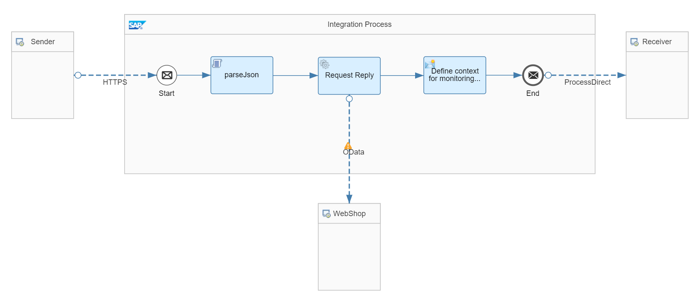
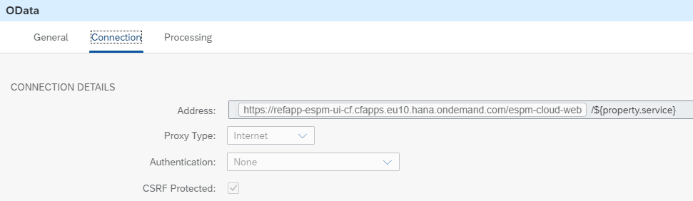
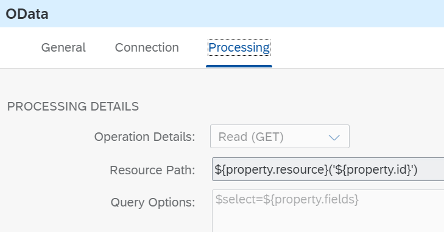

<!-- loioaf0da6488ea6459e96dbac78426635cb -->

# Parse JSON

The integration flow *Scripting – ParseJson accesses* the elements of an incoming JSON message and uses them to call an external OData service.

In this case, the query for the OData call is formed with the incoming message.



As a first step, the script is responsible for reading the payload of the incoming message and parses it to JSON format. Like this, it can access the individual fields and values of the JSON and saves them in properties.

> ### Sample Code:  
> ```
> import com.sap.gateway.ip.core.customdev.util.Message;
> import java.util.HashMap;
> import groovy.json.JsonSlurper;
> 
> def Message parseJsonMessage(Message message) {
>     //Get message and parse to json
>     def json = message.getBody(java.io.Reader);
>     def data  = new JsonSlurper().parse(json);
> 
>     //get fields of the payload (service, ressource & id)
>     message.setProperty("service", data.query.service);
>     message.setProperty("resource", data.query.entity.name);
>     message.setProperty("id", data.query.entity.id);
>     //get columns to be read
>     def numFields = data.query.entity.fields.size();
>     def fields = "";
>     for (int i=0; i<numFields; i++) {
>         fields += data.query.entity.fields[i].name;
>         if (i<numFields-1) fields += ",";
>     }
>     message.setProperty("fields", fields);
> 
>     return message;
> }
> 
> ```

Then, the [WebShop Example Application](webshop-example-application-767d8ef.md) is called. It uses the corresponding properties to build the right request.





In the postman collection, you can find the Post request *ParseJson* to execute the integration flow. You can use for example:

> ### Sample Code:  
> ```
> {
>     "query":{
>         "service":"espm.svc",
>         "entity":{
>             "name": "Products",
>             "id": "HT-1073",
>             "fields":[
>                 {"name": "ProductId"},
>                 {"name": "Category"},
>                 {"name": "Price"}
>             ] 
>         }
>     }
> }
> 
> ```

The body of the request brings together the service to be called, the entity, the id, and the selected columns.

The response is saved in the Data Store by the *Generic Receiver*.

More information: [Stream the XMLSlurper input in Groovy Scripts](https://blogs.sap.com/2017/06/20/stream-the-xmlslurper-input-in-groovy-scripts/) \(SAP Community blog\)

