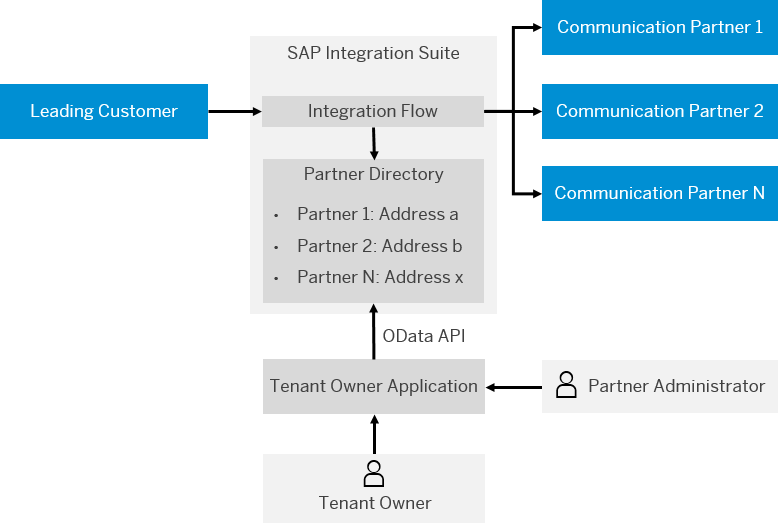
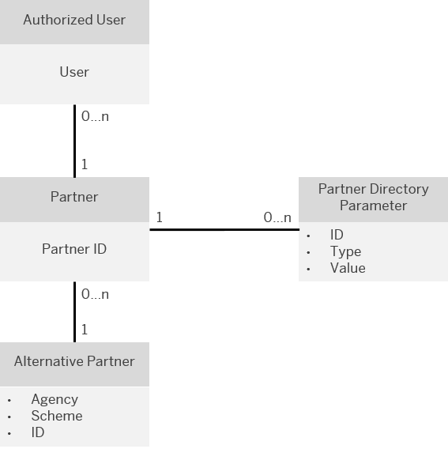

<!-- loiof917d6eb5e8949378b8e58784a32e450 -->

# Partner Directory Concepts

In the context of a business-to-business \(B2B\) scenario involving a partner network, the person or organization that is responsible for the B2B scenario as a whole is also the owner of the SAP Integration Suite tenant.

Administrators at the side of each business partner use a dedicated application \(referred to as tenant owner application\) to maintain entities in the Partner Directory \(through an OData API\). The tenant owner application is provided to the partners by the tenant owner.

Note that such a tenant owner application is not part of the feature set of SAP Integration Suite . However, SAP Integration Suite comes with a set of OData APIs that allow access to the Partner Directory \(and can be used to implement such a tenant owner application\).

As illustrated in the figure, the Partner Directory is embedded in the system landscape in the following way.

<a name="loiof917d6eb5e8949378b8e58784a32e450__section_cdn_1pk_pdb"/>

## Partner Directory Entities

The Partner Directory contains the following entities \(which can be accessed using an OData API\):

-   Partner ID \(PID\)

    A partner has an ID \(PID\) that is unique within the Partner Directory. The uniqueness of the PID is ensured by the tenant owner application.

-   Alternative Partner

    A partner can have several alternative identifiers \(Alternative Partner\). The same concepts are applied to the Alternative Partner as to party identifiers in SAP Process Integration: Each Alternative Partner has three string fields: Agency, Scheme, and ID.

    -   Agency

        Name of the organization that defines the identification scheme \(or schema\) and issues names for the objects to be identified.

    -   Scheme

        The reference framework within which objects are uniquely identified by names.

    -   ID

        An ID or name that identifies the object within the given scheme.

    For more information on the alternative partner ID and how it is related to the partner ID, check out the following SAP Community blog: [Cloud Integration – Partner Directory – Partner Dependent XML Structures and IDs](https://blogs.sap.com/2017/08/22/cloud-integration-partner-directory-partner-dependent-xml-structures-and-ids/).

    For more information on the usage of the fields `Agency`, `Scheme`, and `ID`, see the documentation of SAP Process Integration at [http://help.sap.com](http://help.sap.com).

-   Authorized User

    This user authorizes a sending partner system to log in to SAP Integration Suite \(inbound communication\).

-   Partner Directory Parameters for the parameterization of integration flows

The following figure provides an overview of the Partner Directory entities.

The Partner Directory entities related to a partner are maintained by an administrator at the partner organization using the tenant owner application. The Partner Directory entities are accessed using an OData application interface.

**Related Information**  

[Partner Authorization \(Inbound\)](partner-authorization-inbound-c0c9950.md "For inbound calls (when a partner sends a message to the integration platform), a partner authorization check evaluates whether the logged-in user has permission to execute messages with a particular sender partner ID.")

[Dynamically Reading XSLT Mappings from the Partner Directory](dynamically-reading-xslt-mappings-from-the-partner-directory-66a551a.md "You can configure the XSLT Mapping step in an integration flow to dynamically read XSLT mappings from the Partner Directory. The Mapping step will then point to an XSLT mapping defined in the Partner Directory.")

[Dynamically Reading XSD Files from the Partner Directory](dynamically-reading-xsd-files-from-the-partner-directory-9331745.md "You can configure the XML Validator step in an integration flow to dynamically read XML schema (XSD) files from the Partner Directory. The XML Validator step will then point to an XSD file in the Partner Directory.")

[Partner Directory Cache](partner-directory-cache-1577f77.md "To improve performance, Partner Directory is cached.")

