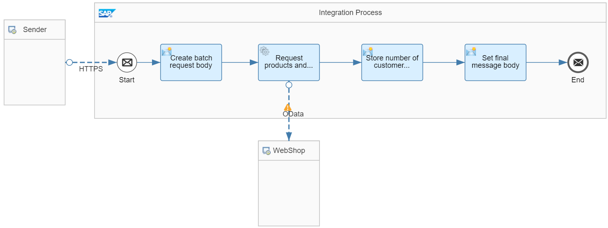

<!-- loiob0372d4d1c0745cbadadbfb6b094ea51 -->

# Perform OData Batch Requests

OData batch processing allows you to group multiple operations in 1 request. Using batch processing, you can minimize the number of calls against a remote component.

The SAP Cloud Connector OData adapters \(OData V2, OData V4, SucessFactors OData V2, and SuccessFactors OData V4 receiver adapter\) allow you to access data that is exposed by remote components through OData APIs.

The OData V2 receiver adapter also supports batch processing, see: [Configure the OData V2 Receiver Adapter](configure-the-odata-v2-receiver-adapter-c5c2e38.md).

Batch processing is in general possible for various operations such like GET, POST, PUT, and DELETE, for example. However, the details depend on the characteristics of the OData API of the remote component.

To set up batch processing, you need to provide a batch request body with your request. The body contains the relative resource paths of the addressed OData resources, the operations and, if supported, query options.

For detailed information and examples for batch processing for various operations, see the following SAP Community blog: [Batch Operation in OData V2 Adapter in SAP Cloud Platform Integration](https://blogs.sap.com/2017/05/10/batch-operation-in-odata-v2-adapter-in-sap-cloud-platform-integration/).

This guideline illustrates OData batch processing with the OData V2 receiver adapter for GET requests.

As OData source, the WebShop component is used that exposes data of a fictitious seller of electronic products.

The WebShop component exposes different kind of data through different resources such like `Products`, `CustomerReviews`, or `Customers`. If you don't use batch processing, you've to set up at least 2 separate OData calls to the WebShop when you like to access both product data and customer reviews:

-   To access product data, you need to send a request with the `Products` resource path specified in the OData adapter.

-   To access customer reviews, you need to send a request with the `CustomerReviews` resource path specified in the OData adapter.


Using batch processing, you can group the 2 operations against the different WebShop resources in 1 request.


<a name="loiob0372d4d1c0745cbadadbfb6b094ea51__section_u4h_2wd_jpb"/>

## Implementation

To illustrate an OData batch processing, you can consult the *Relax Dependencies - OData Batch GET Request* integration flow.

This integration flow sends an OData batch GET request to the WebShop in order to access both product data and customer reviews in 1 request.

In particular, the number of products and the number of customer reviews is counted by the integration flow. The response sent to the HTTP client contains both numbers and the response from the WebShop.



The integration flow performs the following steps:

1.  Triggered by an HTTP request from an HTTP client \(for example, Postman\), the integration flow first defines the batch request body in the Content Modifier *Create batch request body*.

    Check out the *Message Body* tab to find the batch request body:

    ```
    <batchParts>
        <batchQueryPart>
            <method>GET</method>
            <uri>Products</uri>
        </batchQueryPart>
        <batchQueryPart>
            <method>GET</method>
            <uri>CustomerReviews</uri>
        </batchQueryPart>
    </batchParts>
    ```

    The batch request contains 2 parts: The 1st part reads out all product data \(`Products` resource\), whereas the 2nd part reads out customer reviews stored in the WebShop \(`CustomerReviews` resource\). The resource paths are specified with the `uri` element. For both parts of the batch request, the GET operation is specified \(`method` element\).

2.  The Request Reply step *Request products and customer reviews* sends an OData request to the WebShop through the OData V2 receiver channel.

    The OData V2 receiver adapter is configured in the following way:

    -   As *Address*, the WebShop endpoint address is specified \(as externalized parameter\):

        `https://refapp-espm-ui-cf.cfapps.eu10.hana.ondemand.com/espm-cloud-web/espm.svc`

    -   As *Resource Path*, the *Products* resource is specified:

        Although the batch request not only addresses the *Products* resource, the *Products* resource is nevertheless specified. The reason is that this parameter is mandatory.

    -   The option *Enable Batch Processing* is selected.


    > ### Note:  
    > The response is an XML document with 2 parts:
    > 
    > -   The first part contains a list of `Product` items with several attributes for each product.
    > 
    > -   The 2nd part contains a list of `CustomerReview` items with several attributes for each customer review.

3.  Content Modifier *Store number of customer reviews and products* retrieves the number of products and customer reviews and stores them as exchange properties.

    Check out tab *Exchange Property* to notice the following settings:

    -   Property `NoProducts` is defined by the following XPath expression:

        `count(//Product)`

        This expression retrieves the number of `Product` items in the message.

    -   Property `NoCustomerReviews` is defined by the following XPath expression:

        `count(//CustomerReview)`

        This expression retrieves the number of `CustomerReview` items in the message.


4.  Content Modifier *Set final message body*, finally, defines the message body by the following expression \(tab *Message Body*\):

    ```
    The WebShop contains ${property.NoProducts} products and ${property.NoCustomerReviews} customer reviews.
    \n
    OData response:
    \n
    ${in.body}
    ```

    > ### Note:  
    > The expression `${in.body}` defines the message payload that contains the response from the WebShop.


To execute the scenario, select the request in folder *ODataBatchGetRequest* of the Postman collection contained in the integration package.

As response, you receive a message like the following one \(example\):

```
The WebShop contains 106 products and 23 customer reviews.


OData response:


<batchPartResponse>
    <batchQueryPartResponse>
      <headers>
        <Accept></Accept>
        <Accept-Language></Accept-Language>
        <Content-Length>170358</Content-Length>
        <DataServiceVersion>2.0</DataServiceVersion>
        <Content-Type>application/atom+xml;charset=utf-8;type=feed</Content-Type>
      </headers>
      <statusInfo>OK</statusInfo>
      <contentId/>
      <body>
        <Products>
          <Product>
            <Category>MP3-Players</Category>
            <WeightUnit>G</WeightUnit>
            <ProductId>HT-6122</ProductId>
            <DimensionUnit>m</DimensionUnit>
            <DimensionHeight>0.0840</DimensionHeight>
            <Weight>266.000</Weight>
            <Name>Power Pro Player 40</Name>
            <ShortDescription>MP3-Player with 40 GB HDD and Color Display, can play movies</ShortDescription>
            <CurrencyCode>EUR</CurrencyCode>
            <DimensionWidth>0.0760</DimensionWidth>
            <SupplierId>100000048</SupplierId>
            <LongDescription>MP3-Player with 40 GB HDD and Color Display, can play movies</LongDescription>
            <Price>167.000</Price>
            <CategoryName>MP3-Players</CategoryName>
            <PictureUrl>HT-6122.jpg</PictureUrl>
            <DimensionDepth>0.0200</DimensionDepth>
            <QuantityUnit>EA</QuantityUnit>
          </Product>
....
          </Product>
        </Products>
      </body>
      <statusCode>200</statusCode>
    </batchQueryPartResponse>
    <batchQueryPartResponse>
      <headers>
        <Accept></Accept>
        <Accept-Language></Accept-Language>
        <Content-Length>21956</Content-Length>
        <DataServiceVersion>2.0</DataServiceVersion>
        <Content-Type>application/atom+xml;charset=utf-8;type=feed</Content-Type>
      </headers>
      <statusInfo>OK</statusInfo>
      <contentId/>
      <body>
        <CustomerReviews>
          <CustomerReview>
            <Comment>Good product for the price</Comment>
            <CreationDate>2015-01-09T00:07:00.000</CreationDate>
            <CustomerReviewId>109</CustomerReviewId>
            <FirstName>Paul</FirstName>
            <Rating>3</Rating>
            <ProductId>HT-1000</ProductId>
            <LastName>Burke</LastName>
          </CustomerReview>
...
          </CustomerReview>
        </CustomerReviews>
      </body>
      <statusCode>200</statusCode>
    </batchQueryPartResponse>
  </batchPartResponse>
```

> ### Note:  
> You can enter a customer review on the WebShop frontend and run the integration flow again. The number of customer reviews is increased by one.
> 
> You can access the WebShop frontend at:
> 
> [https://refapp-espm-ui-cf.cfapps.eu10.hana.ondemand.com/webshop/index.html](https://refapp-espm-ui-cf.cfapps.eu10.hana.ondemand.com/webshop/index.html)

