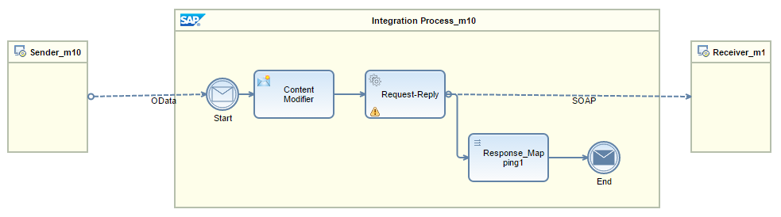

<!-- loioeae8a7280a19416c929f1bc8540cace5 -->

# Predefined Integration Flow for Query Operations

This integration flow is autogenerated for Query operations. In order to complete the binding to the data source, you have to edit at least the following elements:

-   Content Modifier
-   Response Mapping

> ### Note:  
> If you want to enable system query options such as $top, $skip, and $filter, you can replace the Content Modifier element with a Script element.

To understand this integration flow, let's look at an example.

## Example

A mobile application needs to get a list of hotels available in the city of New York from a hotel booking system. The hotel booking system publishes this data in the form of a SOAP Web service. The mobile application places this request in the form of a URI, where the city of New York is passed as a parameter.

When the OData sender channel receives the URI request, it passes it to the Content Modifier element. The Content Modifier element adds additional information to the head and body of the incoming message so that the SOAP receiver can understand it.

The SOAP receiver processes the request and, if there are no issues with the request, returns a list of hotels as the response. The Response Mapping element contains information that maps the fields from the SOAP structure to the OData structure. The mapped data is then sent to the mobile application through the OData sender channel.

