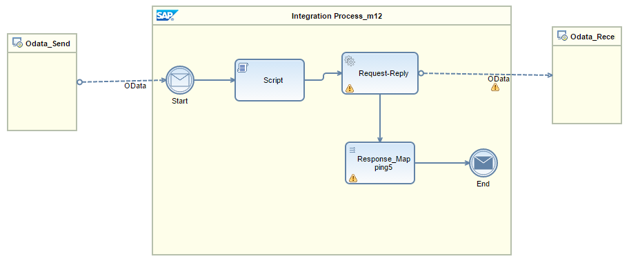

<!-- loio585b5af228e74a3bbe434ab83a606609 -->

# Predefined Integration Flows for OData

The Cloud Integration Web application sets up predefined integration flows when the Create, Read, Update, and Query operations of entity sets are bound to an OData API.

> ### Note:  
> Function imports are not available in the OData receiver channel. We recommend that you use another adapter like HTTP for it.

## Predefined Integration Flows for Query and Read Operations

This integration flow is autogenerated for Query and Read operations. Script step in this integration flow takes the query options from the incoming URI and sets it into an exchange header *<odataURI\>*. In the case of Query operations, you can use this exchange header to dynamically pass the query options to the OData receiver channel. And in the case of Read operations, you can use this exchange header to dynamically pass the key fields of the entity set to the OData receiver channel.

## Predefined Integration Flows for Create and Update Operations

This integration flow is autogenerated for Create and Update operations. Script step in this integration flow takes the query options from the incoming URI and sets it into an exchange header *<odataURI\>*. In the case of Update operations, you can use this exchange header to dynamically pass the key fields of the entity set to the OData receiver channel.

