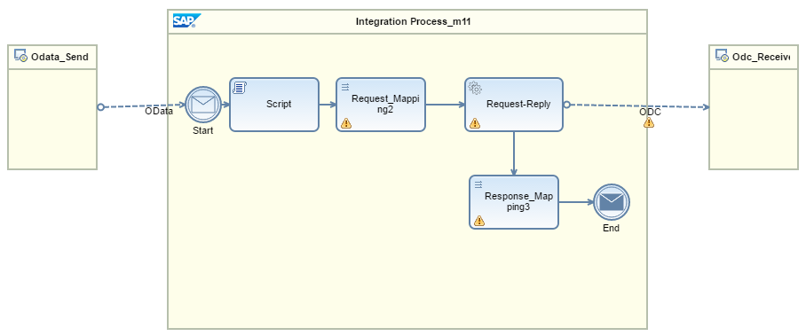
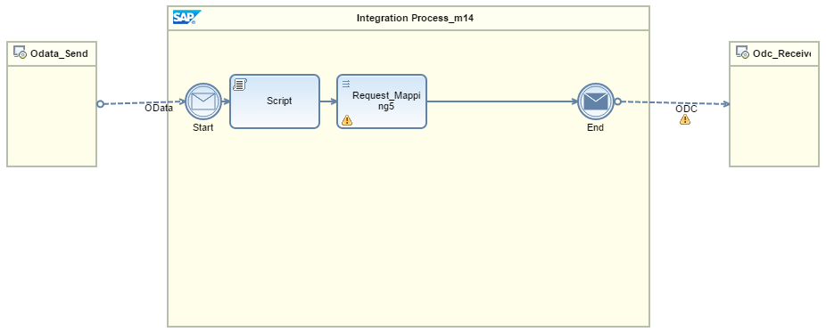
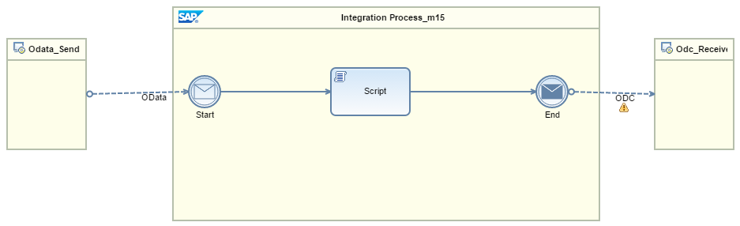

<!-- loio677fcbab6f6b4888891e952c99678de1 -->

# Predefined Integration Flows for ODC

The Cloud Integration Web application sets up predefined integration flows when the CRUDQ \(Create, Read, Update, Delete, and Query\) operations of entity sets and function imports are bound to an ODC service.

## Predefined Integration Flow for Query and Read Operations

This integration flow is autogenerated for Query and Read operations. Script step in this integration flow takes the query options and key fields of entity sets from the incoming URI and sets it into an exchange header *<odataURI\>*.

> ### Note:  
> Currently, the ODC receiver channel does not support any query options or key fields of entity sets that are dynamically passed using the exchange header.

You can map the fields from the ODC structure to the OData structure in the Response Mapping element.

## Predefined Integration Flow for Create Operation

This integration flow is autogenerated for Create operation. You can map the fields from the OData structure to the ODC structure in the Request Mapping element. Similarly, map the fields from the ODC structure to the OData structure in the Response Mapping element.

## Predefined Integration Flow for Update Operation

This integration flow is autogenerated for Update operation. Script step in this integration flow takes the key fields of entity sets from the incoming URI and sets it into an exchange header *<odataURI\>*.

> ### Note:  
> Currently, the ODC receiver channel does not support any key fields of entity sets that are dynamically passed using the exchange header.

You can map the fields from the OData structure to the ODC structure in the Request Mapping element.

## Predefined Integration Flow for Delete Operation

This integration flow is autogenerated for Delete operation. Script step in this integration flow takes the key fields of entity sets from the incoming URI and sets it into an exchange header *<odataURI\>*.

> ### Note:  
> Currently, the ODC receiver channel does not support any key fields of entity sets that are dynamically passed using the exchange header.

