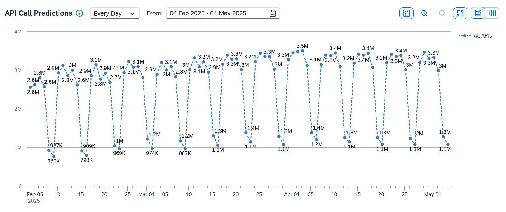
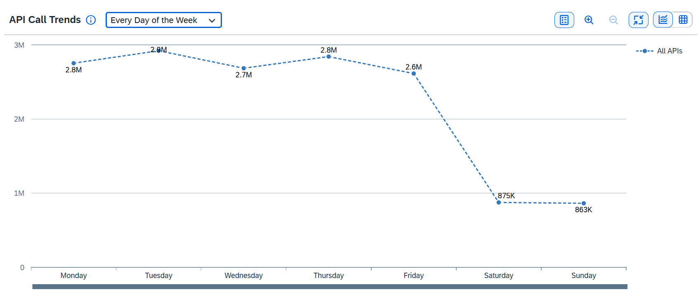
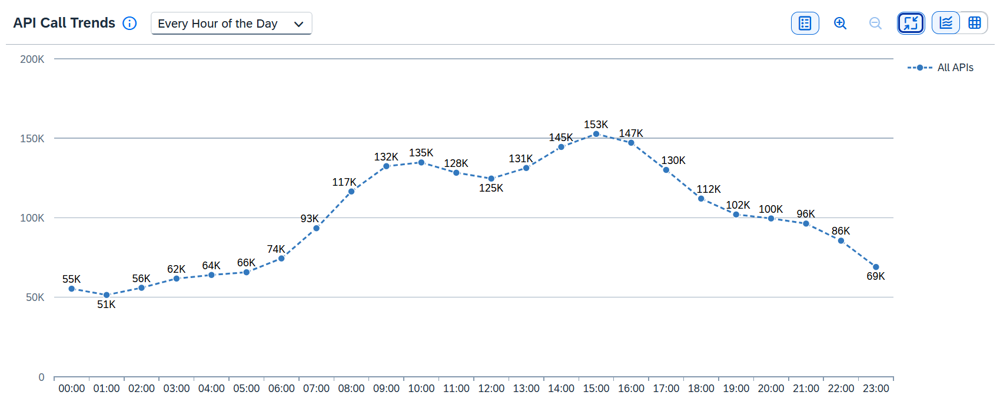

<!-- loio823bcd7727944ba9b09b659988d394f2 -->

# Predictions

In addition to anomaly detection, we have now introduced *Predictions*, an AI-based feature that can forecast future API call volumes based on past call data. With this new feature, you can identify trends in API traffic and view predictions for upcoming API call volumes. Predictions are available for all API proxies that meet the minimum data requirement of at least 3 months of API call volume data. Additionally, it offers customizable options, allowing you to select specific API proxies, choose the prediction duration, and set the frequency according to your preferences.

The **Predictions** feature is associated with Anomaly Detection. To activate it, see [Enabling Anomaly Detection and Predictions](enabling-anomaly-detection-and-predictions-98534a0.md).

> ### Note:  
> The availability of the anomaly detection and prediction features depends on your SAP Integration Suite service plan. For more information about different service plans and their supported feature set, see SAP Notes [2903776](https://me.sap.com/notes/2903776) and [3463620](https://me.sap.com/notes/3463620).

For example, take a look at the **API Call Predictions** graph below. In this chart, the frequency is set to the default option, which is *Every Day*, with dates ranging from February 4, 2025 to May 4, 2025 \(a maximum of 90 days can be selected, starting from the day after the current date\). The chart displays the aggregated data for all APIs. As you can see, the expected call traffic on Saturday, February 15, 2025, is relatively low. In contrast, on Tuesday, February 18, 2025, the expected call traffic is approximately 3 million.

Similarly, take a look at the **API Call Trends** graph below. In this chart, we have set the frequency to **Every Day of the Week**. As you can see, the expected call traffic is typically high throughout the week, except on Saturdays and Sundays.

Here, the frequency is set to **Every Hour of the Day**. As you can see, the expected call traffic is quite low at the beginning of the day, gradually increasing and peaking between the hours of 14:00 and 16:00, before decreasing for the rest of the day.

These insights can help to optimize resource allocation, manage system load, and make informed decisions about your API strategy.

**Related Information**  

[Enabling Anomaly Detection and Predictions](enabling-anomaly-detection-and-predictions-98534a0.md "Activate the anomaly detection and prediction features for API proxy calls to enhance monitoring and forecasting capabilities.")

[Viewing Predictions and Trends](viewing-predictions-and-trends-47f349c.md "Analyze potential API call traffic and identify trends.")

