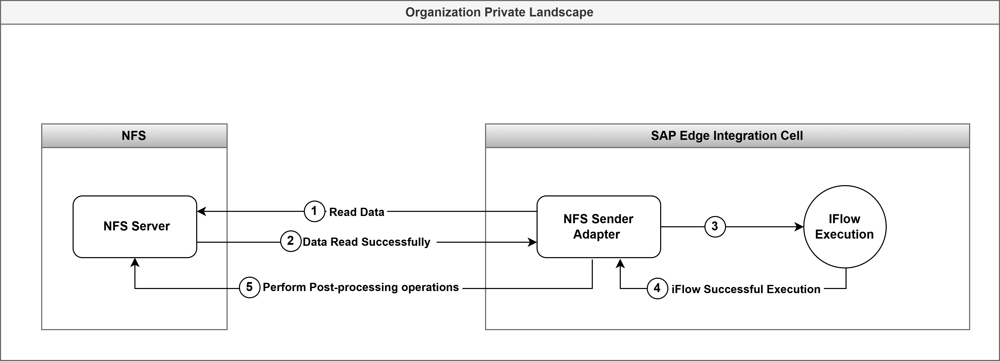
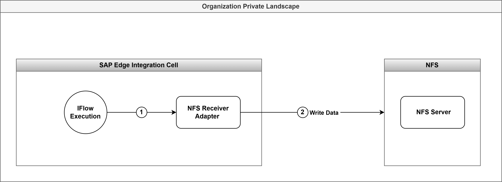

<!-- loio9efec9ebe92b43baa38637727e0070ea -->

# Prerequisites and Operational Considerations

This topic contains information about adapter architecure, application configuration, and authentication considerations relevant to the NFS Adapter.

## Prerequisites

NFS Adapter is only available for Edge Integration Cell.

## Adapter Architecture Flow

**How the Sender Adapter works ?**

1.  SAP Integration Suite tenant sends a request via NFS adapter to the NFS server \(think of this as a Sender system\) to read a file from a directory.
2.  The NFS adapter performs the file read operation.
3.  After the file is successfully read, the NFS adapter sends data for integration flow processing.
4.  The integration flow processes the message; a successful completion of this processing is required before any Post-processing actions are executed on the source file.
5.  Finally, the Post-processing actions are performed. \(Example: Moving, Deleting, or Keeping file for further processing.\)

**How the Receiver Adapter works ?** 

1.  SAP Integration Suite tenant sends a request via NFS adapter to write to a file on the NFS server \(think of this as a Receiver system\).
2.  The NFS adapter supports various existing file handling options such as override, append, fail, and ignore.
3.  Additionally, the adapter also handles responses, execution statuses, and errors.

## Authentication

The adapter operates within a trusted internal network environment, where the NFS server trusts clients communicating from the same network. As the protocol is designed for a trusted comunication, the adapter does not require a separate authentication mechanism. This trust-based model enables efficient interaction with internal file servers while relying on the controlled and secured nature of the deployment environment.

-   To get a brief overview of NFS, see [Network File System \(NFS\) overview](https://learn.microsoft.com/en-us/windows-server/storage/nfs/nfs-overview).
-   To set up NFS for Windows Server, see [Deploy NFS](https://learn.microsoft.com/en-us/windows-server/storage/nfs/deploy-nfs).

    > ### Note:  
    > Create dedicated UIDs/GIDs for valid users and allow access for those select UIDs/GIDs. For more information, see [NFS Authentication](https://learn.microsoft.com/en-us/windows-server/storage/nfs/deploy-nfs?tabs=gui#nfs-authentication).

## Creating a Secure Parameter in Security Material

To create a security artifact that stores the User ID/Group ID associated with the NFS client, see [Deploying Secure Parameter](https://help.sap.com/docs/cloud-integration/sap-cloud-integration/deploying-secure-parameter-artifact-monitor).

