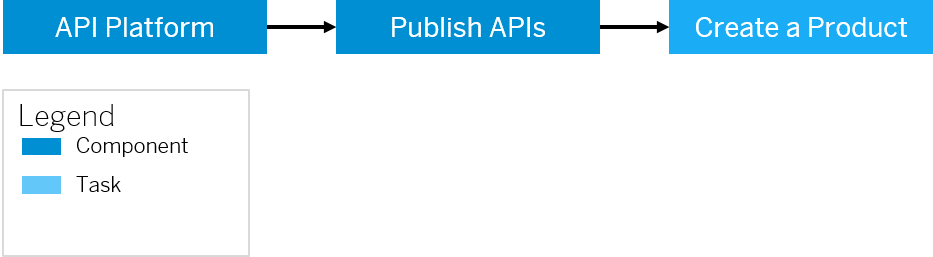

<!-- loio75a4a11ed5294ec89b69fb40dba36308 -->

# Publish APIs

You need to publish APIs to make it consumable by external application developers. Publishing enables to expose the APIs in a structured manner in the form of a product. To publish APIs, you need to know how to bundle APIs and publish them together as a product.

A product is a bundle of APIs. It contains metadata specific to your business for monitoring or analytics. For example, all APIs related to CRM can be bundled as one CRM product. Instead of publishing APIs individually, it is easier to bundle related APIs together as a product and publish it. After including the required APIs to a product, the product is published to the catalog, where the product is available for Application developers to browse through.

> ### Remember:  
> To publish the product, all the API proxies in the product should have a deployed revision.
> 
> If the product has one API associated to it, you should ensure that this API is deployed before publishing the product.
> 
> Let us assume that a product is associated with five API proxies, out of which three are deployed. When you publish such a product, only three proxies will get published.
> 
> You've created multiple revisions out of an API proxy, and deployed one of the revisions. However, the deployed revision is not the latest revison. Now if you attach such an API to a product, and try to publish the product, the deployed revision of the API proxy gets published.
> 
> Let us consider another scenario where resources are attached to your API, and you have created multiple revisions of this API. If you add such an API to a product and try to publish it, you'll notice the following behaviour:
> 
> -   The deployed revision of the API and the resources attached to the it gets published.
> 
> -   If you add a resource from an API which is not deployed, the same resource will not get published.

When you create a product, you link it to one or more APIs. Also, the same API can be linked to multiple products. After you have linked an API to a product, all attributes of the API such as API resources and API documentation are implicitly part of the product.

A product is a vehicle that lets the application developer know which APIs are exposed on the Integration Suite. When you create an application, you select the product to include in the application. For each application that you create, SAP Integration Suite generates an Application key and secret. Use this key to gain access to multiple products.

