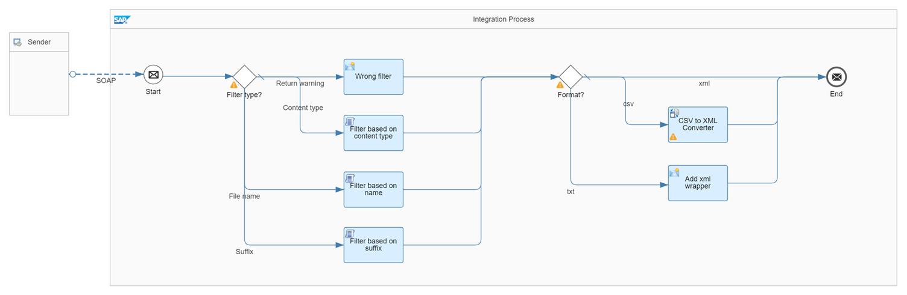

<!-- loiof7f513f915044435a269157ffa325c2c -->

# Read Attachment Based on Filter Criteria

In this use case, the content of a particular file out of multiple files attached to a message is read to replace the body of the message. To determine the right attachment, different filter criteria are presented.

The *Attachment Handling - Read Attachment Based On Filter Criteria* integration flow illustrates this guideline.



In this example, a SOAP sender adapter is used to receive a message with multiple attachments.

> ### Note:  
> SOAP supports multiple files attached to the message exchange. Alternatively, you can apply the guideline when using any other protocol supporting attachments such as when reading an email with multiple attachments from a mail server.

To be able to test the different filter criteria, the SOAP request expects the headers FilterType and FilterValue. As FilterType the following options are supported: *FileName*, *Suffix*, and *ContentType*.

Depending on the filter criteria, different Groovy scripts are carried out. In general, the scripts loop through the list of attachments, and if the filter criteria applies, they replace the body of the message with the content of the particular attachment. Furthermore, the attachments are deleted from the message exchange so that the response of the SOAP call contains the content of the attachment only. For tracking purposes, the number of attached files is determined and returned as http header.

The *Filter based on content type* Groovy script is defined as follows:

> ### Sample Code:  
> ```
> import com.sap.gateway.ip.core.customdev.util.Message
> import java.util.Map
> import java.util.Iterator
> import javax.activation.DataHandler
> 
> def Message processData(Message message) {
> 	// fetch headers
> 	def headers = message.getHeaders();
>     def filterContentType = headers.get("FilterValue");
>     // set content type of body in case that filter does not apply
>     message.setProperty('AttachmentContentType', 'text/xml');
>     // get attachments
> 	Map<String, DataHandler> attachments = message.getAttachments();
> 	if (attachments.isEmpty()) {
>         // in case of no attachment
>         message.setBody('<warning>Attachment is missing</warning>')
> 	} else {
> 	    // get overall number of attachments
> 	    message.setHeader('NumberOfAttachments', attachments.size());
>         // filter based on content type
>         attachments.values().each{ attachment ->
> 	        if(attachment.getContentType().contains(filterContentType)){
> 	            message.setBody(attachment.getContent());
> 	            message.setProperty('AttachmentContentType', attachment.getContentType());
> 		    }
> 	    }
> 	    // delete attachments
> 	     message.getAttachments().clear()
>          message.getAttachmentWrapperObjects().clear()
> 	}
> 	return message;
> }
> 
> ```

The *Filter based on name* Groovy script is defined as follows:

> ### Sample Code:  
> ```
> import com.sap.gateway.ip.core.customdev.util.Message
> import java.util.Map
> import java.util.Iterator
> import javax.activation.DataHandler
> 
> def Message processData(Message message) {
> 	// fetch headers
> 	def headers = message.getHeaders();
>     def filterFileName = headers.get("FilterValue");
>     // set content type of body in case that filter does not apply
>     message.setProperty('AttachmentContentType', 'text/xml');
>     // get attachments
> 	Map<String, DataHandler> attachments = message.getAttachments();
> 	if (attachments.isEmpty()) {
>         // in case of no attachment
>         message.setBody('<warning>Attachment is missing</warning>')
> 	} else {
> 	    // get overall number of attachments
> 	    message.setHeader('NumberOfAttachments', attachments.size());
>         // filter based on content type
>         attachments.values().each{ attachment ->
> 	        if(attachment.getName().contains(filterFileName)){
> 	            message.setBody(attachment.getContent());
> 	            message.setProperty('AttachmentContentType', attachment.getContentType());
> 		    }
> 	    }
> 	    // delete attachments
> 	     message.getAttachments().clear()
>          message.getAttachmentWrapperObjects().clear()
> 	}
> 	return message;
> }
> 
> ```

The *Filter based on suffix* Groovy script is defined as follows:

> ### Sample Code:  
> ```
> import com.sap.gateway.ip.core.customdev.util.Message
> import java.util.Map
> import java.util.Iterator
> import javax.activation.DataHandler
> 
> def Message processData(Message message) {
> 	// fetch headers
> 	def headers = message.getHeaders();
>     def filterSuffix = headers.get("FilterValue").toLowerCase();
>     // set content type of body in case that filter does not apply
>     message.setProperty('AttachmentContentType', 'text/xml');
>     // get attachments
> 	Map<String, DataHandler> attachments = message.getAttachments();
> 	if (attachments.isEmpty()) {
>         // in case of no attachment
>         message.setBody('<warning>Attachment is missing</warning>')
> 	} else {
> 	    // get overall number of attachments
> 	    message.setHeader('NumberOfAttachments', attachments.size());
>         // filter based on suffix
>         attachments.values().each{ attachment ->
> 	        if(attachment.getName().toLowerCase().endsWith(filterSuffix)){
> 	            message.setBody(attachment.getContent());
> 	            message.setProperty('AttachmentContentType', attachment.getContentType());
> 		    }
> 	    }
> 	    // delete attachments
> 	     message.getAttachments().clear()
>          message.getAttachmentWrapperObjects().clear()
> 	}
> 	return message;
> }
> 
> ```

Because SOAP expects a response in XML format, the following format conversions are carried out for non-XML formats:

-   In case of a CSV file, the CSV to XML Converter step is added.

-   In case of a text file, XML tags are added around the text.


To test the scenario, perform the following steps:

1.  Set up inbound *Basic* authentication for integration flow endpoints.

    See: [Basic Authentication with clientId and clientsecret for Integration Flow Processing](../40-RemoteSystems/basic-authentication-with-clientid-and-clientsecret-for-integration-flow-processing-647eeb3.md)

2.  Deploy the integration flow *Attachment Handling - Read Attachment Based On Filter Criteria*.

3.  In the Postman client, open the *HandlingAttachments* folder in the *ModelingBasics* collection. There, you find three requests that have been prepared to cover all filter options: *ReadAttachmentBasedOnFilter – FileName, ReadAttachmentBasedOnFilter – Suffix*, and *ReadAttachmentBasedOnFilter – ContentType*. For each request, the sample message contains a SOAP message with a list of product IDs and four attachments: Two XML files containing product details, one CSV file containing product details, and one text file containing supplier information. Run each of the requests.

4.  For the request *ReadAttachmentBasedOnFilter – FileName*, the header *FilterType* is set to `FileName` and the header *FilterValue* is set to`HT-1081`. Run the request. You receive the product details of the product HT-1081 as response.

5.  For the *ReadAttachmentBasedOnFilter – Suffix* request, the header *FilterType* is set to `Suffix` and the header *FilterValue* is set to `txt`. Run the request. You receive the supplier ID as response.

6.  For the *ReadAttachmentBasedOnFilter – ContentType* request, the header *FilterType* is set to `ContentType` and the header *FilterValue* is set to `csv`. Run the request. You receive the product details of the product HT-1082 as response.

    > ### Note:  
    > Optionally, you can use SoapUI to send a sample SOAP message with multiple attached files in XML, CSV, and text format to the integration flow end point. In this case, ensure that the request property Disable Multipart is set to false. Furthermore, define the http headers FilterType and FilterValue accordingly.


