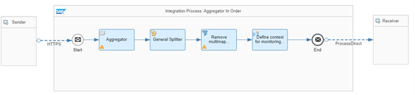

<!-- loio068cfc7cdaf54d71a51726dff203da5b -->

# Resequencer

If you want to reorder individual messages that have been received by Cloud Integration in a wrong order, you can use an Aggregator pattern which allows you to collect individual messages in bulks, sorted by sequence number. To revert the message bulks into multiple individual messages again, use the Splitter pattern and send the individual messages to the receiver.


<a name="loio068cfc7cdaf54d71a51726dff203da5b__section_f5x_znf_tsb"/>

## Use Cases

Let's assume that you want to send product items related to the same order sorted by sequence \(item\) number.

The messages contain the item numbers 1 to 4 and have the following structure:

> ### Sample Code:  
> Message 1
> 
> ```
> <?xml version='1.0' encoding='UTF-8'?>
> <ns0:Item xmlns:ns0="http://demo.sap.com/eip/resequencer" ItemNumber="1" PurchaseOrderNumber="72001001">
> <ProductId>HT-1030</ProductId>
> <ProductName>Ergo Screen</ProductName>
> <Category>Flat screens</Category>
> <Quantity>2</Quantity>
> <CurrencyCode>EUR</CurrencyCode>
> <Price>460.00</Price>
> </ns0:Item>
> 
> ```

> ### Sample Code:  
> Message 2
> 
> ```
> <?xml version='1.0' encoding='UTF-8'?>
> <ns0:Item xmlns:ns0="http://demo.sap.com/eip/resequencer" ItemNumber="2" PurchaseOrderNumber="72001001">
> <ProductId>HT-1101</ProductId>
> <ProductName>Smart Design</ProductName>
> <Category>Software</Category>
> <Quantity>10</Quantity>
> <CurrencyCode>EUR</CurrencyCode>
> <Price>799.00</Price>
> </ns0:Item>
> 
> ```

> ### Sample Code:  
> Message 3
> 
> ```
> <?xml version='1.0' encoding='UTF-8'?>
> <ns0:Item xmlns:ns0="http://demo.sap.com/eip/resequencer" ItemNumber="3" PurchaseOrderNumber="72001001">
> <ProductId>HT-1001</ProductId>
> <ProductName>Notebook Basic 17</ProductName>
> <Category>Notebooks</Category>
> <Quantity>1</Quantity>
> <CurrencyCode>EUR</CurrencyCode>
> <Price>1056.00</Price>
> </ns0:Item>
> 
> ```

> ### Sample Code:  
> Message 4
> 
> ```
> <?xml version='1.0' encoding='UTF-8'?>
> <ns0:Item xmlns:ns0="http://demo.sap.com/eip/resequencer" ItemNumber="4" PurchaseOrderNumber="72001001">
> <ProductId>HT-1000</ProductId>
> <ProductName>Notebook Basic 15</ProductName>
> <Category>Notebooks</Category>
> <Quantity>1</Quantity>
> <CurrencyCode>EUR</CurrencyCode>
> <Price>956.00</Price>
> </ns0:Item>
> 
> ```

To test the scenario, the messages will be sent in an unsorted/random order.


<a name="loio068cfc7cdaf54d71a51726dff203da5b__section_xsd_n4f_tsb"/>

## Implementation

The *Pattern Resequencer* integration flow illustrates how to implement this use case with a simple scenario.



The Aggregator step collects the message stream in a single message. The *Aggregation Algorithm* *Combine in Sequence* is used to store the incoming messages sorted by *Message Sequence Expression*: `//@ItemNumber`.

The Last *Message Condition* isn't defined in the message body. Therefore, we set the *Completion Timeout* to define the maximum time between two messages before the aggregation is stopped.

The following aggregation strategy has been defined for the Aggregator step:


<table>
<tr>
<th valign="top">

Attribute

</th>
<th valign="top">

Value

</th>
</tr>
<tr>
<td valign="top">

Incoming Format

</td>
<td valign="top">

XML \(Same Format\)

</td>
</tr>
<tr>
<td valign="top">

Aggregation Algorithm

</td>
<td valign="top">

Combine in Sequence

</td>
</tr>
<tr>
<td valign="top">

Message Sequence Expression \(XPath\)

</td>
<td valign="top">

//@ItemNumber

</td>
</tr>
<tr>
<td valign="top">

Last Message Condition \(XPath\)

</td>
<td valign="top">

0

</td>
</tr>
<tr>
<td valign="top">

Completion Timeout \(in min\)

</td>
<td valign="top">

2

</td>
</tr>
<tr>
<td valign="top">

Data Store Name

</td>
<td valign="top">

Pattern-Resequencer

</td>
</tr>
</table>

As a result, the messages are combined in one message and sorted by item number.

To break up the message back into single Item messages, we use a **General splitter** step with the XPath expression type and the following **XPath** expression: `//ns0:Item`.

> ### Note:  
> Deselect the flag *Parallel Processing* of the splitter, to keep the order of the split messages.

The subsequent Filter step removes the multimapping from the message, using the following **XPath** expression: `//ns0:Item`.


To test the scenario, perform the following steps:

1.  Set up inbound **Basic** authentication for integration flow endpoints. [Setting Up Basic Inbound Authentication with clientId and clientsecret from a Service Key, Cloud Foundry Environment](../40-RemoteSystems/basic-authentication-with-clientid-and-clientsecret-for-integration-flow-processing-647eeb3.md) [Setting Up Inbound HTTP Connections (with Basic Authentication), Neo Environment](https://help.sap.com/viewer/368c481cd6954bdfa5d0435479fd4eaf/Cloud/en-US/391c45cfcd0f4435952ab085283b7f7d.html "") :arrow_upper_right: 
2.  Deploy the integration flows *Generic Receiver*, and *Pattern Resequencer*.
3.  In the Postman client, open the *Resequencer* folder of the Postman collection that has been provided with the *Integration Flow Design Guidelines - Enterprise Integration Patterns* package. There, you find four POST requests, each with a unique item number. The requests are sorted in the wrong order.
4.  Run all four requests.
5.  Once the system has processed all messages successfully and the completion timeout condition of the aggregator has been met, check the data store *Pattern-Resequencer* \(open the *Monitor* application and select the *Data Stores* tile under *Manage Stores*\).

    > ### Tip:  
    > You see four entries each with an entry ID that concatenates the order ID with the respective item ID. The order of the entries should be sorted by the item id.

6.  Before rerunning the test, change the purchase order number. You notice that for the purchase order number in the request body, a Postman collection variable is used. You can change the value of the variable on the Prerequest Script tab of the first POST request before rerunning the scenario.
7.  Optionally, you can switch on the trace to verify the overall behavior.

**Related Information**  


[Define Aggregator](define-aggregator-aa23816.md "")

